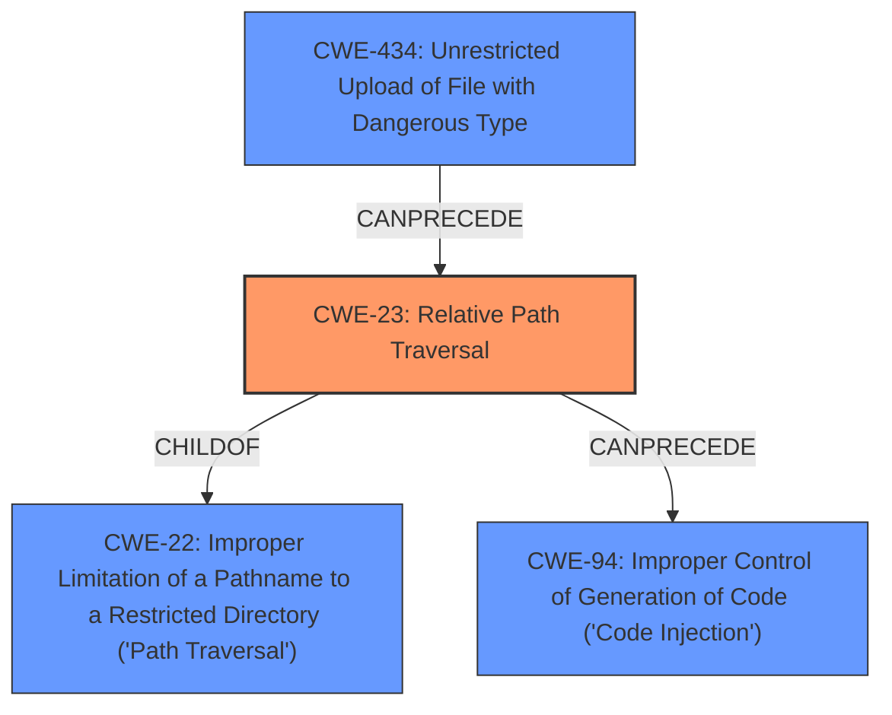

# Final Resolution for CVE-2022-1373

# Summary
| CWE ID | CWE Name | Confidence | CWE Abstraction Level | CWE Vulnerability Mapping Label | CWE-Vulnerability Mapping Notes |
|---|---|---|---|---|---|
| **CWE-23** | **Relative Path Traversal** | 0.95 | Base | Allowed | Primary CWE. Improper neutralization of path traversal sequences allows writing files outside the intended directory. |
| CWE-94 | Improper Control of Generation of Code ('Code Injection') | 0.75 | Base | Allowed-with-Review | Secondary Candidate. The *impact* of the path traversal is arbitrary code execution via DLL loading. Use with caution; path traversal is root cause. |
| CWE-434 | Unrestricted Upload of File with Dangerous Type | 0.70 | Base | Allowed | Secondary Candidate. The ability to upload a ZIP file contributes to the exploit, but the primary vulnerability is path traversal. Relates to CWE-668, as it places resources (DLLs) into an unintended control sphere. |

## Evidence and Confidence

*   **Confidence Score:** 0.95
*   **Evidence Strength:** HIGH

## Relationship Analysis
The primary weakness is **CWE-23** [Relative Path Traversal], which is a base CWE. It has a parent **CWE-22** [Improper Limitation of a Pathname to a Restricted Directory ('Path Traversal')]. The attack involves uploading a zip file, which is related to **CWE-434** [Unrestricted Upload of File with Dangerous Type]. The path traversal allows the attacker to write a DLL to disk and execute it, which is code injection and is represented by **CWE-94** [Improper Control of Generation of Code ('Code Injection')].

## Vulnerability Chain
The vulnerability chain begins with the unrestricted upload of a zip file (**CWE-434** [Unrestricted Upload of File with Dangerous Type]). The application fails to properly neutralize path traversal sequences within the zip file (**CWE-23** [Relative Path Traversal]). This allows an attacker to write a malicious DLL to an arbitrary location on the file system. When the application accesses or executes this DLL, it results in arbitrary code execution (**CWE-94** [Improper Control of Generation of Code ('Code Injection')]). The root cause is the path traversal, and the impact is code execution.

## Summary of Analysis
The initial analysis and criticism both agree that **CWE-23** [Relative Path Traversal] is the primary weakness. The vulnerability description explicitly mentions a "directory traversal vulnerability" and that an attacker can "craft a zip file to load an arbitrary dll and execute code." The evidence clearly points to the improper handling of file paths within the uploaded zip file, which is a hallmark of **CWE-23** [Relative Path Traversal].

**CWE-94** [Improper Control of Generation of Code ('Code Injection')] is a secondary candidate because the path traversal leads to code execution. However, the root cause is the path traversal itself. **CWE-434** [Unrestricted Upload of File with Dangerous Type] is also a secondary candidate because the vulnerability involves uploading a zip file. However, the key issue is not the unrestricted upload itself, but rather the improper handling of file paths within the zip file.

The graph relationships confirm that **CWE-23** [Relative Path Traversal] is the most specific and appropriate classification. It is a base CWE, which is the preferred level of abstraction. The relationships also show that **CWE-23** [Relative Path Traversal] can lead to **CWE-94** [Improper Control of Generation of Code ('Code Injection')] and is facilitated by **CWE-434** [Unrestricted Upload of File with Dangerous Type]. I agree with the initial analysis and the suggestions in the criticism. The selected CWEs are at the optimal level of specificity based on the available evidence.