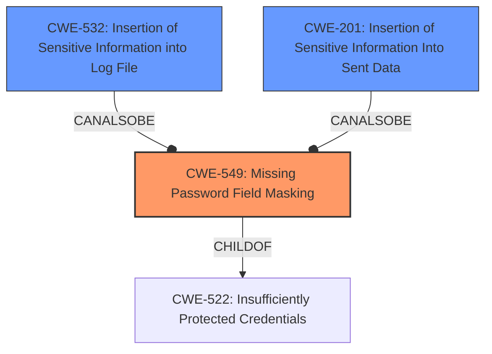

# Final Resolution for CVE-2022-1413

# Summary
| CWE ID | CWE Name | Confidence | CWE Abstraction Level | CWE Vulnerability Mapping Label | CWE-Vulnerability Mapping Notes |
|---|---|---|---|---|---|
| CWE-549 | Missing Password Field Masking | 0.95 | Base | Allowed | Primary CWE |
| CWE-532 | Insertion of Sensitive Information into Log File | 0.6 | Base | Allowed | Secondary Candidate |
| CWE-201 | Insertion of Sensitive Information Into Sent Data | 0.6 | Base | Allowed | Secondary Candidate |

## Evidence and Confidence

*   **Confidence Score:** 0.8
*   **Evidence Strength:** MEDIUM

## Relationship Analysis
The primary CWE, CWE-549, is a base-level CWE, making it appropriate for direct mapping. It is a child of CWE-522, Insufficiently Protected Credentials, which provides a broader context. The secondary candidates, CWE-532 and CWE-201, represent potential information leaks stemming from the initial failure to mask sensitive data. These are peer CWEs in the sense that they describe alternative ways the sensitive information could be exposed. The abstraction levels are appropriate, as all selected CWEs are at the Base level.

## Vulnerability Chain
The vulnerability chain starts with the **ROOTCAUSE** being the lack of input masking (CWE-549). This leads to the potential disclosure of sensitive integration properties in the web interface. The weaknesses that follow include the possibility of the sensitive information being logged (CWE-532) or sent to an unintended recipient (CWE-201). The final impact is the exposure of sensitive information, which could lead to unauthorized access or other security breaches.

## Summary of Analysis
The initial analysis correctly identified CWE-549 as the primary weakness. The criticism provided valuable suggestions for improvement, including exploring potential mitigations and expanding the discussion of CWE relationships. The vulnerability description states "Missing input masking in GitLab CE/EE... causes potentially sensitive integration properties to be disclosed in the web interface". This provides direct evidence for CWE-549. The graph relationships influenced the selection by highlighting the potential for secondary weaknesses, such as logging (CWE-532) or transmission (CWE-201) of the unmasked data. The selected CWEs are at the optimal level of specificity, as they directly address the root cause and potential consequences of the vulnerability.

The confidence in CWE-532 and CWE-201 has been slightly increased to 0.6 to reflect the potential, even if unconfirmed, for these weaknesses to be present. The overall confidence score is 0.8 to reflect this.