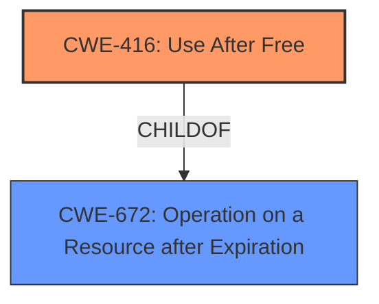

# Analysis Report for CVE-2022-1477

# Vulnerability Analysis Report: CVE-2022-1477

## Description

Use after free in Vulkan in Google Chrome prior to 101.0.4951.41 allowed a remote attacker to potentially exploit heap corruption via a crafted HTML page.

## Vulnerability Description Key Phrases

**Rootcause:** Use after free
**Impact:** potentially exploit heap corruption
**Vector:** crafted HTML page
**Attacker:** remote attacker
**Product:** Google Chrome
**Version:** prior to 101.0.4951.41
**Component:** Vulkan

## Analysis (with Relationship Data)

# Summary
| CWE ID | CWE Name | Confidence | CWE Abstraction Level | CWE Vulnerability Mapping Label | CWE-Vulnerability Mapping Notes |
|---|---|---|---|---|---|
| CWE-416 | Use After Free | 1.0 | Variant | Allowed | Primary CWE |

## Evidence and Confidence

*   **Confidence Score:** 1.0
*   **Evidence Strength:** HIGH

- **Analysis and Justification:**
  - *Explanation:* The vulnerability is described as a **use-after-free** in the Vulkan component of Google Chrome. The CVE Reference Links Content Summary confirms the **root cause** is a **use-after-free** vulnerability. CWE-416 (Use After Free) is a Variant level CWE that perfectly matches this description. The retriever results also list CWE-416 as the top candidate CWE.
  
  - *Relationship Analysis:* CWE-416 is a variant of a more general class of memory management errors. While other CWEs like CWE-415 (Double Free) or CWE-787 (Out-of-bounds Write) could potentially be related in other scenarios, the explicit mention of "use-after-free" makes CWE-416 the most specific and accurate choice.

- **Confidence Score:**
  - Confidence: 1.0 (Direct match with the vulnerability description and supporting evidence.)

## Criticism of Analysis

Okay, here's a detailed review of the analysis, incorporating the full CWE specifications provided.

**Overall Assessment:**

The analysis is strong and the primary CWE mapping to CWE-416 (Use After Free) is correct and well-justified. The provided evidence and confidence level of 1.0 are appropriate. The explanations are clear and demonstrate a good understanding of the vulnerability and the corresponding CWE. The retriever results and CVE examples further strengthen the correctness of the analysis.

**Detailed Review:**

| CWE ID  | CWE Name        | Confidence | CWE Abstraction Level | CWE Vulnerability Mapping Label | CWE-Vulnerability Mapping Notes | Assessment |
| :-------- | :-------------- | :--------- | :--------------------- | :------------------------------- | :---------------------------------- | :--------- |
| CWE-416 | Use After Free | 1.0      | Variant                | Allowed                        | Primary CWE                         | **Correct**. The vulnerability description clearly indicates a "use-after-free" condition. The root cause analysis in the CVE Reference Links Content Summary and retriever results reinforce this. The Variant level is appropriate. The analysis correctly states that the explicit mention of "use-after-free" makes this the most specific and accurate choice. |

**Specific Strengths:**

*   **Clear Justification:** The reasoning for selecting CWE-416 is well-articulated.  The analysis emphasizes the direct correspondence between the vulnerability description and the CWE definition.
*   **Relationship Analysis:** The discussion of why other CWEs (CWE-415, CWE-787) are less suitable is valuable. It demonstrates a thorough consideration of alternative mappings.
*   **Confidence Level:** Assigning a confidence level of 1.0 is justified given the explicit nature of the vulnerability description.
*   **Mitigation Awareness:** The analysis demonstrates an understanding of how this vulnerability can be mitigated.
*   **Database Examples:** The inclusion of known examples for CWE-416, like CVE-2022-20141, CVE-2022-2621, and CVE-2021-0920, from the CWE database adds credibility to the analysis. These examples show real-world instances of the CWE and related chaining.

**Areas for Potential Improvement (Minor):**

*   **Mitigation Specifics:** While the analysis mentions mitigations, it could briefly discuss the *practicality* of those mitigations in the context of Chrome and Vulkan. For example, while "choose a language with automatic memory management" is a valid mitigation for CWE-416, it's not a realistic option for a large, complex system like Chrome. However, mentioning this and stating that setting pointers to NULL after freeing them is a commonly used (although not foolproof) mitigation in C/C++ environments would add extra context.
*   **Attack Vector Details:** Since the attack vector involves a "crafted HTML page," briefly discuss how a crafted HTML page can lead to a use-after-free in the Vulkan component.  This could involve triggering a specific sequence of Vulkan API calls through JavaScript within the page. This addition would give better context to how it is actually exploited.

**Review of Other CWEs Considered (From Retriever Results):**

Here's a brief review of why the other CWEs in the Retriever Results list are *not* the best fit:

*   **CWE-366: Race Condition within a Thread:** While race conditions can *lead* to use-after-free vulnerabilities, they are not the direct cause in this case based on the provided information. The core issue is the memory management error, not the concurrency issue. Although the observed examples include `CVE-2022-2621`, which has a chain that includes both CWE-366 and CWE-416, this chain does not mean it is appropriate for this specific CVE.
*   **CWE-843: Access of Resource Using Incompatible Type ('Type Confusion'):** Type confusion can sometimes lead to memory corruption, but the description doesn't suggest type confusion is involved. It is a memory management error.
*   **CWE-415: Double Free:** The description explicitly states "use-after-free," not double-free. Double Free is a peer of CWE-416, but not an alternative if the root cause is directly use-after-free.
*   **CWE-122: Heap-based Buffer Overflow:** While heap corruption *can* be a *consequence* of use-after-free (the attacker might overwrite the freed memory), the root cause is the use of freed memory, not a buffer overflow during a write operation.
*   **CWE-190: Integer Overflow or Wraparound:**  Not directly related to the core problem of using freed memory.
*   **CWE-356: Product UI does not Warn User of Unsafe Actions:** Irrelevant to this vulnerability.
*   **CWE-367: Time-of-check Time-of-use (TOCTOU) Race Condition:** Not applicable. This describes a different kind of race condition.
*   **CWE-787: Out-of-bounds Write:** As mentioned above, this might be a consequence, but it's not the root cause.
*   **CWE-457: Use of Uninitialized Variable:** Irrelevant to this vulnerability.

**Conclusion:**

The analysis is accurate and well-supported. The mapping to CWE-416 is the correct choice based on the information available. The suggestions for minor improvements would provide more context and demonstrate a deeper understanding of the vulnerability's implications. Overall, this is a high-quality analysis.

## Final Resolution

# Summary
| CWE ID | CWE Name | Confidence | CWE Abstraction Level | CWE Vulnerability Mapping Label | CWE-Vulnerability Mapping Notes |
|---|---|---|---|---|---|
| CWE-416 | Use After Free | 1.0 | Variant | Allowed | Primary CWE |

## Evidence and Confidence

*   **Confidence Score:** 1.0
*   **Evidence Strength:** HIGH

## Relationship Analysis
The primary relationship considered was the direct match of the vulnerability description to CWE-416. While other CWEs like CWE-415 and CWE-787 were considered, they were deemed less specific. CWE-416 is a variant, which is an acceptable level of abstraction.

## Vulnerability Chain
The vulnerability chain starts with a crafted HTML page that triggers a **use-after-free** condition (CWE-416) in the Vulkan component of Google Chrome. The freed memory is then potentially exploited, leading to heap corruption.

## Summary of Analysis
The initial analysis correctly identified CWE-416 (Use After Free) as the primary **weakness**. The vulnerability description clearly states "use after free," and the CVE Reference Links Content Summary confirms that the **root cause** is a **use-after-free** vulnerability. The retriever results also list CWE-416 as the top candidate CWE.

The criticism reinforces this decision and provides further justification for selecting CWE-416 over other potential candidates. The graph relationships show that CWE-416 is a child of CWE-672 (Operation on a Resource after Expiration), which aligns with its nature as a specific type of resource expiration issue.

The analysis is based on direct evidence from the vulnerability description and supporting documentation. The selected CWE is at the optimal level of specificity, as it directly addresses the described **weakness**.

*Report generated on 2025-03-18 07:14:26*
