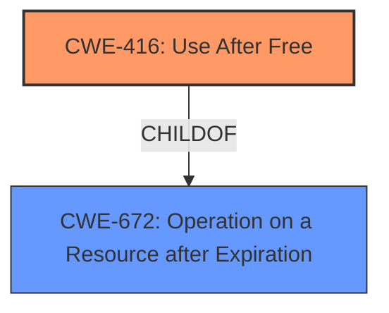

# Final Resolution for CVE-2022-1477

# Summary
| CWE ID | CWE Name | Confidence | CWE Abstraction Level | CWE Vulnerability Mapping Label | CWE-Vulnerability Mapping Notes |
|---|---|---|---|---|---|
| CWE-416 | Use After Free | 1.0 | Variant | Allowed | Primary CWE |

## Evidence and Confidence

*   **Confidence Score:** 1.0
*   **Evidence Strength:** HIGH

## Relationship Analysis
The primary relationship considered was the direct match of the vulnerability description to CWE-416. While other CWEs like CWE-415 and CWE-787 were considered, they were deemed less specific. CWE-416 is a variant, which is an acceptable level of abstraction.

## Vulnerability Chain
The vulnerability chain starts with a crafted HTML page that triggers a **use-after-free** condition (CWE-416) in the Vulkan component of Google Chrome. The freed memory is then potentially exploited, leading to heap corruption.

## Summary of Analysis
The initial analysis correctly identified CWE-416 (Use After Free) as the primary **weakness**. The vulnerability description clearly states "use after free," and the CVE Reference Links Content Summary confirms that the **root cause** is a **use-after-free** vulnerability. The retriever results also list CWE-416 as the top candidate CWE.

The criticism reinforces this decision and provides further justification for selecting CWE-416 over other potential candidates. The graph relationships show that CWE-416 is a child of CWE-672 (Operation on a Resource after Expiration), which aligns with its nature as a specific type of resource expiration issue.

The analysis is based on direct evidence from the vulnerability description and supporting documentation. The selected CWE is at the optimal level of specificity, as it directly addresses the described **weakness**.