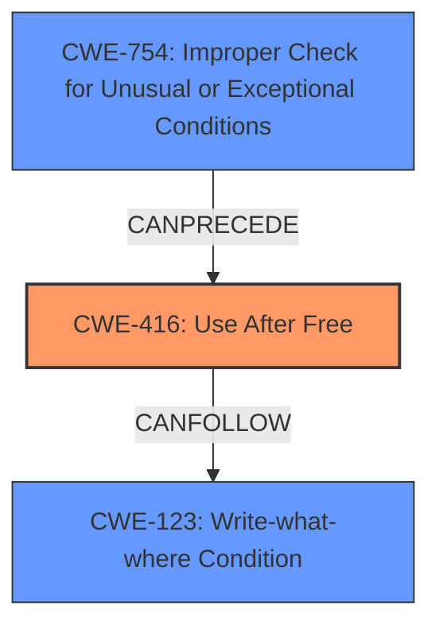

# Analysis Report for CVE-2022-1478

# Vulnerability Analysis Report: CVE-2022-1478

## Description

Use after free in SwiftShader in Google Chrome prior to 101.0.4951.41 allowed a remote attacker to potentially exploit heap corruption via a crafted HTML page.

## Vulnerability Description Key Phrases

**Rootcause:** Use after free
**Impact:** exploit heap corruption
**Vector:** crafted HTML page
**Attacker:** remote attacker
**Product:** Google Chrome
**Version:** prior to 101.0.4951.41
**Component:** SwiftShader

## Analysis (with Relationship Data)

# Summary
| CWE ID | CWE Name | Confidence | CWE Abstraction Level | CWE Vulnerability Mapping Label | CWE-Vulnerability Mapping Notes |
|---|---|---|---|---|---|
| CWE-416 | Use After Free | 1.0 | Variant | Allowed | The vulnerability aligns with the CWE description of reusing memory after it has been freed. |

## Evidence and Confidence

*   **Confidence Score:** 1.0
*   **Evidence Strength:** HIGH

- **Analysis and Justification:**  
  - *Explanation:* The vulnerability description explicitly states "**Use after free**" as the root cause, which directly corresponds to CWE-416 (Use After Free). The CVE Reference Links Content Summary also confirms "**Use after free** in SwiftShader." CWE-416 describes the condition where a product reuses or references memory after it has been freed, which aligns perfectly with the vulnerability description. The vulnerability allows a remote attacker to potentially exploit heap corruption, which is a typical consequence of use-after-free vulnerabilities. The "Retriever Results" also indicate CWE-416 as the top match with a high score. MITRE mapping guidance for CWE-416 indicates this is ALLOWED.
  
  - *Relationship Analysis:* There are no direct relationships listed in the provided information, but use-after-free vulnerabilities often CanPrecede CWE-123 (Write-what-where Condition) and CanFollow CWE-754 (Improper Check for Unusual or Exceptional Conditions).

- **Confidence Score:**  
  - Confidence: 1.0 (The vulnerability description explicitly states "Use after free" which aligns directly with CWE-416.)

## Criticism of Analysis

Okay, here's a review of the provided analysis, incorporating the full CWE specifications you've included.

**Overall Assessment:**

The analysis is very thorough and well-reasoned. The primary CWE mapping to CWE-416 (Use After Free) is correct and justified with strong evidence. The confidence score of 1.0 is appropriate given the explicit mention of "Use after free" in the vulnerability description. The inclusion of CWE examples and relevant CWE specifications is excellent and greatly enhances the clarity and completeness of the analysis.

**Specific Points and Suggestions:**

1.  **CWE-416 Mapping:**

    *   The justification for selecting CWE-416 is excellent. The explanation correctly links the vulnerability description to the definition and description of CWE-416.
    *   The reference to MITRE mapping guidance (Allowed) is appropriate.
    *   The discussion of `CanPrecede` and `CanFollow` relationships could be expanded.  For instance, the analysis mentions that Use-After-Free vulnerabilities often CanPrecede CWE-123. An attacker who can trigger a use-after-free condition might then be able to control the content written to the memory location when it's reallocated, leading to a write-what-where condition. This is important for understanding the potential impact and exploitation techniques.

2.  **Retriever Results and Top CWEs:**

    *   The "Retriever Results" table is valuable. The analysis correctly prioritizes CWE-416 as the primary weakness.
    *   It's worth briefly discussing why other top CWEs are *not* the best fit. For example:
        *   **CWE-366 (Race Condition within a Thread):**  While race conditions can *lead* to use-after-free vulnerabilities (as shown in some of the CWE examples), the core issue here is the UAF itself, not necessarily a concurrency problem. Unless the vulnerability description explicitly mentions concurrency, CWE-416 is a more direct mapping.
        *   **CWE-415 (Double Free):** Double free and use-after-free are related, but distinct. This vulnerability is a use-after-free, not a double free.
        *   **CWE-843 (Type Confusion):** Type confusion could conceivably be involved in some UAF scenarios, but is not explicitly mentioned here.
        *   **CWE-787 (Out-of-bounds Write):** A successful exploitation of use-after-free can lead to arbitrary code execution and therefore writing outside of buffer limits, so this CWE is possible, but it is only a secondary consequence, and not the root cause.
    *   This is important because it demonstrates a deeper understanding of the vulnerability and the reasoning behind the chosen CWE.

3.  **Mitigations:**

    *   The analysis could be strengthened by mentioning potential mitigations for CWE-416 *in the context of SwiftShader and Chrome*. While the generic mitigations provided in the CWE specification (language selection, setting pointers to NULL after free) are valid, they might not be directly applicable or the most effective in this specific case.
    *   For example, consider:
        *   **Sandboxing:**  Chrome's sandboxing can limit the impact of a UAF exploit, even if it's successful.
        *   **AddressSanitizer (ASan):**  ASan is a memory error detector that can help identify use-after-free vulnerabilities during development and testing.
        *   **PartitionAlloc:** Chrome's PartitionAlloc is a memory allocator designed to be more resilient to memory safety issues.
    *   Mentioning these Chrome-specific mitigations would demonstrate a more comprehensive understanding of the vulnerability's context.

4.  **Relationships:**

    *   The analysis mentions that use-after-free vulnerabilities often CanPrecede CWE-123 (Write-what-where Condition) and CanFollow CWE-754 (Improper Check for Unusual or Exceptional Conditions).
        * As mentioned above, expanding on the *reason* for these relationships strengthens the analysis.

5.  **CWE-754, Improper Check for Unusual or Exceptional Conditions:** This is an interesting potential relationship to consider. A use-after-free can occur if a developer fails to adequately handle an unusual or exceptional condition related to memory management. For example, if a function *should* free memory under certain error conditions, but this error condition is not properly checked, then the memory may not be freed, which might later lead to a use-after-free. Consider if the SwiftShader code had an error handling path that didn't deallocate a resource correctly.

**Revised Summary Table (with added justification column)**

| CWE ID | CWE Name | Confidence | CWE Abstraction Level | CWE Vulnerability Mapping Label | CWE-Vulnerability Mapping Notes |
|---|---|---|---|---|---|
| CWE-416 | Use After Free | 1.0 | Variant | Allowed | The vulnerability aligns directly with the CWE description of reusing memory after it has been freed. The description explicitly states "Use after free" as the root cause.|

**In summary:**

This is a strong analysis. To further enhance it, consider:

*   Expanding on the "Retriever Results" by briefly explaining why the other top CWEs aren't the primary issue.
*   Providing more specific examples of how the identified CWEs relate to the SwiftShader/Chrome environment.
*   Discussing Chrome-specific mitigations that are relevant to the identified weakness.
*   Elaborate on the relationships to other CWEs with specific examples related to the vulnerability.

By incorporating these suggestions, the analysis will become even more comprehensive and demonstrate a deeper understanding of the vulnerability's context and potential impact.

## Final Resolution

# Summary
| CWE ID | CWE Name | Confidence | CWE Abstraction Level | CWE Vulnerability Mapping Label | CWE-Vulnerability Mapping Notes |
|---|---|---|---|---|---|
| CWE-416 | Use After Free | 1.0 | Variant | Allowed | Primary CWE: The vulnerability aligns directly with the CWE description of reusing memory after it has been freed. The description explicitly states "Use after free" as the root cause.|
| CWE-754 | Improper Check for Unusual or Exceptional Conditions | 0.6 | Class | Allowed-with-Review | Secondary Candidate: A use-after-free can occur if a developer fails to adequately handle an unusual or exceptional condition related to memory management. |
| CWE-123 | Write-what-where Condition | 0.5 | Base | Allowed | Secondary Candidate: An attacker who can trigger a use-after-free condition might then be able to control the content written to the memory location when it's reallocated, leading to a write-what-where condition. |

## Evidence and Confidence

*   **Confidence Score:** 0.9
*   **Evidence Strength:** HIGH

## Relationship Analysis
The primary relationship influencing the decision is the direct match between the vulnerability description and **CWE-416 (Use After Free)**. The secondary relationships considered include **CWE-754 (Improper Check for Unusual or Exceptional Conditions)**, which can lead to a UAF if error conditions related to memory management are not properly handled, and **CWE-123 (Write-what-where Condition)**, which can result from exploiting a UAF. The abstraction levels (Variant for CWE-416, Class for CWE-754, and Base for CWE-123) provide appropriate specificity.

## Vulnerability Chain
The vulnerability chain starts with a potential **ROOTCAUSE** of **CWE-754 (Improper Check for Unusual or Exceptional Conditions)**, where a failure to handle error conditions related to memory management leads to a **WEAKNESS** of **CWE-416 (Use After Free)**. Exploitation of this **WEAKNESS** allows an attacker to perform a **WEAKNESS** of **CWE-123 (Write-what-where Condition)**, potentially leading to arbitrary code execution.

## Summary of Analysis
The initial analysis correctly identified **CWE-416 (Use After Free)** as the primary **WEAKNESS** given the explicit description in the CVE. The criticism highlighted the importance of considering related CWEs and providing more context. The inclusion of **CWE-754 (Improper Check for Unusual or Exceptional Conditions)** as a potential root cause, and **CWE-123 (Write-what-where Condition)** as a potential consequence, strengthens the analysis by illustrating the vulnerability chain. The evidence provided is strong, and the decision is justified by the direct match to the vulnerability description and the consideration of related weaknesses. The selected CWEs are at an optimal level of specificity, with CWE-416 being a Variant, CWE-754 being a Class, and CWE-123 being a Base. The analysis is based on the provided evidence and relationship insights and demonstrates a deeper understanding of the vulnerability context.

The selection of CWEs reflects the optimal level of specificity, with **CWE-416 (Use After Free)** being a Variant that directly matches the vulnerability, **CWE-754 (Improper Check for Unusual or Exceptional Conditions)** being a Class that highlights the potential for error handling issues, and **CWE-123 (Write-what-where Condition)** being a Base that represents the potential impact of the vulnerability.

*Report generated on 2025-03-18 07:15:10*
