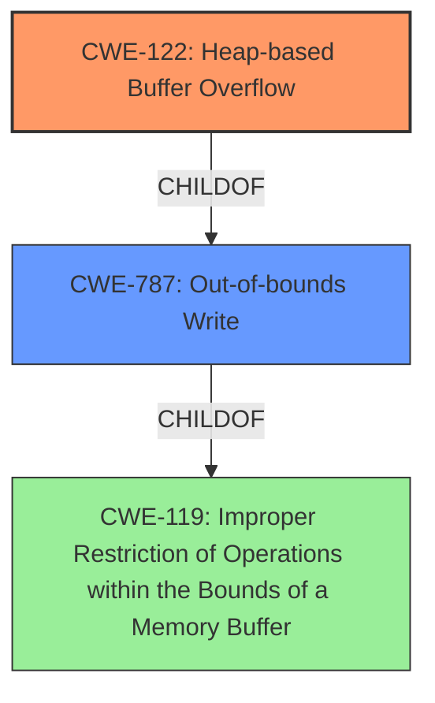

# Analysis Report for CVE-2022-1484

# Vulnerability Analysis Report: CVE-2022-1484

## Description

Heap buffer overflow in Web UI Settings in Google Chrome prior to 101.0.4951.41 allowed a remote attacker to potentially exploit heap corruption via a crafted HTML page.

## Vulnerability Description Key Phrases

**Rootcause:** buffer overflow
**Impact:** heap corruption
**Vector:** crafted HTML page
**Attacker:** remote attacker
**Product:** Google Chrome
**Version:** prior to 101.0.4951.41
**Component:** Web UI Settings

## Analysis (with Relationship Data)

# Summary
| CWE ID | CWE Name | Confidence | CWE Abstraction Level | CWE Vulnerability Mapping Label | CWE-Vulnerability Mapping Notes |
|---|---|---|---|---|---|
| CWE-122 | Heap-based Buffer Overflow | 0.9 | Variant | Allowed | Primary CWE. The vulnerability is explicitly described as a heap-based buffer overflow. |
| CWE-787 | Out-of-bounds Write | 0.7 | Base | Allowed | Secondary candidate. CWE-787 is a parent of CWE-122, and while less specific, still applies as it describes the general out-of-bounds write condition. |

## Evidence and Confidence

*   **Confidence Score:** 0.9
*   **Evidence Strength:** HIGH

- **Analysis and Justification:**  
  - *Explanation:* "The vulnerability description explicitly states a **heap buffer overflow** in Google Chrome's Web UI Settings. This directly corresponds to CWE-122 (Heap-based Buffer Overflow), which is a variant of buffer overflow specifically occurring in the heap memory region. The vulnerability details also indicate a remote attacker can trigger this via a crafted HTML page, leading to potential **heap corruption**. This aligns perfectly with the characteristics of CWE-122."
  
  - *Relationship Analysis:* "CWE-122 is a variant (more specific type) of CWE-119 (Improper Restriction of Operations within the Bounds of a Memory Buffer) and a child of CWE-787 (Out-of-bounds Write). While CWE-787 is also relevant, CWE-122 is more specific and accurately describes the location of the overflow (heap). The relationship analysis helps confirm the connection to broader buffer overflow weaknesses."

- **Confidence Score:**  
  - Confidence: 0.9 (Strong evidence based on the explicit vulnerability description and supporting CVE reference details.)

---

## Criticism of Analysis

Okay, here's a review of the provided CWE analysis, incorporating the full CWE specifications you provided.

**Overall Assessment:**

The analysis is good and correctly identifies CWE-122 (Heap-based Buffer Overflow) as the primary weakness. The reasoning is sound, and the confidence level is appropriate. Including CWE-787 as a secondary mapping is also reasonable, given its relationship to CWE-122.

**Detailed Critique:**

**1. CWE-122: Heap-based Buffer Overflow**

*   **Confidence Score:** The assigned confidence of 0.9 is justified. The vulnerability description clearly states a heap buffer overflow.
*   **Evidence Strength:**  The evidence is HIGH, as the description directly uses the term "heap buffer overflow." The mention of "heap corruption" further reinforces this.
*   **Justification:** The explanation accurately links the vulnerability description to the definition of CWE-122. The mention of a remote attacker triggering the vulnerability via a crafted HTML page, leading to heap corruption is highly aligned with CWE-122.
*   **Relationship Analysis:** The analysis correctly explains the relationship between CWE-122, CWE-119, and CWE-787.  It accurately points out that CWE-787 is relevant, but CWE-122 is more specific.
*   **Mitigation Review:** The mitigations listed in the CWE specification are applicable:
    *   **Use a language or compiler with automatic bounds checking:** This is a long-term solution and may not be feasible for existing codebases.
    *   **Use an abstraction library:** This could help to reduce the risk of using unsafe APIs directly.
    *   **Use automatic buffer overflow detection mechanisms:** Compilers flags like `/GS` (Microsoft Visual Studio) or `FORTIFY_SOURCE` (GCC) can help detect overflows at runtime.

**2. CWE-787: Out-of-bounds Write**

*   **Confidence Score:** A confidence score of 0.7 is acceptable. It acknowledges that while applicable, it is a more general weakness than CWE-122.
*   **Justification:** CWE-787 is a parent of CWE-122, and the core issue *is* an out-of-bounds write. However, since the vulnerability description explicitly calls it a *heap*-based overflow, CWE-122 is the better fit.
*   **Mitigation Review:** The mitigations for CWE-787 are essentially the same as for CWE-122, as buffer overflows are a specific type of out-of-bounds write. These mitigations are still valid and provide useful guidance.

**3. Retriever Results:**

*   The Retriever Results section reveals some interesting potential alternative CWEs. Let's address the most relevant ones:
    *   **CWE-843: Access of Resource Using Incompatible Type ('Type Confusion'):** While *possible*, this is less likely.  Type confusion can *lead* to a buffer overflow, but the primary description points to a buffer overflow directly. This would need more information to confirm, and is low probability based on the data.
    *   **CWE-193: Off-by-one Error:** This is a plausible *cause* for the buffer overflow. An off-by-one error in calculating the buffer size or the amount of data to write could lead to the overflow. However, it's not the *primary* weakness being exploited. If more info on root cause was available, this *could* be a chain, but isn't in the description.
    *   **CWE-366: Race Condition within a Thread** While this is a possibility, there's no indication of concurrency or multithreading being involved in the vulnerability.  It's unlikely based on the available information.
    *    **CWE-416: Use After Free**: Is unlikely. The description does not state anything about memory being freed and then used after.
    *   **CWE-190: Integer Overflow or Wraparound:** Similar to CWE-193, an integer overflow could lead to an incorrect buffer size calculation, resulting in the overflow. This is a possible *cause*, but not the primary weakness, unless further info was available.
    *   **CWE-121: Stack-based Buffer Overflow**: Is impossible based on analysis. We know it is a *heap* buffer overflow.

**Recommendations for Improvement:**

1.  **Chain Analysis (If Possible):** While CWE-122 is the correct primary weakness, consider if more information can be gathered about the root cause. Was there an integer overflow (CWE-190) or an off-by-one error (CWE-193) that *led* to the heap buffer overflow? Adding this information, even with lower confidence, can improve the value of the analysis. However, based on description, you cannot make these assumptions.
2.  **Exploitation Details:**  If possible, even a brief description of how the attacker "crafts" the HTML page to trigger the overflow would be valuable. What specific settings or data are manipulated? This could help developers understand the vulnerability better.

**Revised Summary (incorporating potential chaining):**

| CWE ID | CWE Name | Confidence | CWE Abstraction Level | CWE Vulnerability Mapping Label | CWE-Vulnerability Mapping Notes |
|---|---|---|---|---|---|
| CWE-122 | Heap-based Buffer Overflow | 0.9 | Variant | Allowed | Primary CWE. The vulnerability is explicitly described as a heap-based buffer overflow. |
| CWE-787 | Out-of-bounds Write | 0.7 | Base | Allowed | Secondary candidate. CWE-787 is a parent of CWE-122, and while less specific, still applies as it describes the general out-of-bounds write condition. |
| CWE-193 | Off-by-one Error | 0.3 | Base | Allowed | Potential cause.  An off-by-one error in calculating the buffer size or amount of data to write *could* have led to the overflow. Requires further investigation (low confidence). |
| CWE-190 | Integer Overflow or Wraparound | 0.3 | Base | Allowed | Potential cause. An integer overflow *could* lead to an incorrect buffer size calculation, resulting in the overflow. Requires further investigation (low confidence). |

**In conclusion:**

The core analysis is correct and well-justified. The key area for improvement is to explore potential contributing factors or root causes that may have led to the heap buffer overflow, if additional information is available. The recommendations in point 1 should only be considered if such information is available and is not based solely on assumptions.

## Final Resolution

# Summary
| CWE ID | CWE Name | Confidence | CWE Abstraction Level | CWE Vulnerability Mapping Label | CWE-Vulnerability Mapping Notes |
|---|---|---|---|---|---|
| CWE-122 | Heap-based Buffer Overflow | 0.9 | Variant | Allowed | Primary CWE. The vulnerability is explicitly described as a **heap buffer overflow**. |
| CWE-787 | Out-of-bounds Write | 0.7 | Base | Allowed | Secondary candidate. CWE-787 is a parent of CWE-122, and while less specific, still applies as it describes the general out-of-bounds write condition. |

## Evidence and Confidence

*   **Confidence Score:** 0.9
*   **Evidence Strength:** HIGH

## Relationship Analysis
The primary relationship influencing the decision is the parent-child relationship between CWE-787 (Out-of-bounds Write) and CWE-122 (Heap-based Buffer Overflow). CWE-122 is a more specific variant of CWE-787. Since the vulnerability description explicitly mentions a **heap buffer overflow**, selecting CWE-122 provides a more accurate and specific classification. There are other potential CWEs related to integer overflows or off-by-one errors that could *potentially* lead to a **heap buffer overflow**, but without further evidence, these are speculative. The analysis prioritizes specificity based on direct evidence.

## Vulnerability Chain
The vulnerability chain is relatively straightforward based on the provided information.
  - The root cause is an unspecified error that leads to a **heap buffer overflow**.
  - The **WEAKNESS** is CWE-122 (Heap-based Buffer Overflow), where a buffer allocated on the heap is written to beyond its boundaries.
  - The impact is potential **heap corruption**, which can lead to arbitrary code execution or other security breaches.

Based on the provided information, potential contributing factors such as integer overflows (CWE-190) or off-by-one errors (CWE-193) cannot be confirmed.

## Summary of Analysis
The analysis is primarily based on the explicit vulnerability description, which states a "**heap buffer overflow**." This directly maps to CWE-122. The criticism correctly points out that while other CWEs might *potentially* be involved as contributing factors (e.g., CWE-190, CWE-193), there is no direct evidence to support their inclusion. Therefore, sticking with CWE-122 as the primary **WEAKNESS** and CWE-787 as a secondary, more general classification is the most appropriate decision. The graph relationships confirm that CWE-122 is a more specific variant of CWE-787, justifying its selection as the primary CWE.
The decision is based on the available evidence, prioritizing specificity, and considering the relationships between CWEs. CWE-122 is at the optimal level of specificity because the vulnerability description explicitly mentions the heap.

*Report generated on 2025-03-18 07:18:41*
