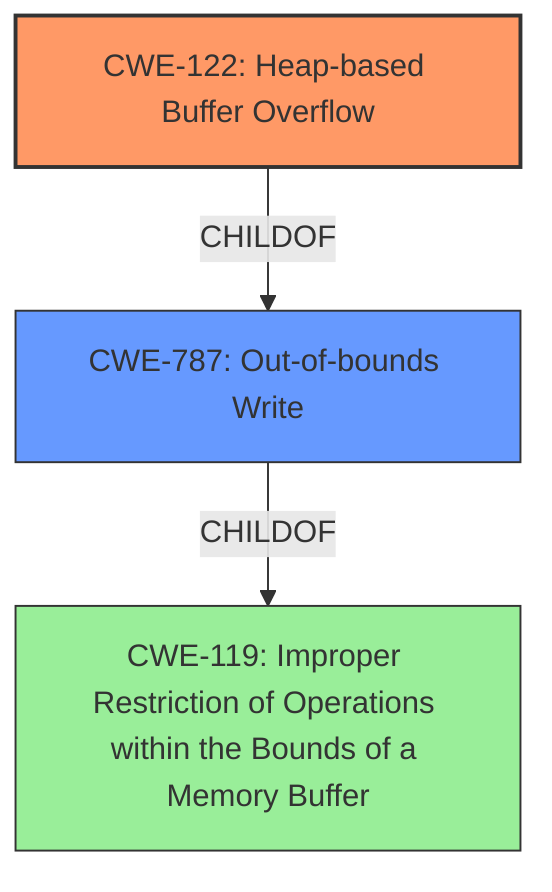

# Final Resolution for CVE-2022-1484

# Summary
| CWE ID | CWE Name | Confidence | CWE Abstraction Level | CWE Vulnerability Mapping Label | CWE-Vulnerability Mapping Notes |
|---|---|---|---|---|---|
| CWE-122 | Heap-based Buffer Overflow | 0.9 | Variant | Allowed | Primary CWE. The vulnerability is explicitly described as a **heap buffer overflow**. |
| CWE-787 | Out-of-bounds Write | 0.7 | Base | Allowed | Secondary candidate. CWE-787 is a parent of CWE-122, and while less specific, still applies as it describes the general out-of-bounds write condition. |

## Evidence and Confidence

*   **Confidence Score:** 0.9
*   **Evidence Strength:** HIGH

## Relationship Analysis
The primary relationship influencing the decision is the parent-child relationship between CWE-787 (Out-of-bounds Write) and CWE-122 (Heap-based Buffer Overflow). CWE-122 is a more specific variant of CWE-787. Since the vulnerability description explicitly mentions a **heap buffer overflow**, selecting CWE-122 provides a more accurate and specific classification. There are other potential CWEs related to integer overflows or off-by-one errors that could *potentially* lead to a **heap buffer overflow**, but without further evidence, these are speculative. The analysis prioritizes specificity based on direct evidence.

## Vulnerability Chain
The vulnerability chain is relatively straightforward based on the provided information.
  - The root cause is an unspecified error that leads to a **heap buffer overflow**.
  - The **WEAKNESS** is CWE-122 (Heap-based Buffer Overflow), where a buffer allocated on the heap is written to beyond its boundaries.
  - The impact is potential **heap corruption**, which can lead to arbitrary code execution or other security breaches.

Based on the provided information, potential contributing factors such as integer overflows (CWE-190) or off-by-one errors (CWE-193) cannot be confirmed.

## Summary of Analysis
The analysis is primarily based on the explicit vulnerability description, which states a "**heap buffer overflow**." This directly maps to CWE-122. The criticism correctly points out that while other CWEs might *potentially* be involved as contributing factors (e.g., CWE-190, CWE-193), there is no direct evidence to support their inclusion. Therefore, sticking with CWE-122 as the primary **WEAKNESS** and CWE-787 as a secondary, more general classification is the most appropriate decision. The graph relationships confirm that CWE-122 is a more specific variant of CWE-787, justifying its selection as the primary CWE.
The decision is based on the available evidence, prioritizing specificity, and considering the relationships between CWEs. CWE-122 is at the optimal level of specificity because the vulnerability description explicitly mentions the heap.