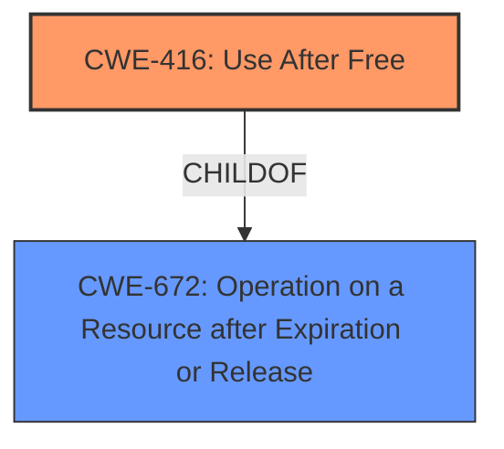

# Final Resolution for CVE-2022-1487

# Summary
| CWE ID | CWE Name | Confidence | CWE Abstraction Level | CWE Vulnerability Mapping Label | CWE-Vulnerability Mapping Notes |
|---|---|---|---|---|---|
| CWE-416 | Use After Free | 1.0 | Variant | Allowed | Primary CWE |

## Evidence and Confidence

*   **Confidence Score:** 1.0
*   **Evidence Strength:** HIGH

## Relationship Analysis
The analysis correctly identifies CWE-416 as the primary **weakness**. The vulnerability description explicitly mentions "Use after free," which aligns directly with the definition of CWE-416. CWE-416 is a Variant of CWE-672 (Operation on Resource after Expiry). The selection of CWE-416 is appropriate because it is more specific than its parent, CWE-672. No chain relationships are explicitly mentioned in the description.

## Vulnerability Chain
The vulnerability chain consists of the **root cause** of using memory after it has been freed, leading to potential **heap corruption** and exploitable conditions. The chain can be described as:

1.  Memory is freed.
2.  The same memory is accessed after being freed (**CWE-416**).
3.  This leads to heap corruption.
4.  A remote attacker exploits the heap corruption.

## Summary of Analysis
The initial analysis and criticism both converge on the conclusion that CWE-416 (Use After Free) is the most appropriate classification for this vulnerability. The vulnerability description clearly states "Use after free," providing direct evidence.
The selection of CWE-416 is at the optimal level of specificity, as it is a Variant-level CWE that directly addresses the **root cause** of the vulnerability. While other CWEs might be related (e.g., **CWE-362**, **CWE-415**), they represent either potential contributing factors or consequences rather than the primary **weakness**. The vulnerability description mentions "heap corruption," which is a consequence of **CWE-416**.
The graph relationships, specifically the parent-child relationship between CWE-672 and CWE-416, confirm that choosing the more specific CWE-416 is the right approach. The confidence in this assessment is high (1.0) due to the direct evidence and the clear alignment with CWE guidelines.