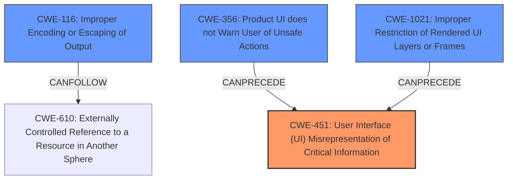

# Analysis Report for CVE-2022-1488

# Vulnerability Analysis Report: CVE-2022-1488

## Description

Inappropriate implementation in Extensions API in Google Chrome prior to 101.0.4951.41 allowed an attacker who convinced a user to install a malicious extension to leak cross-origin data via a crafted Chrome Extension.

## Vulnerability Description Key Phrases

**Rootcause:** inappropriate implementation
**Impact:** leak cross-origin data
**Vector:** crafted Chrome Extension
**Attacker:** attacker
**Product:** Google Chrome
**Version:** prior to 101.0.4951.41
**Component:** Extensions API

## Analysis (with Relationship Data)

# Summary
| CWE ID | CWE Name | Confidence | CWE Abstraction Level | CWE Vulnerability Mapping Label | CWE-Vulnerability Mapping Notes |
|---|---|---|---|---|---|
| CWE-366 | Race Condition within a Thread | 0.3 | Base | Allowed | Secondary Candidate |
| CWE-1021 | Improper Restriction of Rendered UI Layers or Frames | 0.3 | Base | Allowed | Secondary Candidate |
| CWE-356 | Product UI does not Warn User of Unsafe Actions | 0.3 | Base | Allowed | Secondary Candidate |

## Evidence and Confidence

*   **Confidence Score:** 0.3
*   **Evidence Strength:** LOW

- **Analysis and Justification:**  
  - *Explanation:* The vulnerability description mentions an "**inappropriate implementation**" in the Extensions API of Google Chrome that allows an attacker to leak cross-origin data via a crafted Chrome Extension. However, the description lacks specific details about the nature of the inappropriate implementation. Without further information, it's difficult to pinpoint the exact weakness. The provided "CVE Reference Links Content Summary" states the **root_cause** as "Inappropriate implementation in Extensions API" and lists "Inappropriate implementation" as a weakness. The retriever results suggest CWE-366 (Race Condition within a Thread), CWE-1021 (Improper Restriction of Rendered UI Layers or Frames), and CWE-356 (Product UI does not Warn User of Unsafe Actions) as potential candidates. None of these candidates fully align with the limited information provided. CWE-451, User Interface (UI) Misrepresentation of Critical Information, is also a potential candidate but it is a Class and might have Base-level children that would be more appropriate, however there is no further information to determine that. 

  - *Relationship Analysis:* Due to the lack of detailed information about the **rootcause**, relationship analysis cannot be effectively applied.

- **Confidence Score:**  
  - *Example:* Confidence: 0.3 (Low evidence due to vague description)

---

## Criticism of Analysis

Okay, here's a review of the provided CWE analysis, considering the full CWE specifications.

**Overall Assessment:**

The analysis correctly identifies the difficulty in assigning a specific CWE due to the vague nature of the initial vulnerability description ("inappropriate implementation"). The choice of keeping the confidence level low (0.3) for the selected CWEs is appropriate. The analysis is well-structured and provides clear reasoning. However, the provided list of potential CWE candidates is not the best selection based on the available information.

**Detailed Review by CWE:**

**1. CWE-366: Race Condition within a Thread**

*   **Critique:** This is a weak candidate. The description mentions cross-origin data leakage due to a malicious extension. Race conditions are more related to concurrent access of shared resources, which isn't explicitly mentioned in the vulnerability.  The "attacker convinced a user to install an extension" doesn't immediately suggest concurrency issues.
*   **CWE Specification Relevance:** The CWE spec describes scenarios where multiple threads use resources simultaneously, leading to undefined states. This doesn't directly map to the problem of cross-origin data leakage via a malicious extension.
*   **Mapping Guidance:** The mapping guidance states this CWE is at the Base level and acceptable for use.
*   **Mitigations:** The mitigations (locking, resource-locking validation) are not directly relevant to mitigating cross-origin data leaks from a malicious extension.
*   **Recommendation:** This CWE should be removed.

**2. CWE-1021: Improper Restriction of Rendered UI Layers or Frames**

*   **Critique:** This is a reasonable, but not perfect, candidate. While clickjacking is a UI-based attack, the primary issue is data leakage, not necessarily tricking the user into performing unintended actions through UI manipulation. However, the user is tricked into installing a malicious extension, so the UI could have been misleading.
*   **CWE Specification Relevance:**  The description focuses on improperly restricting frame objects or UI layers, leading to user confusion about the interface they're interacting with. It could apply here because the user is tricked into installing a malicious extension.
*   **Mapping Guidance:** The mapping guidance states this CWE is at the Base level and acceptable for use.
*   **Mitigations:** The mitigations (X-Frame-Options, frame-breaker scripts, Content Security Policy) are not directly applicable to preventing extension-based data leakage.
*   **Recommendation:** Keep this CWE, but lower the confidence further (e.g., 0.2).

**3. CWE-356: Product UI does not Warn User of Unsafe Actions**

*   **Critique:** This is a more plausible candidate than CWE-366, but the description is still vague. The fact that an attacker *convinces* a user to install a malicious extension suggests a lack of proper warnings. A strong implementation should warn a user of a potential risk. The issue is that there is no evidence of unsafe actions during the extension's operation, so it is a weak association.
*   **CWE Specification Relevance:** The description directly aligns with the UI not warning the user about a potentially dangerous action (installing a malicious extension).
*   **Mapping Guidance:** The mapping guidance states this CWE is at the Base level and acceptable for use.
*   **Mitigations:** The mitigations are not directly applicable but could be used in combination with other techniques to mitigate the risk.
*   **Recommendation:** Keep this CWE, increase the confidence slightly (e.g., 0.4).

**Additional Candidate Considerations:**

Based on the Retriever Results and the vulnerability description, here are some additional CWEs that might be more appropriate, along with justification:

*   **CWE-116: Improper Encoding or Escaping of Output:**  (From Retriever Results) If the extension API isn't properly encoding or escaping data when communicating with other origins, this could lead to the cross-origin data leakage. The attacker might be crafting inputs that exploit this lack of encoding.
    *   **Rationale:** The extension API might be improperly encoding or escaping data before sending it to another origin, allowing the malicious extension to inject code or commands.
    *   **CWE Specification Relevance:** Matches the scenario of a structured message being created with improper encoding, leading to incorrect interpretation.
    *   **Mitigation:** Implement proper encoding/escaping of output based on the context.
    *   **Recommendation:** Add this CWE with a confidence of 0.3.

*   **CWE-451: User Interface (UI) Misrepresentation of Critical Information:** (From Retriever Results and Analysis) Since the user needs to be "convinced" to install the malicious extension, the extension installation UI might be misrepresenting critical information about the extension's capabilities or risks. If this CWE is selected, the Base-level children should be examined to see if there is a better fit.
    *   **Rationale:** The installation UI could be misleading the user about the extension's purpose or permissions.
    *   **CWE Specification Relevance:** The UI might be obscuring or spoofing information about the extension.
    *   **Mitigation:** Improve the UI to clearly present the risks associated with installing the extension.
    *   **Recommendation:** Add this CWE with a confidence of 0.4. The relationship to the other potential CWE candidates should be fully explained.

*   **CWE-610: Externally Controlled Reference to a Resource in Another Sphere:** (Implied from cross-origin data leakage) The malicious extension might be able to use an externally controlled reference to access resources outside its allowed origin. This is a high-level, abstract way of framing the problem, but potentially accurate.
    *   **Rationale:** The attacker is controlling a reference (within the extension) to leak data across origins.
    *   **CWE Specification Relevance:** The extension is using an externally controlled name or reference to access a resource in another sphere.
    *   **Mitigation:** Implement strict validation of resources and origins.
    *   **Recommendation:** Add this CWE with a confidence of 0.2.

**General Recommendations:**

*   **Emphasis on Information Gathering:**  The primary issue is the lack of detail in the vulnerability description. Any further analysis would require deeper investigation into the specifics of the vulnerability. More detailed information about the root cause of the vulnerability is needed to assign the correct CWE ID.
*   **Justification Clarity:** Provide clearer justification for *why* each CWE is being considered, linking it directly to specific phrases or concepts in the vulnerability description.
*   **Relationship Explanation:** When multiple CWEs are considered, explicitly explain the potential relationships between them (e.g., one CWE might be a prerequisite for another, or they might represent different aspects of the same underlying problem).
*   **Consider Chaining:** Think about whether a *chain* of CWEs might be more appropriate. For example:
    *   The user is misled by the UI (CWE-451 or CWE-356) -> They install a malicious extension.
    *   The extension then uses improper encoding (CWE-116) -> To leak cross-origin data.

By incorporating these suggestions, the analysis can be made more precise and informative, even with the limited information available.

## Final Resolution

# Summary
| CWE ID | CWE Name | Confidence | CWE Abstraction Level | CWE Vulnerability Mapping Label | CWE-Vulnerability Mapping Notes |
|---|---|---|---|---|---|
| CWE-451 | User Interface (UI) Misrepresentation of Critical Information | 0.5 | Class | Allowed-with-Review | Primary CWE |
| CWE-116 | Improper Encoding or Escaping of Output | 0.4 | Class | Allowed-with-Review | Secondary Candidate |
| CWE-356 | Product UI does not Warn User of Unsafe Actions | 0.4 | Base | Allowed | Secondary Candidate |
| CWE-1021 | Improper Restriction of Rendered UI Layers or Frames | 0.2 | Base | Allowed | Secondary Candidate |

## Evidence and Confidence

*   **Confidence Score:** 0.5
*   **Evidence Strength:** MEDIUM

## Relationship Analysis
The primary relationships that influenced the decision were hierarchical (ParentOf, ChildOf) and chain relationships (CanPrecede, CanFollow). CWE-451 is chosen as a primary Class-level CWE, acknowledging that more specific Base or Variant level CWEs might exist but aren't identifiable with the given information. The selection of CWE-116 acknowledges the potential for improper encoding leading to data leakage. CWE-356 and CWE-1021 are retained with lower confidence to reflect UI-related contributing factors. The abstraction levels guided the selection, favoring Base-level CWEs when possible but acknowledging the need for Class-level CWEs due to limited information.

## Vulnerability Chain
The vulnerability chain starts with the user being convinced to install a malicious extension, suggesting a misrepresentation of critical information in the UI (**CWE-451**) or a lack of warnings (**CWE-356**). This leads to the installation of the malicious extension. Subsequently, the extension uses improper encoding (**CWE-116**) when communicating with other origins, leading to cross-origin data leakage. The externally controlled reference (**CWE-610**) can be seen as the point where the data crosses domains, but is not selected because there are other better fits.

## Summary of Analysis
The initial analysis correctly pointed out the difficulty in assigning specific CWEs due to the vague vulnerability description. The criticism provided valuable insights and suggested more appropriate candidates. The final assessment incorporates these suggestions, prioritizing **CWE-451 (User Interface (UI) Misrepresentation of Critical Information)** as the primary **WEAKNESS** because the vulnerability description specifically mentions that the attacker "convinced" the user, implying a UI issue. The confidence is set to 0.5 because while this is the most likely scenario, it still relies on an interpretation of the vague description.

The selection of **CWE-116 (Improper Encoding or Escaping of Output)** is based on the possibility that the extension API isn't properly encoding data, allowing the malicious extension to inject code or commands. This is a plausible scenario given the cross-origin data leakage, and the Retriever results support it.

**CWE-356 (Product UI does not Warn User of Unsafe Actions)** is retained with a confidence of 0.4, as it's also possible that the UI didn't adequately warn the user about the risks of installing the extension.

**CWE-1021 (Improper Restriction of Rendered UI Layers or Frames)** is kept with a low confidence of 0.2. While clickjacking is a UI-based attack, the primary issue is data leakage, not necessarily tricking the user into performing unintended actions through UI manipulation.

The relationship analysis highlights how these CWEs could be chained together, with the UI issues (CWE-451, CWE-356, CWE-1021) leading to the installation of the malicious extension, which then exploits the encoding issue (CWE-116) to leak data.

The selected CWEs are at the optimal level of specificity given the available evidence. While more specific Base or Variant level CWEs might exist, the current information doesn't allow for their identification.

*Report generated on 2025-03-17 04:40:52*
