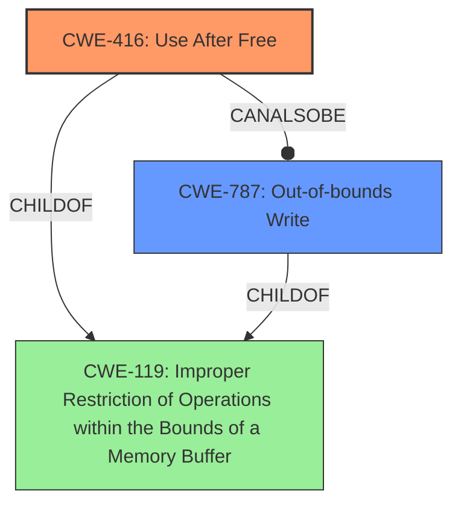

# Final Resolution for CVE-2022-1489

# Summary
| CWE ID | CWE Name | Confidence | CWE Abstraction Level | CWE Vulnerability Mapping Label | CWE-Vulnerability Mapping Notes |
|---|---|---|---|---|---|
| CWE-416 | Use After Free | 0.85 | Variant | Allowed | Primary CWE |
| CWE-787 | Out-of-bounds Write | 0.60 | Base | Allowed | Secondary Candidate |

## Evidence and Confidence

*   **Confidence Score:** 0.80
*   **Evidence Strength:** MEDIUM

## Relationship Analysis
The primary CWE, CWE-416 (**Use After Free**), is a variant of CWE-119 (**Improper Restriction of Operations within the Bounds of a Memory Buffer**). This parent-child relationship indicates that CWE-416 is a more specific instance of a broader class of buffer management issues. CWE-787 (**Out-of-bounds Write**) is also a child of CWE-119, indicating a potential peer relationship as alternative manifestations of the same underlying issue.

## Vulnerability Chain
The vulnerability chain starts with a specific user interaction that triggers a **Use After Free** condition (CWE-416). This allows an attacker to potentially corrupt the heap. The **Out-of-bounds Write** (CWE-787) could be the mechanism by which the heap corruption is achieved after the memory has been freed. The description indicates an out-of-bounds memory access leading to heap corruption, suggesting that exploiting the use-after-free vulnerability results in writing to unintended memory locations.

## Summary of Analysis
The initial analysis correctly identifies CWE-416 (**Use After Free**) as the primary CWE due to the vulnerability description stating "out of bounds memory access" leading to "heap corruption." The criticism suggests that the inclusion of CWE-787 (**Out-of-bounds Write**) as a secondary candidate requires more justification related to how it leads to heap corruption. While the initial description lacks the specifics, the **Use After Free** condition can lead to heap corruption via an **Out-of-bounds Write**.

The evidence provided only mentions "out of bounds memory access" and "heap corruption" from the vulnerability description.

The relationship analysis supports the selection of CWE-416 as a more specific instance of CWE-119, while also acknowledging that CWE-787 represents a plausible alternative or contributing factor.

The final decision maintains CWE-416 as the primary CWE due to its direct link to "heap corruption". CWE-787 is retained as a secondary candidate with slightly decreased confidence because an out-of-bounds write is a likely mechanism for exploiting the **Use After Free** and causing the corruption. Both CWEs are at the optimal level of specificity, with CWE-416 being a Variant and CWE-787 a Base.