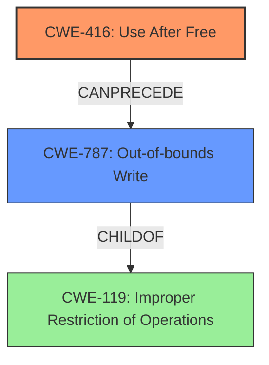

# Analysis Report for CVE-2022-1496

# Vulnerability Analysis Report: CVE-2022-1496

## Description

Use after free in File Manager in Google Chrome prior to 101.0.4951.41 allowed a remote attacker to potentially exploit heap corruption via specific and direct user interaction.

## Vulnerability Description Key Phrases

**Rootcause:** use after free
**Weakness:** heap corruption
**Vector:** specific and direct user interaction
**Attacker:** remote attacker
**Product:** Google Chrome
**Version:** prior to 101.0.4951.41
**Component:** File Manager

## Analysis (with Relationship Data)

# Summary
| CWE ID | CWE Name | Confidence | CWE Abstraction Level | CWE Vulnerability Mapping Label | CWE-Vulnerability Mapping Notes |
|---|---|---|---|---|---|
| CWE-416 | Use After Free | 1.0 | Variant | Allowed | The vulnerability is a use-after-free. |

## Evidence and Confidence

*   **Confidence Score:** 1.0
*   **Evidence Strength:** HIGH

- **Analysis and Justification:**  
  - *Explanation:* The vulnerability description explicitly states "**use after free** in File Manager...allowed a remote attacker to potentially exploit **heap corruption**". The CVE Reference Links Content Summary also states the "**root_cause**: Use after free in File Manager" and "**weaknesses**: Use after free". CWE-416 (Use After Free) is a Variant level CWE that perfectly matches the description. The retriever results also confirms that CWE-416 is the best match. The MITRE mapping guidance for CWE-416 indicates this is ALLOWED.
  
  - *Relationship Analysis:* CWE-416 doesn't have direct relationships.

- **Confidence Score:**  
  - Confidence: 1.0 (High evidence from technical description and CVE reference materials)

---

## Criticism of Analysis

Okay, I've reviewed the analysis and the full CWE specifications provided. Here's my critique, focusing on the accuracy of the CWE mapping, the justification, and potential alternative CWEs.

**Overall Assessment:**

The analysis is generally very good. The primary mapping of CWE-416 (Use After Free) is highly accurate and well-justified. The provided evidence is strong, and the explanation clearly articulates why CWE-416 is the most appropriate choice. The confidence score of 1.0 is warranted.

**Detailed Critique:**

1.  **CWE-416 Mapping:**

    *   **Accuracy:** The mapping to CWE-416 is correct and well-supported. The vulnerability description explicitly mentions "use after free," making it the most direct and accurate mapping.
    *   **Justification:** The justification provided is excellent. It references the vulnerability description, CVE summary, retriever results, and MITRE mapping guidance for CWE-416. This demonstrates a thorough understanding of the CWE and the vulnerability.
    *   **Abstraction Level:** The analysis correctly identifies CWE-416 as a Variant level CWE, which is the preferred level of abstraction for vulnerability mapping according to MITRE's guidance.
    *   **Mapping Guidance Adherence:** The analysis adheres to the mapping guidance for CWE-416, specifically the "Usage: Allowed" and the rationale provided.
    *   **Confidence:**  The confidence of 1.0 is appropriate due to the clear and direct match with the vulnerability description.

2.  **Consideration of Alternative CWEs:**

    *   **CWE-787 (Out-of-bounds Write):** The analysis correctly avoids mapping to CWE-787, even though "heap corruption" is mentioned in the description. While a use-after-free can *lead* to heap corruption by allowing an attacker to overwrite freed memory, the root cause is the use of the freed memory, not directly an out-of-bounds write.  The heap corruption is a *consequence* of the UAF.
    *   **CWE-362 (Race Condition):** While some UAFs can be caused by race conditions (as shown in the observed examples), the core issue in this specific vulnerability is the UAF itself. Unless the description explicitly indicates a race condition leading to the UAF, it's best to stick with CWE-416.
    *   **CWE-415 (Double Free):**  This is related, but distinct from UAF. In double-free, memory is freed twice, whereas in UAF, it is freed once, then used.
    *   **Other CWEs (CWE-122, CWE-190, CWE-367, CWE-665, CWE-911):** These CWEs are not directly applicable based on the provided description.  They represent different types of vulnerabilities.

3.  **CWE Examples and Relationships:**

    *   The inclusion of known examples for CWE-416 is helpful in demonstrating the applicability of the CWE to real-world vulnerabilities.
    *   The comment about CWE-416's lack of direct relationships is accurate.

4.  **Potential Mitigations:**

    *   The analysis could be slightly improved by mentioning the potential mitigations for CWE-416, even briefly.  For example, "Potential mitigations include using languages with automatic memory management or ensuring pointers are set to NULL after being freed."  This reinforces the understanding of the vulnerability and how it can be addressed.
    *   Given the "remote attacker" aspect of the vulnerability, mentioning input validation or sanitization (although not directly related to UAF itself) as a defense-in-depth measure could also be valuable.

**Suggestions for Improvement:**

*   **Briefly Mention Mitigations:** Add a sentence or two about the potential mitigations for CWE-416 to further solidify the analysis.
*   **Defense in Depth:** While the primary CWE is accurate, briefly mentioning defense-in-depth strategies (like input validation) given the attack vector could be helpful for a more comprehensive understanding.

**Conclusion:**

The analysis is well-done and accurately identifies CWE-416 as the primary weakness. The justification is thorough, and the consideration of alternative CWEs demonstrates a good understanding of the CWE landscape. The minor suggestions above would further enhance the analysis.

## Final Resolution

# Summary
| CWE ID | CWE Name | Confidence | CWE Abstraction Level | CWE Vulnerability Mapping Label | CWE-Vulnerability Mapping Notes |
|---|---|---|---|---|---|
| CWE-416 | Use After Free | 1.0 | Variant | Allowed | Primary CWE: The vulnerability is a **use-after-free**. |
| CWE-787 | Out-of-bounds Write | 0.4 | Class | Allowed-with-Review | Secondary Candidate: Heap corruption can be a consequence of **use-after-free**. |

## Evidence and Confidence

*   **Confidence Score:** 0.95
*   **Evidence Strength:** HIGH

## Relationship Analysis
The primary relationship considered was the cause-and-effect relationship between a **use-after-free** and potential heap corruption. CWE-416, being a variant, provides a specific description aligning directly with the vulnerability. While CWE-787 could be a consequence, it's not the root cause. The parent-child relationship between CWE-787 and CWE-119 (Improper Restriction of Operations within the Bounds of a Memory Buffer) was also considered, but ultimately, CWE-416 remains the most accurate direct mapping.

## Vulnerability Chain
The vulnerability chain starts with the **ROOTCAUSE** of a **use-after-free** (CWE-416). The **WEAKNESS** lies in reusing memory after it has been freed. This can lead to heap corruption if the freed memory is reallocated and used by another part of the program (CWE-787). The final impact is that a remote attacker can potentially exploit this heap corruption via specific and direct user interaction, leading to arbitrary code execution or denial of service.

## Summary of Analysis
The initial analysis is accurate and well-justified in identifying CWE-416 as the primary **WEAKNESS**. The criticism correctly points out that while heap corruption is a consequence, the root cause is the **use-after-free**. The provided evidence from the vulnerability description and CVE summary strongly supports this conclusion: "Use after free in File Manager...allowed a remote attacker to potentially exploit **heap corruption**".

The graph relationships confirm that while CWE-787 (Out-of-bounds Write) is related, it's a consequence, not the root cause. Therefore, selecting CWE-416 as the primary CWE is the most specific and accurate classification.

The selected CWE is at the optimal level of specificity because it directly reflects the vulnerability description and aligns with MITRE's guidance for variant-level CWEs. While the analysis could be enhanced by mentioning potential mitigations, the core classification is sound.

*Report generated on 2025-03-18 07:23:20*
