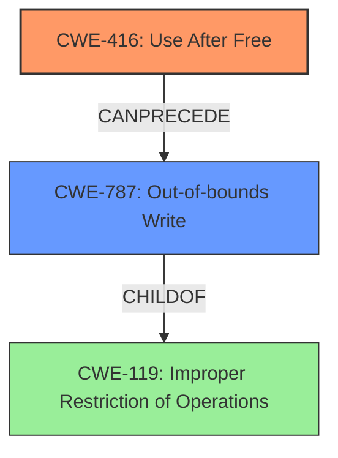

# Final Resolution for CVE-2022-1496

# Summary
| CWE ID | CWE Name | Confidence | CWE Abstraction Level | CWE Vulnerability Mapping Label | CWE-Vulnerability Mapping Notes |
|---|---|---|---|---|---|
| CWE-416 | Use After Free | 1.0 | Variant | Allowed | Primary CWE: The vulnerability is a **use-after-free**. |
| CWE-787 | Out-of-bounds Write | 0.4 | Class | Allowed-with-Review | Secondary Candidate: Heap corruption can be a consequence of **use-after-free**. |

## Evidence and Confidence

*   **Confidence Score:** 0.95
*   **Evidence Strength:** HIGH

## Relationship Analysis
The primary relationship considered was the cause-and-effect relationship between a **use-after-free** and potential heap corruption. CWE-416, being a variant, provides a specific description aligning directly with the vulnerability. While CWE-787 could be a consequence, it's not the root cause. The parent-child relationship between CWE-787 and CWE-119 (Improper Restriction of Operations within the Bounds of a Memory Buffer) was also considered, but ultimately, CWE-416 remains the most accurate direct mapping.

## Vulnerability Chain
The vulnerability chain starts with the **ROOTCAUSE** of a **use-after-free** (CWE-416). The **WEAKNESS** lies in reusing memory after it has been freed. This can lead to heap corruption if the freed memory is reallocated and used by another part of the program (CWE-787). The final impact is that a remote attacker can potentially exploit this heap corruption via specific and direct user interaction, leading to arbitrary code execution or denial of service.

## Summary of Analysis
The initial analysis is accurate and well-justified in identifying CWE-416 as the primary **WEAKNESS**. The criticism correctly points out that while heap corruption is a consequence, the root cause is the **use-after-free**. The provided evidence from the vulnerability description and CVE summary strongly supports this conclusion: "Use after free in File Manager...allowed a remote attacker to potentially exploit **heap corruption**".

The graph relationships confirm that while CWE-787 (Out-of-bounds Write) is related, it's a consequence, not the root cause. Therefore, selecting CWE-416 as the primary CWE is the most specific and accurate classification.

The selected CWE is at the optimal level of specificity because it directly reflects the vulnerability description and aligns with MITRE's guidance for variant-level CWEs. While the analysis could be enhanced by mentioning potential mitigations, the core classification is sound.