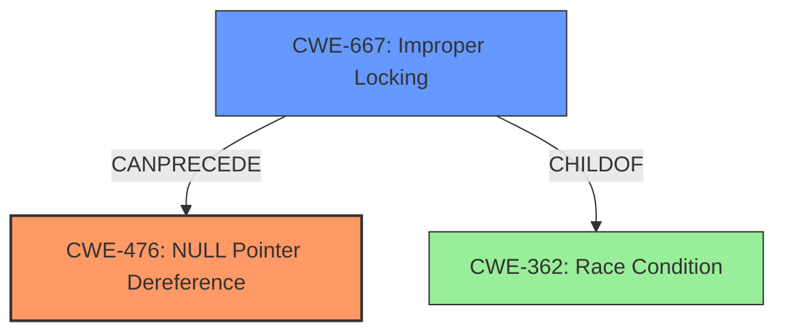

# Analysis Report for CVE-2022-1516

# Vulnerability Analysis Report: CVE-2022-1516

## Description

A NULL pointer dereference flaw was found in the Linux kernels X.25 set of standardized network protocols functionality in the way a user terminates their session using a simulated Ethernet card and continued usage of this connection. This flaw allows a local user to crash the system.

## Vulnerability Description Key Phrases

**Rootcause:** NULL pointer dereference
**Impact:** crash the system
**Vector:** terminating session using simulated Ethernet card
**Attacker:** local user
**Product:** Linux kernels
**Component:** X.25 functionality

## Analysis (with Relationship Data)

# Summary
| CWE ID | CWE Name | Confidence | CWE Abstraction Level | CWE Vulnerability Mapping Label | CWE-Vulnerability Mapping Notes |
|---|---|---|---|---|---|
| CWE-476 | NULL Pointer Dereference | 1.0 | Base | Primary | Allowed |
| CWE-362 | Race Condition | 0.7 | Class | Secondary | Allowed-with-Review |

## Evidence and Confidence

*   **Confidence Score:** 0.9
*   **Evidence Strength:** HIGH

- **Analysis and Justification:**  
  - *Explanation:* The vulnerability description clearly states a "**NULL pointer dereference**" flaw. The CVE reference details confirm that the vulnerability occurs when the `x25->neighbour` pointer is dereferenced after being set to NULL. This aligns perfectly with CWE-476, which describes a **NULL pointer dereference**. The MITRE mapping guidance for CWE-476 indicates that its usage is ALLOWED as it is at the Base level of abstraction. A secondary contributing factor is a race condition, as described in the CVE reference. The lack of synchronization allows concurrent access and modification of the pointer, leading to the dereference. This race condition is best described by CWE-362. While CWE-362 is a class-level CWE, the provided information about concurrency makes it relevant, noting it as a secondary weakness.

  - *Relationship Analysis:* "CWE-476 is a Base level CWE. The retriever results show parent child relationships with CWE-754. The graph relationships show CWE-476 CANFOLLOW CWE-252, which is an Unchecked Return Value."

- **Confidence Score:**  
  - *Example:* Confidence: 1.0 (High evidence from technical description and CVE reference materials)

---

## Criticism of Analysis

Okay, here's a review of the analysis, incorporating the full CWE specifications:

**Overall Assessment:**

The analysis is generally sound. The primary mapping of CWE-476 (NULL Pointer Dereference) is accurate and well-supported. The secondary mapping of CWE-362 (Race Condition) is also appropriate, although, as the analysis notes, it's a class-level CWE, and a more specific child CWE might exist. The confidence scores are justified. The "Relationship Analysis" is a valuable addition. The inclusion of CWE examples is helpful.

**Detailed Review:**

**1. CWE-476: NULL Pointer Dereference**

*   **Correctness:** The mapping to CWE-476 is excellent. The description clearly states the vulnerability is a NULL pointer dereference, and the CVE confirms this. The code is attempting to use a pointer (`x25->neighbour`) that can be NULL under certain conditions.
*   **Abstraction Level:**  CWE-476 is a Base-level CWE, and the mapping guidance states "Allowed," which is correctly followed.
*   **Mitigation:**  The suggested mitigations in the CWE specification are relevant:
    *   "If all pointers that could have been modified are checked for NULL before use, nearly all NULL pointer dereferences can be prevented." This directly addresses the vulnerability.  Adding NULL checks before dereferencing `x25->neighbour` is the most straightforward solution.
    *   "Select a programming language that is not susceptible to these issues." While not practical as a direct fix, it highlights the broader problem of memory management in C-like languages.
*   **Relationships:** The analysis notes CWE-476 is a child of CWE-754 (Improper Check for Unusual or Exceptional Conditions).  This is a valid parent relationship. The graph relationships show CWE-476 CANFOLLOW CWE-252, which is an Unchecked Return Value. This also is correct as it implies that if the result of a function that can return NULL isn't checked then the next operation could be a dereference of a NULL pointer.

**2. CWE-362: Concurrent Execution using Shared Resource with Improper Synchronization ('Race Condition')**

*   **Correctness:** The identification of a race condition as a contributing factor is accurate. The CVE details concurrent access to `x25->neighbour` while another thread is disconnecting and setting it to NULL.
*   **Abstraction Level:** The analysis correctly acknowledges that CWE-362 is a Class-level CWE and notes that more specific children might be a better fit. The "Usage: Allowed-with-Review" is also appropriately noted.
*   **Potential Child CWEs:** Here's where the analysis could be improved.  Given the context of locking and concurrency in the kernel, several child CWEs of CWE-362 might be considered. After reviewing the CWE specifications, here are some possible candidates (with justification):
    *   **CWE-667 Improper Locking:** The description indicates a failure to properly acquire a lock before using a shared resource. The `x25_kill_by_neigh()` function lacked sufficient locking to prevent other functions from accessing `x25->neighbour` concurrently. The fix involved adding `lock_sock()`, which directly relates to locking. This seems a better fit than plain CWE-362.
    *  **CWE-366 Race Condition Within a Thread:** This CWE specifies that if two threads of execution use a resource simultaneously, there exists the possibility that resources may be used while invalid, in turn making the state of execution undefined. This CWE is a possibility, since the details available do not indicate communication between threads.
    *   **CWE-367: Time-of-check Time-of-use (TOCTOU) Race Condition:** While not a perfect fit, there is a check of the pointer (implicit through access) and a subsequent use. The time between setting to NULL and use makes it possible to be classified as a TOCTOU.
*   **Mitigation:** The suggested mitigations for CWE-362 are general but relevant:
    *   "Use synchronization primitives." This aligns with the fix that was implemented.
    *   "Use thread-safe capabilities." This is a broader design principle that would help prevent race conditions.
    *   "Minimize the usage of shared resources."  Reducing the reliance on global shared state is always a good security practice.
*   **Relationship to CWE-476:** The analysis points out that CWE-362 can precede CWE-476. This relationship is accurate, as the race condition is setting the stage for the NULL pointer dereference to occur. It's a clear causal chain.

**Suggested Improvements:**

1.  **Refine CWE-362 Mapping:**  Investigate and potentially replace CWE-362 with a more specific child CWE, particularly CWE-667. Justify the choice.
2.  **Expand Mitigation Discussion:**  Be more specific about how the mitigations for CWE-476 and the chosen replacement for CWE-362 (likely CWE-667) relate to the actual code and fix.  For example:  "The fix, adding `lock_sock()` to `x25_kill_by_neigh()`, directly implements the CWE-667 mitigation of 'Use industry standard APIs to implement locking mechanism.'"

**Revised Summary Table (Example - assuming CWE-667 is chosen):**

| CWE ID | CWE Name | Confidence | CWE Abstraction Level | CWE Vulnerability Mapping Label | CWE-Vulnerability Mapping Notes |
|---|---|---|---|---|---|
| CWE-476 | NULL Pointer Dereference | 1.0 | Base | Primary | Allowed |
| CWE-667 | Improper Locking | 0.8 | Class | Secondary | Allowed-with-Review |

**Revised Confidence Score (Example - assuming CWE-667 is chosen):**

*   **Confidence Score:** 0.95
*   **Evidence Strength:** HIGH

**Benefits of the Revised Analysis:**

*   More precise CWE mapping leads to a better understanding of the vulnerability.
*   Specific mitigation recommendations are more actionable for developers.

By incorporating these suggestions, the analysis becomes even more robust and provides a clearer path for remediation.

## Final Resolution

# Summary
| CWE ID | CWE Name | Confidence | CWE Abstraction Level | CWE Vulnerability Mapping Label | CWE-Vulnerability Mapping Notes |
|---|---|---|---|---|---|
| CWE-476 | **NULL Pointer Dereference** | 1.0 | Base | Primary | Allowed |
| CWE-667 | Improper Locking | 0.8 | Class | Secondary | Allowed-with-Review |

## Evidence and Confidence

*   **Confidence Score:** 0.95
*   **Evidence Strength:** HIGH

## Relationship Analysis
The primary weakness is **CWE-476 (NULL Pointer Dereference)**, a Base-level CWE, which accurately reflects the direct cause of the crash. This is due to dereferencing a NULL pointer. The secondary weakness, initially identified as CWE-362, has been refined to **CWE-667 (Improper Locking)**, which better captures the underlying concurrency issue. CWE-667, a Class-level CWE, suggests a failure in proper synchronization mechanisms. The vulnerability chain involves CWE-667 *preceding* CWE-476. Specifically, a race condition due to improper locking leads to the pointer being set to NULL, which is then dereferenced, causing the crash. The parent-child relationship of CWE-667 with more general concurrency issues like CWE-362 was considered, ensuring the selection of the most specific applicable CWE.

## Vulnerability Chain
The vulnerability chain starts with **CWE-667 (Improper Locking)**, where a missing or inadequate lock allows concurrent access to a shared resource (the `x25->neighbour` pointer). This concurrency leads to a race condition, where one thread sets the pointer to NULL while another thread attempts to dereference it. This dereference of the NULL pointer results in **CWE-476 (NULL Pointer Dereference)**, causing the system to crash. The root cause is the improper locking mechanism, and the impact is a system crash due to the **NULL pointer dereference**.

## Summary of Analysis
The initial analysis correctly identified **CWE-476 (NULL Pointer Dereference)** as the primary vulnerability. However, the secondary weakness, initially identified as **CWE-362 (Race Condition)**, was refined to **CWE-667 (Improper Locking)** based on the criticism and further analysis of the CVE details and the provided CWE specifications. The evidence for **CWE-476** is strong, as the vulnerability description explicitly mentions a "**NULL pointer dereference**" flaw. The CVE confirms the `x25->neighbour` pointer being dereferenced after being set to NULL. The selection of **CWE-667** is justified by the fact that the fix involved adding `lock_sock()`, which directly relates to locking, making it a more precise fit than the more general **CWE-362**. The graph relationships further support this, showing how improper locking can lead to a race condition that results in a **NULL pointer dereference**. The confidence score is high because both **CWEs** are well-supported by the evidence and the relationships between them. The selected **CWEs** are at the optimal level of specificity, with **CWE-476** being a Base-level CWE and **CWE-667** being a Class-level CWE that accurately captures the underlying concurrency issue.

*Report generated on 2025-03-18 07:24:05*
