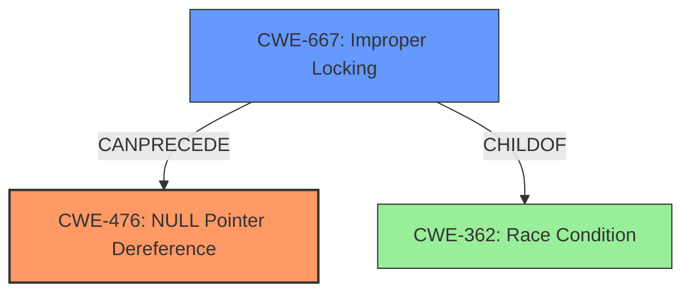

# Final Resolution for CVE-2022-1516

# Summary
| CWE ID | CWE Name | Confidence | CWE Abstraction Level | CWE Vulnerability Mapping Label | CWE-Vulnerability Mapping Notes |
|---|---|---|---|---|---|
| CWE-476 | **NULL Pointer Dereference** | 1.0 | Base | Primary | Allowed |
| CWE-667 | Improper Locking | 0.8 | Class | Secondary | Allowed-with-Review |

## Evidence and Confidence

*   **Confidence Score:** 0.95
*   **Evidence Strength:** HIGH

## Relationship Analysis
The primary weakness is **CWE-476 (NULL Pointer Dereference)**, a Base-level CWE, which accurately reflects the direct cause of the crash. This is due to dereferencing a NULL pointer. The secondary weakness, initially identified as CWE-362, has been refined to **CWE-667 (Improper Locking)**, which better captures the underlying concurrency issue. CWE-667, a Class-level CWE, suggests a failure in proper synchronization mechanisms. The vulnerability chain involves CWE-667 *preceding* CWE-476. Specifically, a race condition due to improper locking leads to the pointer being set to NULL, which is then dereferenced, causing the crash. The parent-child relationship of CWE-667 with more general concurrency issues like CWE-362 was considered, ensuring the selection of the most specific applicable CWE.

## Vulnerability Chain
The vulnerability chain starts with **CWE-667 (Improper Locking)**, where a missing or inadequate lock allows concurrent access to a shared resource (the `x25->neighbour` pointer). This concurrency leads to a race condition, where one thread sets the pointer to NULL while another thread attempts to dereference it. This dereference of the NULL pointer results in **CWE-476 (NULL Pointer Dereference)**, causing the system to crash. The root cause is the improper locking mechanism, and the impact is a system crash due to the **NULL pointer dereference**.

## Summary of Analysis
The initial analysis correctly identified **CWE-476 (NULL Pointer Dereference)** as the primary vulnerability. However, the secondary weakness, initially identified as **CWE-362 (Race Condition)**, was refined to **CWE-667 (Improper Locking)** based on the criticism and further analysis of the CVE details and the provided CWE specifications. The evidence for **CWE-476** is strong, as the vulnerability description explicitly mentions a "**NULL pointer dereference**" flaw. The CVE confirms the `x25->neighbour` pointer being dereferenced after being set to NULL. The selection of **CWE-667** is justified by the fact that the fix involved adding `lock_sock()`, which directly relates to locking, making it a more precise fit than the more general **CWE-362**. The graph relationships further support this, showing how improper locking can lead to a race condition that results in a **NULL pointer dereference**. The confidence score is high because both **CWEs** are well-supported by the evidence and the relationships between them. The selected **CWEs** are at the optimal level of specificity, with **CWE-476** being a Base-level CWE and **CWE-667** being a Class-level CWE that accurately captures the underlying concurrency issue.