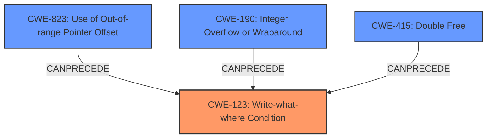

# Final Resolution for CVE-2022-1523

# Summary
| CWE ID | CWE Name | Confidence | CWE Abstraction Level | CWE Vulnerability Mapping Label | CWE-Vulnerability Mapping Notes |
|---|---|---|---|---|---|
| CWE-123 | Write-what-where Condition | 1.0 | Base | Primary | Allowed |
| CWE-823 | Use of Out-of-range Pointer Offset | 0.3 | Base | Root Cause | Possible root cause of write-what-where. |
| CWE-190 | Integer Overflow or Wraparound | 0.2 | Base | Root Cause | Possible root cause if it affects the address written to. |
| CWE-415 | Double Free | 0.1 | Variant | Root Cause | Possible root cause. |

## Evidence and Confidence

*   **Confidence Score:** 0.8
*   **Evidence Strength:** MEDIUM

## Relationship Analysis
The primary weakness is clearly **CWE-123: Write-what-where Condition**, given the vulnerability description. However, identifying the root cause is more complex and requires inferential reasoning. The relationships suggest potential causes like **CWE-823: Use of Out-of-range Pointer Offset**, **CWE-190: Integer Overflow or Wraparound**, and **CWE-415: Double Free**.
*   Parent-child hierarchical relationships: `CWE-123` has children like `CWE-787 (Out-of-bounds Write)` and `CWE-119 (Improper Restriction of Operations)`. This suggests the write-what-where might be a consequence of a buffer overflow.
*   Chain relationships showing progression of vulnerability: The retriever results suggest several possible root causes for CWE-123, including CWE-823, CWE-190, and CWE-415.
*   Peer relationships that offered alternative classifications: CWE-416 is a peer of CWE-123 and represents Use After Free.
*   Abstraction levels influenced my selection: The base level CWEs are preferred, as are variant level CWEs such as CWE-415.

## Vulnerability Chain
The vulnerability chain starts with a potential **ROOTCAUSE** such as **CWE-823 (Use of Out-of-range Pointer Offset)**, **CWE-190 (Integer Overflow or Wraparound)**, or **CWE-415 (Double Free)**. This **ROOTCAUSE** leads to the primary **WEAKNESS**, **CWE-123 (Write-what-where Condition)**, allowing an attacker to overwrite program memory and manipulate the flow of information, ultimately leading to arbitrary code execution or denial of service. The description does not provide more details on how **CWE-123** is reached. There are missing links in the chain based on relationship data.

## Summary of Analysis
The initial analysis correctly identified **CWE-123 (Write-what-where Condition)** as the primary **WEAKNESS**. The criticism highlighted the need to investigate potential root causes such as **CWE-823 (Use of Out-of-range Pointer Offset)**, **CWE-190 (Integer Overflow or Wraparound)**, and **CWE-415 (Double Free)**.

The vulnerability description explicitly states "write-what-where condition, which could allow an attacker to overwrite program memory to manipulate the flow of information." This directly maps to **CWE-123**.

The graph relationships influenced my decision to include potential root causes. While the evidence for these root causes is not definitive, their relationships with **CWE-123** suggest they could be contributing factors.

The selected CWEs are at the optimal level of specificity. **CWE-123** is a base-level CWE that accurately describes the vulnerability. The potential root causes are also base or variant-level CWEs, providing more specific information about the underlying causes of the vulnerability. My confidence is lower because the vulnerability description does not include enough information to solidify the root cause.