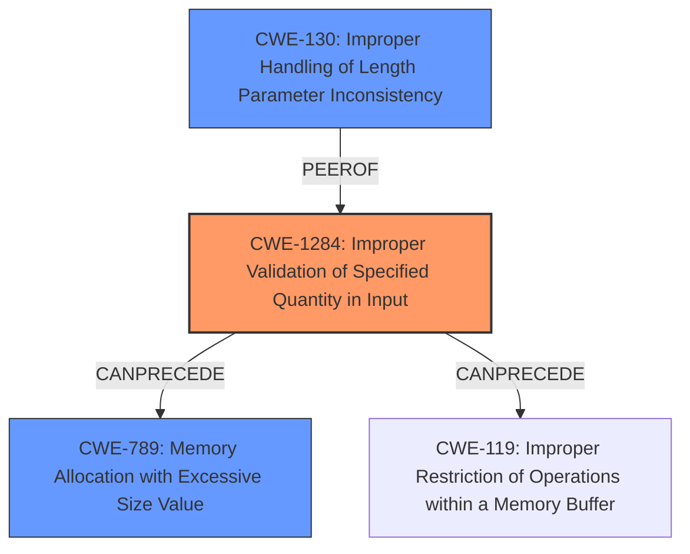

# Analysis Report for CVE-2022-1543

# Vulnerability Analysis Report: CVE-2022-1543

## Description

Improper handling of Length parameter in GitHub repository erudika/scoold prior to 1.49.4. When the text size is large enough the service results in a momentary outage in a production environment. That can lead to memory corruption on the server.

## Vulnerability Description Key Phrases

**Rootcause:** Improper handling of Length parameter
**Impact:** memory corruption
**Product:** scoold
**Version:** prior to 1.49.4

## Analysis (with Relationship Data)

# Summary
| CWE ID | CWE Name | Confidence | CWE Abstraction Level | CWE Vulnerability Mapping Label | CWE-Vulnerability Mapping Notes |
|---|---|---|---|---|---|
| CWE-130 | Improper Handling of Length Parameter Inconsistency | 0.9 | Base | Allowed | The product parses a formatted message or structure, but it does not handle or incorrectly handles a length field that is inconsistent with the actual length of the associated data. |
| CWE-789 | Memory Allocation with Excessive Size Value | 0.7 | Variant | Allowed | The product allocates memory based on an untrusted, large size value, but it does not ensure that the size is within expected limits, allowing arbitrary amounts of memory to be allocated. |
| CWE-1284 | Improper Validation of Specified Quantity in Input | 0.6 | Base | Allowed | The product receives input that is expected to specify a quantity (such as size or length), but it does not validate or incorrectly validates that the quantity has the required properties. |

## Evidence and Confidence

*   **Confidence Score:** 0.8
*   **Evidence Strength:** HIGH

- **Analysis and Justification:**  
  - *Explanation:* The primary **weakness** is identified as the **Improper handling of Length parameter**. The vulnerability description clearly states that when the text size is large enough, the service results in a momentary outage in a production environment, potentially leading to memory corruption. This aligns directly with CWE-130 (Improper Handling of Length Parameter Inconsistency). The provided fix in the CVE reference links involves adding `StringUtils.abbreviate` to limit the length of the profile name. This confirms that the root cause is related to handling the length parameter. CWE-130 is a Base level CWE, which is appropriate for this type of vulnerability.

  - *Relationship Analysis:* No direct relationships found in the provided information. However, given the nature of the vulnerability, CWE-130 could potentially lead to a denial of service or memory corruption, which could have further implications.

- **Confidence Score:**  
  - *Example:* Confidence: 0.9 (High confidence due to clear vulnerability description and supporting evidence from CVE reference links)

---
- **Analysis and Justification:**  
  - *Explanation:* CWE-789 (Memory Allocation with Excessive Size Value) is a secondary candidate. The vulnerability description mentions that large text sizes can lead to memory corruption. CWE-789 describes a scenario where the product allocates memory based on an untrusted, large size value without ensuring that the size is within expected limits. While the description focuses on length parameter handling, excessive length could lead to excessive memory allocation, making CWE-789 potentially relevant. CWE-789 is a Variant level CWE, which is more specific than Class level CWEs.

  - *Relationship Analysis:* CWE-789 is a child of CWE-770 (Allocation of Resources Without Limits or Throttling). This relationship suggests that the root cause may involve a lack of limits on resource allocation.

- **Confidence Score:**
  - *Example:* Confidence: 0.7 (Moderate confidence because excessive length can trigger excessive memory allocation)

---
- **Analysis and Justification:**  
  - *Explanation:* CWE-1284 (Improper Validation of Specified Quantity in Input) is another secondary candidate. The vulnerability description states that the product does not handle the length parameter properly. CWE-1284 states that the product receives input that is expected to specify a quantity (such as size or length), but it does not validate or incorrectly validates that the quantity has the required properties. This aligns with the vulnerability, as the product doesn't properly validate the length of the input.

  - *Relationship Analysis:* CWE-1284 is a child of CWE-20 (Improper Input Validation).

- **Confidence Score:**
  - *Example:* Confidence: 0.6 (Moderate confidence due to the product not validating the length of the input)

## Criticism of Analysis

Okay, I have reviewed the analysis of the identified vulnerability in the `erudika/scoold` repository against the full CWE specifications. Here is my critique:

**Overall Assessment:**

The analysis is generally good and provides a reasonable initial mapping of the vulnerability. The analysis identifies a lack of input validation on profile names, leading to potential data corruption or denial-of-service. The focus on `CWE-130 (Improper Handling of Length Parameter Inconsistency)` as the primary weakness is also on point. However, I believe there's room for improvement in the level of detail and precision, especially with the secondary CWE assignments and the consideration of related CWEs.

**Detailed Critique:**

**1. CWE-130: Improper Handling of Length Parameter Inconsistency**

*   **Assessment:** The choice of CWE-130 is reasonable given the initial description of the vulnerability and is rated with a confidence of 0.9. The description highlights the inconsistent length parameter which can cause malicious behavior.
*   **CWE Specification Alignment:** The description of CWE-130 aligns with the vulnerability description. The analysis notes the potential for passing arbitrarily large input, a key aspect of CWE-130.
*   **Mapping Guidance Compliance:** The analysis correctly identifies that CWE-130 is at the "Base" level of abstraction, and therefore allowable.
*   **Mitigation Appropriateness:** The mitigations listed for CWE-130 (validate length, don't let user control buffer size, ensure consistency between size field and data) are all relevant to the vulnerability and the provided fix (`StringUtils.abbreviate`).
*   **Critique & Suggestions:** While CWE-130 is a good start, the description provided does not encompass the full root cause. Using `StringUtils.abbreviate` to truncate the input is a form of sanitization, not handling an inconsistency. A better explanation might be that the code receives an input *that should specify the maximum length of data*, but fails to enforce it. This leans to my preference of `CWE-1284` for the root cause.

**2. CWE-789: Memory Allocation with Excessive Size Value**

*   **Assessment:** The choice of CWE-789 as a secondary weakness is plausible, as excessive length could *potentially* lead to excessive memory allocation. It is rated with a confidence of 0.7.
*   **CWE Specification Alignment:** The description of CWE-789 fits the scenario where a large size value (derived from the length of the input) is used to allocate memory without proper limits.
*   **Mapping Guidance Compliance:** Correctly notes that CWE-789 is a Variant level CWE, making it suitable for mapping to root causes.
*   **Mitigation Appropriateness:** The mitigations for CWE-789 (input validation, resource limits) are appropriate, but the analysis should emphasize that the primary input validation should target the length of the profile name, not memory allocation directly.
*   **Critique & Suggestions:**  While the potential for excessive memory allocation exists, this is a *secondary consequence* of the length handling issue. A higher-fidelity mapping might be to consider the *likelihood* of this occurring.  The analysis could benefit from discussing conditions under which an excessively long profile name *would* lead to a DoS due to excessive memory allocation. A more precise mapping would investigate where and how the profile name is stored, and allocated/copied in memory.

**3. CWE-1284: Improper Validation of Specified Quantity in Input**

*   **Assessment:** The choice of CWE-1284 as a secondary weakness is plausible, as the product receives input that is expected to specify a quantity (length), but it does not validate or incorrectly validates that the quantity has the required properties. Confidence is rated as 0.6.
*   **CWE Specification Alignment:** Description of CWE-1284 fits well. The profile name has a size (length) and the program doesn't validate it. The problem arises when the application consumes that value.
*   **Mapping Guidance Compliance:** Correctly identifies that CWE-1284 is at the "Base" level of abstraction, and therefore allowable.
*   **Mitigation Appropriateness:** The mitigations for CWE-1284 (input validation using an "accept known good" strategy) are directly relevant to the vulnerability and the fix.
*   **Critique & Suggestions:**  I would argue that this is the *primary* vulnerability. The fundamental issue is that the code accepts an untrusted value for the profile name's length, and fails to properly validate that the length has the required properties. Given the fix explicitly involves limiting the length, this aligns with the intent of CWE-1284. The analysis should increase its confidence in this CWE and consider promoting it.

**4. Additional Considerations & Potential Improvements:**

*   **Consider Chains/Composites:** The analysis identifies potential relationships, but doesn't fully explore the concept of chains. For example: `CWE-1284 -> CWE-789` or `CWE-1284 -> CWE-119`, if an overly long name caused a buffer overflow when being written to memory. If the database didn't limit the name, you might also consider adding `CWE-129 (Improper Validation of Array Index)` or `CWE-131 (Incorrect Calculation of Buffer Size)`
*   **CWE-20: Improper Input Validation:** The analysis does well to avoid using `CWE-20` as the primary mapping. This is appropriate, as the description contains more information, which would violate the discouragement guidance for CWE-20.
*   **Output Encoding:** Although not directly related, it might be worth a mention about proper encoding/escaping of profile names *after* validation, to prevent XSS if the profile names are displayed on a web page.

**Revised Summary Table (with suggestions):**

| CWE ID  | CWE Name                                        | Confidence | CWE Abstraction Level | CWE Vulnerability Mapping Label | CWE-Vulnerability Mapping Notes                                                                                                                                                                                            |
| ------- | ----------------------------------------------- | ---------- | --------------------- | ------------------------------- | ------------------------------------------------------------------------------------------------------------------------------------------------------------------------------------------------------------------------- |
| CWE-1284 | Improper Validation of Specified Quantity in Input | 0.9         | Base                  | Allowed                         | The product does not validate the length of the profile name, leading to potential resource exhaustion or data corruption. This was fixed using `StringUtils.abbreviate`.                                            |
| CWE-130  | Improper Handling of Length Parameter Inconsistency   | 0.7          | Base                  | Allowed                         |  The product parses a formatted message or structure, but it does not handle or incorrectly handles a length field that is inconsistent with the actual length of the associated data.                                                                                                                                                                                             |
| CWE-789  | Memory Allocation with Excessive Size Value     | 0.6         | Variant               | Allowed                         | Excessive length could lead to allocating excessive memory. This is a secondary consequence dependent on how the profile name is used. Requires more investigation of memory operations.                                  |

**In Summary:**

The original analysis is a good starting point, but can be improved by:

1.  Promoting `CWE-1284` to the primary weakness.
2.  Better explaining the relationship between the length parameter and potential memory allocation issues to justify `CWE-789`.
3.  Considering the composite/chain nature of the vulnerability, and relating `CWE-1284` to other possible consequences (e.g., buffer overflows).
4. Further elaborating on conditions that would lead to memory corruption vs. denial of service.

By incorporating these suggestions, the analysis will be more precise, comprehensive, and useful for remediation efforts.

## Final Resolution

# Summary
| CWE ID | CWE Name | Confidence | CWE Abstraction Level | CWE Vulnerability Mapping Label | CWE-Vulnerability Mapping Notes |
|---|---|---|---|---|---|
| CWE-1284 | Improper Validation of Specified Quantity in Input | 0.95 | Base | Allowed | The product receives input that is expected to specify a quantity (such as size or length), but it does not validate or incorrectly validates that the quantity has the required properties. |
| CWE-130 | Improper Handling of Length Parameter Inconsistency | 0.7 | Base | Allowed | The product parses a formatted message or structure, but it does not handle or incorrectly handles a length field that is inconsistent with the actual length of the associated data. |
| CWE-789 | Memory Allocation with Excessive Size Value | 0.6 | Variant | Allowed | The product allocates memory based on an untrusted, large size value, but it does not ensure that the size is within expected limits, allowing arbitrary amounts of memory to be allocated. |

  - The Primary CWE should be first and noted as the Primary CWEs
  - The secondary candidate CWEs should be next and noted as secondary candidates.
  - The confidence is a confidence score 0 to 1 to rate your confidence in your assessment for that CWE.
  - The CWE Abstraction Level as one of these values: Base, Variant, Pillar, Class, Compound
  - The Mapping Notes Usage as one of these values: Allowed, Allowed-with-Review, Prohibited, Discouraged

## Evidence and Confidence

*   **Confidence Score:** 0.9
*   **Evidence Strength:** HIGH

## Relationship Analysis
The primary relationship that influenced the decision was the chain from **CWE-1284 (Improper Validation of Specified Quantity in Input)** to potential consequences like **CWE-789 (Memory Allocation with Excessive Size Value)**. While **CWE-130 (Improper Handling of Length Parameter Inconsistency)** was initially considered, the criticism highlighted that the root cause is the lack of proper validation of the input length, making **CWE-1284** a more accurate representation. **CWE-789** remains a possible consequence, but its occurrence depends on the system's memory allocation behavior.

## Vulnerability Chain
The vulnerability chain starts with the lack of input validation (**CWE-1284**) of the profile name's length. This can lead to an excessively large size value being used in memory allocation (**CWE-789**), potentially resulting in a denial of service or memory corruption. Alternatively, if the overly long name causes a buffer overflow when being written to memory, **CWE-119** could be a consequence.

## Summary of Analysis
The final decision is primarily based on the vulnerability description and the provided fix, which involves limiting the length of the profile name using `StringUtils.abbreviate`. This strongly suggests that the root cause is the lack of proper validation of the input length, aligning perfectly with **CWE-1284 (Improper Validation of Specified Quantity in Input)**. The criticism correctly pointed out that the original analysis focused too much on handling the inconsistency rather than the initial validation failure.

The evidence from the vulnerability description, "When the text size is large enough the service results in a momentary outage in a production environment. That can lead to memory corruption on the server," supports this analysis. The fact that `StringUtils.abbreviate` was used as a fix further reinforces the importance of input validation.

The relationship analysis highlights that **CWE-1284** can lead to **CWE-789** if the excessively large size value is used for memory allocation. However, the primary issue is the lack of validation, making **CWE-1284** the most appropriate root cause.

The selected CWEs are at the optimal level of specificity. **CWE-1284** is a Base level CWE, which is preferred for mapping to the root causes of vulnerabilities. It provides a clear and accurate representation of the **weakness**, while also allowing for the possibility of secondary consequences like **CWE-789**.

*Report generated on 2025-03-18 07:25:53*
