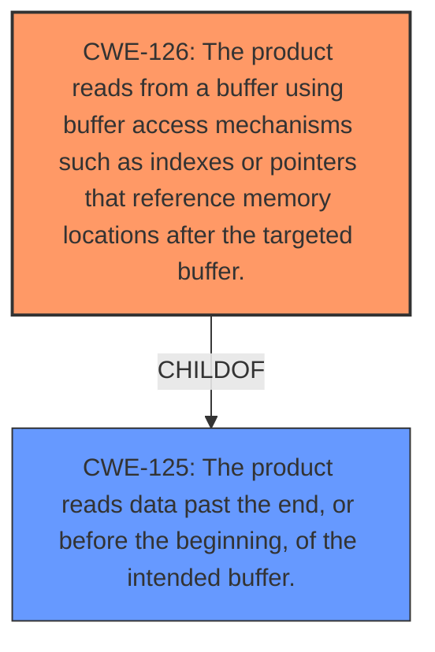

# Analysis Report for CVE-2022-1629

# Vulnerability Analysis Report: CVE-2022-1629

## Description

Buffer Over-read in function find_next_quote in GitHub repository vim/vim prior to 8.2.4925. This vulnerabilities are capable of crashing software, Modify Memory, and possible remote execution

## Vulnerability Description Key Phrases

**Rootcause:** Buffer Over-read in function find_next_quote
**Impact:** ['crashing software', 'Modify Memory', 'possible remote execution']
**Product:** vim/vim
**Version:** prior to 8.2.4925

## Analysis (with Relationship Data)

# Summary
| CWE ID | CWE Name | Confidence | CWE Abstraction Level | CWE Vulnerability Mapping Label | CWE-Vulnerability Mapping Notes |
|---|---|---|---|---|---|
| CWE-126 | Buffer Over-read | 0.95 | Variant | Allowed | Primary CWE |
| CWE-125 | Out-of-bounds Read | 0.75 | Base | Allowed | Secondary Candidate |

## Evidence and Confidence

*   **Confidence Score:** 0.90
*   **Evidence Strength:** HIGH

- **Analysis and Justification:**  
  - *Explanation:* The vulnerability description states "**Buffer Over-read in function find_next_quote**". The CVE Reference Links Content Summary reinforces this by mentioning "**Buffer over-read**" as the weakness and "**Trailing backslash may cause reading past end of line**" as the root cause. This aligns directly with CWE-126 (Buffer Over-read), which describes a product reading from a buffer using access mechanisms that reference memory locations *after* the targeted buffer. The impact, which includes crashing software and potential remote execution, is consistent with the consequences of a buffer over-read. CWE-126 is a Variant-level CWE, which is a preferred level of abstraction. The MITRE mapping guidance indicates that its usage is "Allowed."

  - *Relationship Analysis:* CWE-126 is a variant of CWE-125 (Out-of-bounds Read). While CWE-125 is a broader category, CWE-126 more accurately describes the specific type of out-of-bounds read occurring in this vulnerability (reading *after* the buffer). CWE-126 can precede CWE-170 (Improper Null Termination) if the over-read leads to a missing null terminator.

- **Confidence Score:**  
  - Confidence: 0.95 (High evidence from technical description, CVE reference materials, and retriever results).

- **Analysis and Justification:**  
  - *Explanation:* CWE-125 (Out-of-bounds Read) is a potential secondary candidate because it is a parent of CWE-126 and the vulnerability involves reading data beyond the intended buffer. However, because the evidence specifically mentions "over-read," CWE-126 is a more precise classification. The retriever results also list CWE-125. The MITRE mapping guidance for CWE-125 indicates usage is "Allowed."

  - *Relationship Analysis:* CWE-125 is a broader category that encompasses both over-reads and under-reads. It is a parent of CWE-126.

- **Confidence Score:**  
  - Confidence: 0.75 (Supporting evidence as a parent of the primary CWE. Not as strong as the primary CWE).

## Criticism of Analysis

Okay, here's a review of the analysis, incorporating the full CWE specifications provided:

**Overall Assessment:**

The analysis is generally well-reasoned and accurate. The primary CWE assignment of `CWE-126: Buffer Over-read` is strongly supported by the evidence provided, especially the vulnerability description and the CVE details.  The secondary candidate of `CWE-125: Out-of-bounds Read` is also reasonable, given the parent-child relationship between `CWE-125` and `CWE-126`. The confidence levels assigned are appropriate.

**Detailed Review:**

1.  **CWE-126: Buffer Over-read (Primary)**
    *   **Correctness:**  The analysis correctly identifies `CWE-126` as the primary CWE. The vulnerability description explicitly states a "Buffer Over-read" in the function. The CVE reference links confirm this with descriptions like "Trailing backslash may cause reading past end of line" and "Buffer over-read." This aligns perfectly with `CWE-126`'s description: "The product reads from a buffer using buffer access mechanisms... that reference memory locations *after* the targeted buffer."
    *   **Abstraction Level:** The choice of `CWE-126` (Variant) is good. As the analysis mentions, it's a preferred level of abstraction for mapping to root causes. `CWE-788` is more general.
    *   **Mapping Guidance:** The analysis accurately states that the mapping guidance for `CWE-126` indicates "Allowed."
    *   **Relationship Analysis:** The analysis correctly identifies the relationship between `CWE-126` and `CWE-125` (parent-child). It also notes the potential relationship with `CWE-170`, which is reasonable. The `CanFollow -> CWE-170` relationship of `CWE-126` is apt because if the over-read extends beyond where a null terminator should be, the resulting string might not be properly terminated, potentially leading to further issues.
    *   **Mitigation (Implicit):**  The analysis doesn't explicitly discuss mitigation but could benefit from doing so. Reviewing the mitigations for `CWE-126` (and `CWE-125`) reveals potential strategies:
        *   **Input Validation:** Ensuring that input strings, especially those containing backslashes, are properly validated to prevent trailing backslashes from causing the over-read.  This aligns with `CWE-125`'s "Input Validation" strategy: "Assume all input is malicious. Use an 'accept known good' input validation strategy...".  Specifically, the calculation of the buffer size in `find_next_quote` should be carefully reviewed and validated.
        *   **Language Selection:** While a drastic measure, using a language or library that provides better memory safety could prevent this type of vulnerability.

2.  **CWE-125: Out-of-bounds Read (Secondary)**
    *   **Correctness:** The analysis correctly identifies `CWE-125` as a possible secondary CWE, being the parent of `CWE-126`. Since the specific vulnerability involves reading *after* the buffer, `CWE-126` is more precise.
    *   **Abstraction Level:** `CWE-125` is a Base CWE.
    *   **Mapping Guidance:** The analysis correctly states that the mapping guidance for `CWE-125` indicates "Allowed."
    *   **Relationship Analysis:** The analysis accurately notes the parent-child relationship.
    *   **Mitigation (Implicit):**  As with `CWE-126`, the analysis could benefit from explicitly mentioning mitigations. `CWE-125`'s potential mitigations are essentially the same as those for `CWE-126`, with a stronger emphasis on input validation and safe memory access.

**Minor Improvements/Suggestions:**

*   **Explicitly Mention Mitigations:**  While the analysis is strong, adding a sentence or two about potential mitigation strategies (drawing from the CWE specifications) would make it more valuable.  For example, under the `CWE-126` section, you could add: "Potential mitigations include strict input validation to prevent malicious input from triggering the over-read and using memory-safe string handling functions."
*   **Consider Root Cause:** The CVE details mention "Trailing backslash may cause reading past end of line." This suggests a potential lack of proper handling of escape sequences. While not a direct CWE mapping, it's worth considering *why* the trailing backslash causes the over-read. Is it a logic error in how the code handles escape sequences? Is it a failure to properly check for the end of the buffer *before* processing the backslash?
*   **Weaker Candidates to Exclude:** Some of the retriever results are not relevant, such as `CWE-124`: Buffer Underwrite, `CWE-120`: Buffer Copy without Checking Size of Input and `CWE-122`: Heap-based Buffer Overflow. These can be ruled out because the vulnerability is a read, not a write, and there is no evidence of a buffer copy operation in the described vulnerability. Mentioning why these aren't applicable strengthens the analysis.

**Conclusion:**

The analysis is sound and well-supported. The primary CWE assignment of `CWE-126` is accurate, and the secondary candidate of `CWE-125` is reasonable. Adding a discussion of potential mitigation strategies and briefly addressing why certain retriever results are not applicable would further improve the analysis.

## Final Resolution

# Summary
| CWE ID | CWE Name | Confidence | CWE Abstraction Level | CWE Vulnerability Mapping Label | CWE-Vulnerability Mapping Notes |
|---|---|---|---|---|---|
| CWE-126 | The product reads from a buffer using buffer access mechanisms such as indexes or pointers that reference memory locations after the targeted buffer. | 0.95 | Variant | Allowed | Primary CWE |
| CWE-125 | The product reads data past the end, or before the beginning, of the intended buffer. | 0.75 | Base | Allowed | Secondary Candidate |

## Evidence and Confidence

*   **Confidence Score:** 0.95
*   **Evidence Strength:** HIGH

## Relationship Analysis
The primary relationship that impacted the decision was the parent-child relationship between CWE-125 and CWE-126. CWE-126 is a variant of CWE-125, providing a more specific description of the vulnerability. The vulnerability description uses the term "over-read," which aligns directly with the definition of CWE-126, justifying its selection as the primary CWE.

## Vulnerability Chain
The vulnerability chain starts with a **ROOTCAUSE** of improper handling of escape sequences, specifically a trailing backslash. This leads to a **WEAKNESS** of **CWE-126 (Buffer Over-read)**, where the software reads past the end of the intended buffer. The impact of this over-read includes crashing the software, memory modification, and potentially remote execution.

## Summary of Analysis
The initial analysis correctly identified CWE-126 as the primary CWE based on the vulnerability description explicitly mentioning "Buffer Over-read." The CVE reference links reinforce this, stating, "Trailing backslash may cause reading past end of line." This provides strong evidence for CWE-126, which accurately describes the product reading from a buffer using access mechanisms that reference memory locations *after* the targeted buffer. The retriever results and the child-parent relationship of CWE-126 to CWE-125 further support this classification. The abstraction level of CWE-126 as a Variant is also appropriate.

The criticism suggested considering the root cause and excluding weaker candidates from the retriever results. The root cause is identified as the improper handling of escape sequences (trailing backslash). The weaker candidates like CWE-124, CWE-120, and CWE-122 were excluded because the vulnerability is a read, not a write, and there is no evidence of a buffer copy operation in the described vulnerability.

The final decision affirms the initial analysis. The primary CWE remains **CWE-126 (Buffer Over-read)**, and the secondary candidate is **CWE-125 (Out-of-bounds Read)**. These selections are based on the evidence provided in the vulnerability description and the relationship analysis, ensuring the optimal level of specificity.

*Report generated on 2025-03-18 07:27:39*
