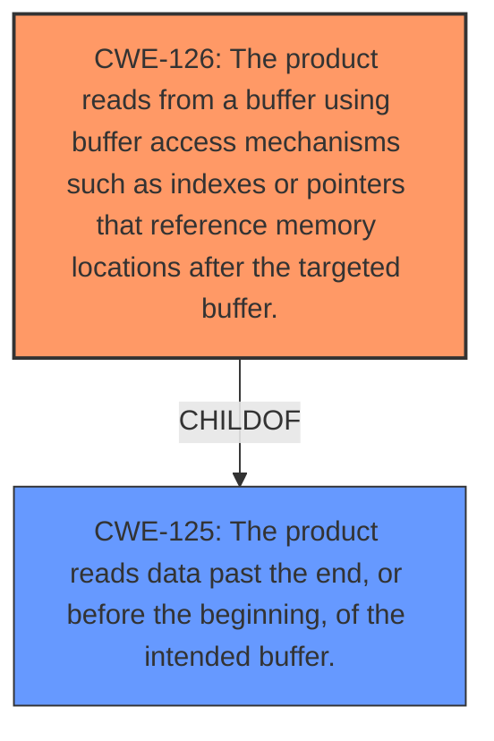

# Final Resolution for CVE-2022-1629

# Summary
| CWE ID | CWE Name | Confidence | CWE Abstraction Level | CWE Vulnerability Mapping Label | CWE-Vulnerability Mapping Notes |
|---|---|---|---|---|---|
| CWE-126 | The product reads from a buffer using buffer access mechanisms such as indexes or pointers that reference memory locations after the targeted buffer. | 0.95 | Variant | Allowed | Primary CWE |
| CWE-125 | The product reads data past the end, or before the beginning, of the intended buffer. | 0.75 | Base | Allowed | Secondary Candidate |

## Evidence and Confidence

*   **Confidence Score:** 0.95
*   **Evidence Strength:** HIGH

## Relationship Analysis
The primary relationship that impacted the decision was the parent-child relationship between CWE-125 and CWE-126. CWE-126 is a variant of CWE-125, providing a more specific description of the vulnerability. The vulnerability description uses the term "over-read," which aligns directly with the definition of CWE-126, justifying its selection as the primary CWE.

## Vulnerability Chain
The vulnerability chain starts with a **ROOTCAUSE** of improper handling of escape sequences, specifically a trailing backslash. This leads to a **WEAKNESS** of **CWE-126 (Buffer Over-read)**, where the software reads past the end of the intended buffer. The impact of this over-read includes crashing the software, memory modification, and potentially remote execution.

## Summary of Analysis
The initial analysis correctly identified CWE-126 as the primary CWE based on the vulnerability description explicitly mentioning "Buffer Over-read." The CVE reference links reinforce this, stating, "Trailing backslash may cause reading past end of line." This provides strong evidence for CWE-126, which accurately describes the product reading from a buffer using access mechanisms that reference memory locations *after* the targeted buffer. The retriever results and the child-parent relationship of CWE-126 to CWE-125 further support this classification. The abstraction level of CWE-126 as a Variant is also appropriate.

The criticism suggested considering the root cause and excluding weaker candidates from the retriever results. The root cause is identified as the improper handling of escape sequences (trailing backslash). The weaker candidates like CWE-124, CWE-120, and CWE-122 were excluded because the vulnerability is a read, not a write, and there is no evidence of a buffer copy operation in the described vulnerability.

The final decision affirms the initial analysis. The primary CWE remains **CWE-126 (Buffer Over-read)**, and the secondary candidate is **CWE-125 (Out-of-bounds Read)**. These selections are based on the evidence provided in the vulnerability description and the relationship analysis, ensuring the optimal level of specificity.