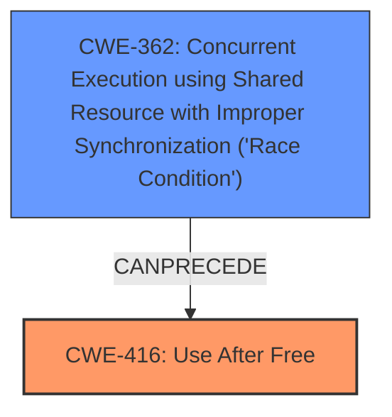

# Final Resolution for CVE-2022-1634

# Summary
| CWE ID | CWE Name | Confidence | CWE Abstraction Level | CWE Vulnerability Mapping Label | CWE-Vulnerability Mapping Notes |
|---|---|---|---|---|---|
| CWE-416 | Use After Free | 0.95 | Variant | Allowed | Primary CWE |
| CWE-362 | Concurrent Execution using Shared Resource with Improper Synchronization ('Race Condition') | 0.7 | Class | Allowed-with-Review | Secondary Candidate: Possible contributing factor to the **Use After Free**. |

## Evidence and Confidence

*   **Confidence Score:** 0.9
*   **Evidence Strength:** MEDIUM

## Relationship Analysis
The primary relationship considered is that CWE-362 **CANPRECEDE** CWE-416, suggesting that a race condition could lead to a use-after-free vulnerability. While no explicit parent-child relationship exists, CWE-362 is a Class, suggesting that more specific Base CWEs might exist, making its selection as a contributing factor a balanced choice. The initial analysis focused solely on the direct match of "use after free" to CWE-416, but the criticism highlighted the potential for CWE-362 to play a role.

## Vulnerability Chain
The vulnerability chain starts with a potential **ROOTCAUSE** of CWE-362 (Race Condition). If a race condition exists, it could lead to a situation where memory is freed prematurely. This then results in CWE-416 (**Use After Free**), where the application attempts to access the freed memory, leading to potential heap corruption and ultimately, remote code execution. The UI interaction acts as the trigger for the race condition. The missing link is confirmation of race condition.

## Summary of Analysis
The initial analysis correctly identified CWE-416 (**Use After Free**) as the primary **WEAKNESS**, supported by the direct mention of "use after free" in the vulnerability description: "Use after free in Browser UI in Google Chrome". The retriever results further support this classification. However, the criticism raised a valid point about the potential contribution of a race condition (CWE-362). The retriever results listed CWE-362 as the 5th result with a high graph score.
While the vulnerability description doesn't explicitly mention a race condition, the possibility exists, and many **Use After Free** vulnerabilities are caused by race conditions. Therefore, including CWE-362 as a secondary contributing factor strengthens the analysis.

The decision to include CWE-362 is based on the following:
1.  The Retriever results showed that CWE-362 could be related.
2.  The relationship analysis showed that CWE-362 can precede CWE-416, indicating a possible chain.
3.  The general understanding that race conditions are a common cause of **Use After Free** vulnerabilities.

Confidence is slightly reduced from 1.0 to 0.9 because there is no explicit evidence of the race condition, and the choice to include CWE-362 is based on a possible vulnerability chain. The level of specificity for CWE-416 is optimal, as it directly describes the core issue. CWE-362 is kept at the class level, as there isn't enough information to determine which of its base variants is more appropriate.