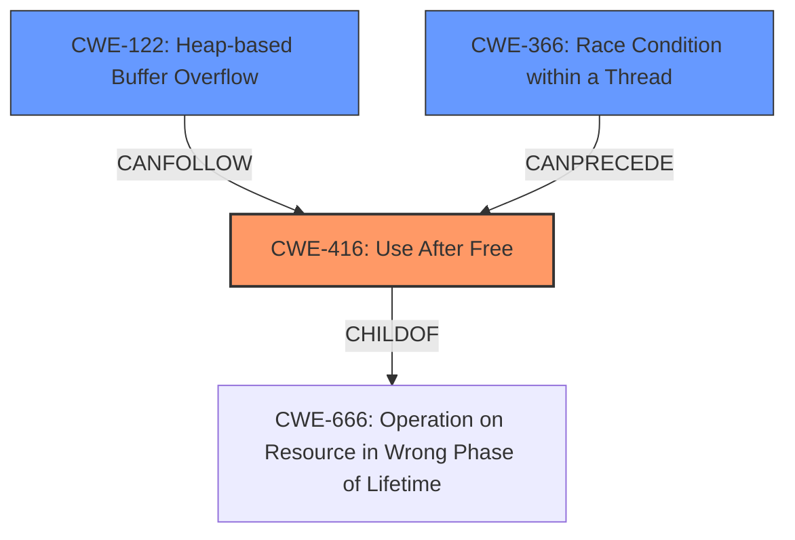

# Analysis Report for CVE-2022-1635

# Vulnerability Analysis Report: CVE-2022-1635

## Description

Use after free in Permission Prompts in Google Chrome prior to 101.0.4951.64 allowed a remote attacker who convinced a user to engage in specific UI interactions to potentially exploit heap corruption via specific user interactions.

## Vulnerability Description Key Phrases

**Rootcause:** Use after free
**Weakness:** heap corruption
**Vector:** specific UI interactions
**Attacker:** remote attacker
**Product:** Google Chrome
**Version:** prior to 101.0.4951.64
**Component:** Permission Prompts

## Analysis (with Relationship Data)

# Summary
| CWE ID | CWE Name | Confidence | CWE Abstraction Level | CWE Vulnerability Mapping Label | CWE-Vulnerability Mapping Notes |
|---|---|---|---|---|---|
| CWE-416 | Use After Free | 1.0 | Variant | Allowed | Primary CWE |
| CWE-122 | Heap-based Buffer Overflow | 0.7 | Variant | Allowed | Secondary Candidate |

## Evidence and Confidence

*   **Confidence Score:** 0.9
*   **Evidence Strength:** HIGH

- **Analysis and Justification:**  
  - *Explanation:* The vulnerability description explicitly states "**Use after free**" as the root cause. The description also mentions "**heap corruption**" as a weakness resulting from specific UI interactions in Google Chrome. The CVE Reference Links Content Summary confirms "Use-after-free" as the root cause and "Use after free" as the vulnerability. CWE-416 (Use After Free) directly matches this description. It occurs when a program reuses memory after it has been freed, potentially leading to corruption or unexpected behavior. The provided description fits the definition of CWE-416 precisely. CWE-122 (Heap-based Buffer Overflow) is included as a secondary candidate because **heap corruption** is mentioned.
  
  - *Relationship Analysis:* CWE-416 is a variant-level CWE, providing a specific description of the vulnerability. It is related to memory management issues and can lead to exploitable conditions. While CWE-416 is the primary weakness, the mention of **heap corruption** suggests that CWE-122 might also be relevant as a resulting condition.

- **Confidence Score:**
  - Confidence: 1.0 (High confidence due to direct matching with the vulnerability description and confirmation from the CVE reference).
---

## Criticism of Analysis

Okay, let's review the CWE analysis provided, focusing on the accuracy of the CWE mappings, the confidence levels, and the relevance of the provided examples and mitigations.

**Overall Assessment:**

The analysis is generally sound, with a clear and justifiable primary mapping to CWE-416 (Use After Free).  The inclusion of CWE-122 (Heap-based Buffer Overflow) as a secondary candidate is also reasonable, given the mention of "heap corruption," but the confidence level is appropriately lower. The explanation of why each CWE was selected or not is well-justified.

**Detailed Review:**

*   **CWE-416: Use After Free (Primary)**

    *   **Confidence:** The confidence level of 1.0 is appropriate. The vulnerability description and CVE summary directly point to a Use-After-Free condition.
    *   **Justification:** The explanation is well-reasoned. It correctly identifies that CWE-416 aligns precisely with the description of reusing memory after it has been freed.
    *   **Relevance of CWE Specification:** The provided CWE-416 specification accurately describes the vulnerability.  The relationships to other CWEs (e.g., `CanPrecede` -> CWE-120, `CanFollow` -> CWE-362) are also potentially relevant, as a buffer overflow or race condition could *lead to* a use-after-free.
    *   **Mitigations:**  The potential mitigations listed are standard and relevant:
        *   **Language Selection (automatic memory management):** Highly relevant.
        *   **Setting pointers to NULL after freeing:** A common, though not foolproof, mitigation strategy.

*   **CWE-122: Heap-based Buffer Overflow (Secondary Candidate)**

    *   **Confidence:** A confidence level of 0.7 is appropriate. "Heap corruption" *can* be a consequence of a heap-based buffer overflow, but it's not the *only* possible cause.  A use-after-free, in itself, can *lead to* heap corruption without necessarily involving a buffer overflow directly.
    *   **Justification:** The reasoning for including CWE-122 (the mention of "heap corruption") is valid. However, it's crucial to understand that heap corruption is a *symptom* or *effect* and not necessarily the direct cause.
    *   **Relevance of CWE Specification:** The provided CWE-122 specification accurately describes heap-based buffer overflows. The relationships to other CWEs like CWE-788 (Access of Memory Location After End of Buffer) and CWE-787 (Out-of-bounds Write) are also valid.
    *   **Mitigations:**
        *   **Language or compiler with bounds checking:**  Relevant.
        *   **Abstraction library:** Relevant.
        *   **Compiler-based buffer overflow detection:** Relevant.

*   **Top Combined Retriever Results Assessment**

    Here is my assessment of the top combined retriever results and whether they are applicable:

    1.  **CWE-366 Race Condition within a Thread** (0.8231):  Potentially relevant, but needs more context. While the vulnerability description doesn't explicitly mention threading, the "specific UI interactions" could involve asynchronous operations that might introduce a race condition leading to the use-after-free. The "Permission Prompts" component might involve concurrency. Needs further investigation.  If the UI interactions are handled in separate threads, this becomes more likely.
    2.  **CWE-843 Access of Resource Using Incompatible Type ('Type Confusion')** (0.6885): Less likely.  While heap corruption *can* sometimes be related to type confusion, it's not a primary characteristic of a UAF.
    3.  **CWE-416 Use After Free** (0.6050): Correct, as discussed above.
    4.  **CWE-122 Heap-based Buffer Overflow** (0.4345): As discussed above, a secondary candidate.
    5.  **CWE-415 Double Free** (0.3986): Less likely, but possible. A double-free could also lead to heap corruption, however the vulnerability report doesn't specifically mention a double free.
    6.  **CWE-367 Time-of-check Time-of-use (TOCTOU) Race Condition** (0.3926): Similar to CWE-366, potentially relevant if the UI interactions involve checking a condition before using a resource, and that resource's state can change in between.
    7.  **CWE-190 Integer Overflow or Wraparound** (0.3653):  Unlikely in the context of this vulnerability.
    8.  **CWE-457 Use of Uninitialized Variable** (0.3642):  Unlikely.
    9.  **CWE-362 Concurrent Execution using Shared Resource with Improper Synchronization ('Race Condition')** (0.2485): Essentially the class-level version of CWE-366 and CWE-367.
    10. **CWE-451 User Interface (UI) Misrepresentation of Critical Information** (0.2448): Less likely, although the fact that the attacker convinces the user to engage in "specific UI interactions" *could* imply some form of misrepresentation. However, it's not directly related to the memory corruption aspect.

**Recommendations:**

1.  **Investigate Concurrency:**  Given the potential relevance of CWE-366 and CWE-367 (Race Conditions), it would be worthwhile to investigate whether the "Permission Prompts" component and the associated UI interactions involve multi-threading or asynchronous operations.  If so, the confidence in CWE-366/367 should be increased.
2.  **Clarify Heap Corruption:** While "heap corruption" is a valid indicator, try to determine *how* the heap is corrupted. Is it due to writing past the end of a buffer (CWE-122), or due to a use-after-free condition corrupting heap metadata?  More detailed analysis would help to clarify.
3. **Observed Examples:** The observed examples provided in the CWE definitions should be used to determine whether the chains of events are similar in the current vulnerability.

**Conclusion:**

The analysis is well-reasoned and accurate in its primary CWE mapping. The inclusion of CWE-122 as a secondary candidate is justified, and the recommendations above are aimed at potentially refining the analysis further, particularly regarding concurrency aspects. The analysis is high quality.

## Final Resolution

# Summary
| CWE ID | CWE Name | Confidence | CWE Abstraction Level | CWE Vulnerability Mapping Label | CWE-Vulnerability Mapping Notes |
|---|---|---|---|---|---|
| CWE-416 | Use After Free | 1.0 | Variant | Allowed | Primary CWE |
| CWE-122 | Heap-based Buffer Overflow | 0.7 | Variant | Allowed | Secondary Candidate |
| CWE-366 | Race Condition within a Thread | 0.4 | Base | Allowed | Secondary Candidate |

## Evidence and Confidence

*   **Confidence Score:** 0.9
*   **Evidence Strength:** MEDIUM

## Relationship Analysis
The primary weakness is **CWE-416 (Use After Free)**, a variant of memory corruption issues. **CWE-122 (Heap-based Buffer Overflow)** is a potential consequence of heap corruption, stemming from the Use-After-Free. **CWE-366 (Race Condition within a Thread)** is considered due to the possibility of concurrent UI interactions triggering the vulnerability.

## Vulnerability Chain
The vulnerability chain starts with a "**Use-After-Free (CWE-416)**" condition. This occurs due to specific user interactions. The use of freed memory can then lead to "**Heap-based Buffer Overflow (CWE-122)**" causing heap corruption. The UI interactions might be subject to "**Race Condition within a Thread (CWE-366)**", if the UI elements are handled by separate threads. The chain highlights a sequence from an initial memory management error to potential exploitation through heap corruption.

## Summary of Analysis
The initial analysis correctly identified **CWE-416 (Use After Free)** as the primary **ROOTCAUSE**, supported by the vulnerability description stating "Use after free". The mention of "**heap corruption**" led to the inclusion of **CWE-122 (Heap-based Buffer Overflow)** as a secondary candidate.

The criticism suggested investigating concurrency, leading to the inclusion of **CWE-366 (Race Condition within a Thread)**. The confidence is lower because there is no explicit evidence of threading, but the UI interactions raise the possibility.

The final decision is primarily based on the evidence in the vulnerability description. **CWE-416 (Use After Free)** is the most specific **WEAKNESS** and best represents the root cause. The secondary candidates, **CWE-122 (Heap-based Buffer Overflow)** and **CWE-366 (Race Condition within a Thread)**, are included due to potential consequences and contributing factors.

*Report generated on 2025-03-18 07:29:47*
