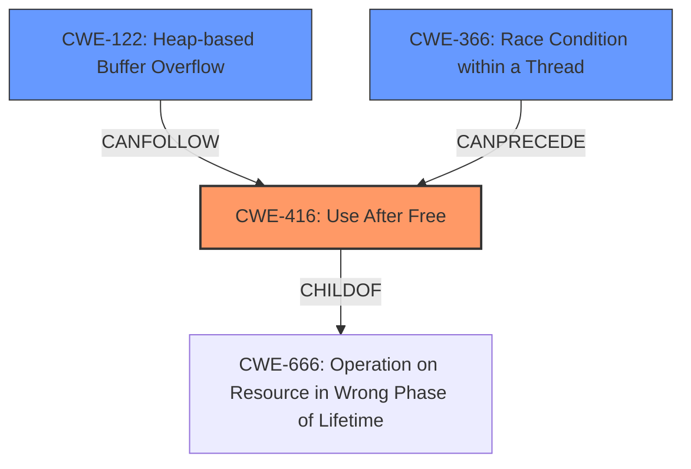

# Final Resolution for CVE-2022-1635

# Summary
| CWE ID | CWE Name | Confidence | CWE Abstraction Level | CWE Vulnerability Mapping Label | CWE-Vulnerability Mapping Notes |
|---|---|---|---|---|---|
| CWE-416 | Use After Free | 1.0 | Variant | Allowed | Primary CWE |
| CWE-122 | Heap-based Buffer Overflow | 0.7 | Variant | Allowed | Secondary Candidate |
| CWE-366 | Race Condition within a Thread | 0.4 | Base | Allowed | Secondary Candidate |

## Evidence and Confidence

*   **Confidence Score:** 0.9
*   **Evidence Strength:** MEDIUM

## Relationship Analysis
The primary weakness is **CWE-416 (Use After Free)**, a variant of memory corruption issues. **CWE-122 (Heap-based Buffer Overflow)** is a potential consequence of heap corruption, stemming from the Use-After-Free. **CWE-366 (Race Condition within a Thread)** is considered due to the possibility of concurrent UI interactions triggering the vulnerability.

## Vulnerability Chain
The vulnerability chain starts with a "**Use-After-Free (CWE-416)**" condition. This occurs due to specific user interactions. The use of freed memory can then lead to "**Heap-based Buffer Overflow (CWE-122)**" causing heap corruption. The UI interactions might be subject to "**Race Condition within a Thread (CWE-366)**", if the UI elements are handled by separate threads. The chain highlights a sequence from an initial memory management error to potential exploitation through heap corruption.

## Summary of Analysis
The initial analysis correctly identified **CWE-416 (Use After Free)** as the primary **ROOTCAUSE**, supported by the vulnerability description stating "Use after free". The mention of "**heap corruption**" led to the inclusion of **CWE-122 (Heap-based Buffer Overflow)** as a secondary candidate.

The criticism suggested investigating concurrency, leading to the inclusion of **CWE-366 (Race Condition within a Thread)**. The confidence is lower because there is no explicit evidence of threading, but the UI interactions raise the possibility.

The final decision is primarily based on the evidence in the vulnerability description. **CWE-416 (Use After Free)** is the most specific **WEAKNESS** and best represents the root cause. The secondary candidates, **CWE-122 (Heap-based Buffer Overflow)** and **CWE-366 (Race Condition within a Thread)**, are included due to potential consequences and contributing factors.