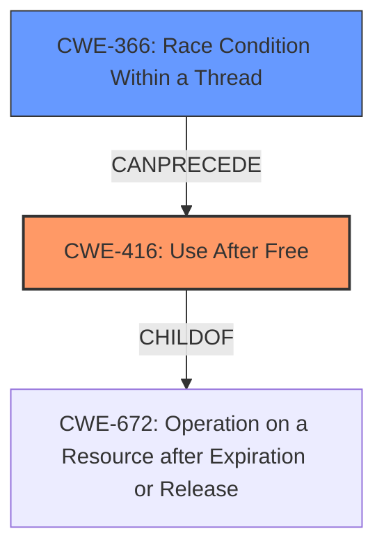

# Analysis Report for CVE-2022-1636

# Vulnerability Analysis Report: CVE-2022-1636

## Description

Use after free in Performance APIs in Google Chrome prior to 101.0.4951.64 allowed a remote attacker to potentially exploit heap corruption via a crafted HTML page.

## Vulnerability Description Key Phrases

**Weakness:** use after free
**Impact:** heap corruption
**Vector:** crafted HTML page
**Attacker:** remote attacker
**Product:** Google Chrome
**Version:** prior to 101.0.4951.64
**Component:** Performance APIs

## Analysis (with Relationship Data)

# Summary
| CWE ID | CWE Name | Confidence | CWE Abstraction Level | CWE Vulnerability Mapping Label | CWE-Vulnerability Mapping Notes |
|---|---|---|---|---|---|
| CWE-416 | Use After Free | 1.0 | Variant |  Primary | Allowed |

## Evidence and Confidence

*   **Confidence Score:** 1.0
*   **Evidence Strength:** HIGH

- **Analysis and Justification:**  
  - *Explanation:* The vulnerability description explicitly states "**use after free** in Performance APIs" and the CVE Reference Links Content Summary confirms "**Root cause of vulnerability:** Use-after-free in Performance APIs." This aligns directly with CWE-416 (Use After Free), which describes the product reusing memory after it has been freed. The vulnerability can lead to heap corruption as stated in the description, which is a typical consequence of use-after-free conditions. The CWE-416 entry is at the Variant level of abstraction, which is the preferred level. MITRE mapping guidance for CWE-416 indicates this is ALLOWED, providing further support for the selection of this CWE.

  - *Relationship Analysis:* CWE-416 is a variant of CWE-672 (Operation on Resource after Expiry).

- **Confidence Score:**  
  - Confidence: 1.0 (Explicit mention of 'use after free' in the vulnerability description and supporting CVE details provides high confidence)

## Criticism of Analysis

Okay, here's a detailed review of the provided CWE analysis, considering the full CWE specifications:

**Overall Assessment:**

The analysis is strong and well-justified. The primary mapping to CWE-416 (Use After Free) is accurate and appropriate. The confidence level of 1.0 is warranted given the explicit mention of "use after free" in the original vulnerability description and CVE summary. The explanation is clear and connects the vulnerability to the CWE definition effectively. The identified relationship to CWE-672 is also correct.

**Detailed Review:**

**1. CWE-416: Use After Free**

*   **Correctness:** Excellent. The analysis correctly identifies CWE-416 as the primary weakness. The description of the vulnerability aligns perfectly with the CWE-416 definition: "The product reuses or references memory after it has been freed."  The consequence, "heap corruption", is also a typical outcome of use-after-free vulnerabilities.
*   **Abstraction Level:** Appropriate.  CWE-416 is a Variant, which is the preferred level of abstraction according to CWE's mapping guidance.
*   **Mapping Guidance Compliance:** The analysis correctly notes that CWE-416 is "Allowed" for mapping, reinforcing the selection.
*   **Evidence Strength:** The evidence strength is rightly assessed as HIGH due to the explicit mentions in the vulnerability description.
*   **Relationship Analysis:** The identification of CWE-672 as a parent is correct. CWE-672 is a more general "Operation on a Resource after Expiration or Release," and CWE-416 is a specific type of this related to memory.
*   **Examples:** The included examples are relevant and illustrate real-world instances of CWE-416.

**2. Top Combined Results from Retriever Results (Evaluation of Alternatives):**

While the analysis correctly chose CWE-416, let's evaluate the other highly ranked CWEs from the retriever results to understand why they *weren't* selected and if there's any argument to be made for their inclusion.

*   **CWE-843: Access of Resource Using Incompatible Type ('Type Confusion')**:  While heap corruption *can* sometimes be caused by type confusion, it's not the *direct* or *most likely* cause in this scenario.  The vulnerability is explicitly described as a *use-after-free*.  Type confusion would be more relevant if the memory was still considered "valid" but was being interpreted incorrectly.  Therefore, excluding CWE-843 is appropriate.

*   **CWE-366: Race Condition within a Thread**:  Race conditions can *lead* to use-after-free vulnerabilities, but the core problem here is the UAF itself. A race condition isn't explicitly mentioned in the description, so including it would be speculative without further evidence. If analysis discovered multiple threads accessing and freeing the same memory region, then it would be a good addition.

*   **CWE-415: Double Free**:  Double-free vulnerabilities are similar to use-after-free vulnerabilities, however the description specifies the memory is accessed *after* it has been freed, which is the defining characteristic of CWE-416.

*   **CWE-122: Heap-based Buffer Overflow**: While a UAF *could* lead to conditions that make exploitation *easier* via a heap-based buffer overflow (e.g., by allowing an attacker to control the contents of the freed memory), it is not the primary weakness. Furthermore, the description doesn't mention an overflow. Buffer overflows involve writing past the bounds of a memory buffer, which is distinct from using memory after it's been freed.

*   **CWE-356: Product UI does not Warn User of Unsafe Actions/CWE-367: Time-of-check Time-of-use (TOCTOU) Race Condition/CWE-190: Integer Overflow or Wraparound/CWE-451: User Interface (UI) Misrepresentation of Critical Information/CWE-911: Improper Update of Reference Count**: These are clearly less relevant given the core vulnerability description.

**Recommendations:**

*   **Mitigations (Enhancement - Optional):** The analysis could optionally include mitigations that are specific to this vulnerability. While the general mitigations for CWE-416 are listed in the CWE entry, mentioning specific techniques applicable to Performance APIs in Chrome could be helpful. For example:
    *   Employing rigorous memory management practices in the Performance APIs code.
    *   Utilizing address sanitizers (ASan) and memory sanitizers (MSan) during development and testing.
    *   Implementing robust reference counting or garbage collection mechanisms (although this might impact performance).
    *   Adding specific checks and assertions to ensure that memory is valid before being accessed.

*   **Potential Chaining (Optional):** While the primary mapping is correct, consider *briefly* mentioning that a race condition (CWE-362, CWE-366) *could* be a contributing factor that triggers the use-after-free condition in a multi-threaded environment.  This is speculative, but it acknowledges a common scenario in which UAF vulnerabilities arise. This should be done cautiously and only if analysis supports that it is at least possible.

**Conclusion:**

The analysis is excellent and provides a solid justification for the selection of CWE-416. The inclusion of relevant CWE specifications reinforces the analysis. The optional enhancements regarding mitigations and potential chaining would further strengthen the assessment.

## Final Resolution

# Summary
| CWE ID | CWE Name | Confidence | CWE Abstraction Level | CWE Vulnerability Mapping Label | CWE-Vulnerability Mapping Notes |
|---|---|---|---|---|---|
| **CWE-416** | **Use After Free** | 1.0 | Variant |  Primary | Allowed |
| CWE-366 | Race Condition within a Thread | 0.3 | Base |  Secondary Candidate | Allowed |

## Evidence and Confidence

*   **Confidence Score:** 0.9
*   **Evidence Strength:** MEDIUM

## Relationship Analysis
The primary relationship influencing the decision is the parent-child relationship between CWE-672 (Operation on Resource after Expiration or Release) and **CWE-416** (**Use After Free**), with **CWE-416** being a variant of CWE-672, making it a more specific and appropriate choice. The analysis also considered that race conditions (CWE-366) can precede **use-after-free** vulnerabilities but are not explicitly stated in the vulnerability description, so it is included as a secondary candidate with low confidence.

## Vulnerability Chain
The vulnerability chain starts with memory being freed. Subsequently, the freed memory is accessed, leading to a **use-after-free** condition (**CWE-416**). This can result in heap corruption, as noted in the vulnerability description. A potential, but not confirmed, race condition (CWE-366) could be a contributing factor that triggers the **use-after-free** condition.

## Summary of Analysis
The initial analysis and the criticism both agree on the primary classification of **CWE-416** (**Use After Free**). The vulnerability description explicitly mentions "**use after free**," providing a strong basis for this classification. The criticism correctly points out that while other CWEs like CWE-843 (Access of Resource Using Incompatible Type) and CWE-366 (Race Condition within a Thread) could potentially be related, they are not the direct cause described in the vulnerability. The decision to include CWE-366 as a secondary candidate with low confidence (0.3) stems from the understanding that race conditions can lead to **use-after-free**, but there isn't enough explicit evidence in the description to warrant a higher confidence level. The selection of **CWE-416** is at the optimal level of specificity, as it is a variant-level CWE that directly addresses the described vulnerability. Evidence: "Use after free in Performance APIs in Google Chrome prior to 101.0.4951.64 allowed a remote attacker to potentially exploit heap corruption via a crafted HTML page."

*Report generated on 2025-03-18 07:30:25*
