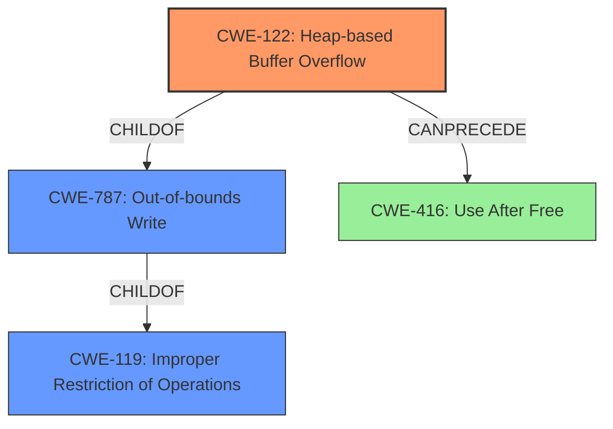

# Final Resolution for CVE-2022-1638

# Summary
| CWE ID | CWE Name | Confidence | CWE Abstraction Level | CWE Vulnerability Mapping Label | CWE-Vulnerability Mapping Notes |
|---|---|---|---|---|---|
| CWE-122 | Heap-based Buffer Overflow | 0.95 | Variant | Allowed | Primary CWE |
| CWE-787 | Out-of-bounds Write | 0.7 | Base | Allowed | Secondary Candidate |
| CWE-416 | Use After Free | 0.5 | Variant | Allowed | Secondary Candidate |

## Evidence and Confidence

*   **Confidence Score:** 0.9
*   **Evidence Strength:** HIGH

## Relationship Analysis
The primary relationship influencing the decision is the parent-child relationship between CWE-787 (**Out-of-bounds Write**) and CWE-122 (**Heap-based Buffer Overflow**). CWE-122 is a specific type of CWE-787 occurring in the heap. While CWE-787 is applicable, CWE-122 provides more specificity. CWE-416 (**Use After Free**) is considered a potential consequence of **heap corruption**, creating a chain relationship where a **heap buffer overflow** leads to memory corruption, potentially followed by a use-after-free condition.

## Vulnerability Chain
The vulnerability chain starts with the **ROOTCAUSE**, a crafted HTML page which exploits V8 Internationalization. This leads to **CWE-122 (Heap-based Buffer Overflow)**, causing **heap corruption**. The **heap corruption** (CWE-787) can potentially lead to **CWE-416 (Use After Free)** if the overflow overwrites metadata that results in premature freeing of memory.

## Summary of Analysis
The initial analysis and criticism are both well-reasoned. The vulnerability description explicitly states "heap buffer overflow," making **CWE-122 (Heap-based Buffer Overflow)** the most direct and appropriate choice as the Primary CWE. The choice of CWE-122 is also supported by the CVE Reference Links Content Summary which confirms "**Heap buffer overflow** in V8 Internationalization." The retriever results also support this, and the mapping guidance indicates `Usage: Allowed` for CWE-122.

**CWE-787 (Out-of-bounds Write)** is a valid secondary consideration as it represents the underlying mechanism of writing beyond the allocated buffer. The decision to include this CWE is based on the understanding that a **heap buffer overflow** necessarily involves writing out of bounds.

**CWE-416 (Use After Free)** is a plausible, but less certain, secondary weakness. The link between "**heap corruption**" and a subsequent use-after-free condition is reasonable, but not explicitly stated.

The suggestion to explicitly rule out **CWE-843 (Access of Resource Using Incompatible Type ('Type Confusion'))** is helpful. Although it appears high in the retriever results, the more direct root cause is the buffer overflow.

The final selection is based on the evidence provided in the vulnerability description and the understanding of the relationships between different CWEs. The selected CWEs are at the optimal level of specificity, with CWE-122 being the most specific and directly applicable, and CWE-787 capturing the broader out-of-bounds write aspect.