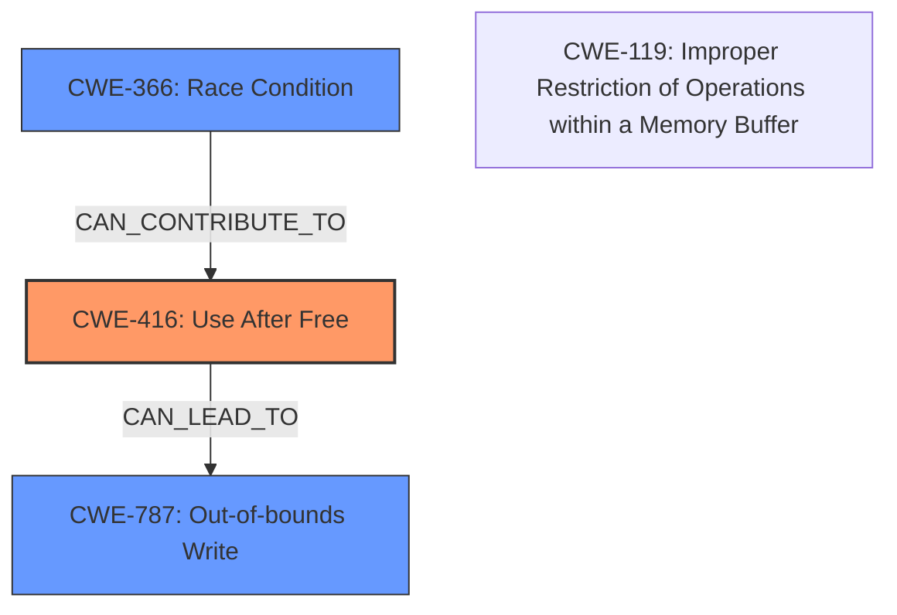

# Analysis Report for CVE-2022-1639

# Vulnerability Analysis Report: CVE-2022-1639

## Description

Use after free in ANGLE in Google Chrome prior to 101.0.4951.64 allowed a remote attacker to potentially exploit heap corruption via a crafted HTML page.

## Vulnerability Description Key Phrases

**Rootcause:** Use after free
**Impact:** potentially exploit heap corruption
**Vector:** crafted HTML page
**Attacker:** remote attacker
**Product:** Google Chrome
**Version:** prior to 101.0.4951.64
**Component:** ANGLE

## Analysis (with Relationship Data)

# Summary
| CWE ID | CWE Name | Confidence | CWE Abstraction Level | CWE Vulnerability Mapping Label | CWE-Vulnerability Mapping Notes |
|---|---|---|---|---|---|
| CWE-416 | Use After Free | 1.0 | Variant | Allowed | Primary CWE |

## Evidence and Confidence

*   **Confidence Score:** 1.0
*   **Evidence Strength:** HIGH

- **Analysis and Justification:**  
  - *Explanation:* The vulnerability description clearly states "**Use after free** in ANGLE". The CVE Reference Links Content Summary also highlights "**Use after free** in ANGLE" as the **root_cause** and one of the **weaknesses**. The description of CWE-416 (Use After Free) precisely matches this, as it describes reusing or referencing memory after it has been freed. The provided mapping guidance states that Usage is ALLOWED for CWE-416, and the Rationale is that it is a Variant level of abstraction, which is a preferred level.
  
  - *Relationship Analysis:* No direct relationships are mentioned in the provided information, but Use-After-Free can lead to various exploits.

- **Confidence Score:**  
  - Confidence: 1.0 (Direct evidence from vulnerability description and CVE reference materials)

## Criticism of Analysis

Okay, I've reviewed the analysis and the provided CWE specifications. Here's my critique:

**Overall Assessment:**

The analysis is generally good.  The primary CWE mapping to CWE-416 (Use After Free) is correct and well-justified, directly based on the vulnerability description. The confidence score of 1.0 is appropriate given the explicit nature of the vulnerability.

**Strengths:**

*   **Clear and Concise Justification:** The explanation for selecting CWE-416 is straightforward and directly references the vulnerability description and CVE summary.
*   **Correct Identification of Primary CWE:** The root cause is indeed Use-After-Free.
*   **Consideration of Abstraction Level:** The analysis correctly acknowledges and follows the CWE mapping guidance, which prefers Variant-level CWEs when applicable.
*   **Inclusion of CWE Examples:** Listing known examples of CWE-416 provides context and reinforces the correct identification.
*   **Correct Usage:** The CWE-416 Usage is "Allowed" and the analysis correctly follows this.

**Potential Improvements & Considerations:**

1.  **Relationship Analysis Expansion:** While the analysis notes that Use-After-Free can lead to various exploits, it could benefit from more specific examples of potential consequences in the ANGLE/Chrome context.  For instance, a UAF could lead to:
    *   **Arbitrary Code Execution:**  If the freed memory is reallocated with attacker-controlled data, the attacker could hijack control flow.
    *   **Information Leakage:** Reading the contents of the reallocated memory before it's initialized could expose sensitive data.
    *   **Heap Corruption (as noted in the original description):** Writing to the freed memory could corrupt the heap metadata, leading to crashes or exploitable conditions.

2.  **Mitigations Specificity (and relationship to architecture):** The generic mitigations for CWE-416 are good starting points but could be enhanced. While the analysis does mention mitigating with multiple complex data structures, there could be more in-depth mitigations based on the ANGLE architecture.

    *   **Reference Counting:** ANGLE might already use reference counting for some objects. The vulnerability might stem from an incorrect implementation or a missing reference count in a specific area. (See also retrievers, and the mention of ref counting).
    *   **Smart Pointers:** If applicable, ANGLE could migrate to using smart pointers (e.g., `std::unique_ptr`, `std::shared_ptr` in C++) to manage object lifetimes automatically, reducing the risk of manual memory management errors.
    *   **Object Pools/Arenas:** If the allocation patterns for certain ANGLE objects are predictable, using object pools or memory arenas could improve performance and simplify memory management, making it easier to track object lifetimes.
    *   **AddressSanitizer (ASan):** This dynamic analysis tool can detect use-after-free errors at runtime.  This is a development/testing mitigation, but a crucial one.

3.  **Review of other Retriever results:** Although the analysis correctly chose CWE-416, there are other retrievers that could be considered, to determine if they contribute to the vulnerability. For example:
    * CWE-366 is a race condition, in the retriever results. If multiple threads can access and free/use the ANGLE resource, there may be a race condition involved.
    * CWE-787 is an out-of-bounds write, which could be related to heap corruption impact. Further investigation would be needed.

**Addressing Top CWEs:**

*   **CWE-787 (Out-of-bounds Write):** The original description mentions "heap corruption."  While CWE-416 is the direct cause, the *impact* (heap corruption) could be linked to a potential out-of-bounds write that occurs *after* the use-after-free.  An attacker might overwrite heap metadata after triggering the UAF.  It's worth considering whether to add CWE-787 as a secondary CWE to represent the potential exploitation path.
*   **CWE-362 (Race Condition):**  This CWE is interesting, given the presence of ANGLE inside of Chrome, which itself may be running in a multi-threaded environment. Race conditions can exacerbate UAF vulnerabilities. If the freeing and subsequent access are not properly synchronized, a race condition could make exploitation more reliable or introduce additional attack vectors. However, without more information about the specific code involved, it's difficult to determine if CWE-362 is directly relevant, but it's one worth keeping in mind.

**Recommendations:**

1.  **Expand Relationship Analysis:** Provide more specific examples of potential consequences stemming from the UAF in the ANGLE/Chrome context.
2.  **Enhance Mitigations with ANGLE specifics:**  Tailor the mitigations to the ANGLE architecture, focusing on reference counting, smart pointers, object pools, and dynamic analysis tools.
3.  **Consider CWE-787 as a secondary CWE:** If the UAF leads to heap corruption via an out-of-bounds write, adding CWE-787 would be beneficial.
4.  **Consider CWE-366 as a secondary CWE:** If there is a possibility of a Race Condition in the freeing/accessing of the resource, include CWE-366.

By incorporating these suggestions, the analysis can provide a more comprehensive and actionable understanding of the vulnerability.

## Final Resolution

# Summary

| CWE ID  | CWE Name                                                       | Confidence | CWE Abstraction Level | CWE Vulnerability Mapping Label | CWE-Vulnerability Mapping Notes |
| :-------- | :------------------------------------------------------------- | :--------- | :-------------------- | :------------------------------ | :------------------------------ |
| CWE-416 | Use After Free                                           | 1.0      | Variant               | Allowed                         | Primary CWE                     |
| CWE-787 | Out-of-bounds Write                                          | 0.6      | Base                  | Allowed                         | Secondary Candidate             |
| CWE-366 | Race Condition                                                | 0.3      | Base                  | Allowed                         | Secondary Candidate             |

## Evidence and Confidence

*   **Confidence Score:** 0.8
*   **Evidence Strength:** MEDIUM

## Relationship Analysis

The primary relationship is based on the direct description of the vulnerability as a Use-After-Free (**CWE-416**). The secondary relationships consider potential consequences and contributing factors. **CWE-787 (Out-of-bounds Write)** is considered because the vulnerability description mentions "heap corruption," which can often result from out-of-bounds writes following a UAF. **CWE-366 (Race Condition)** is considered due to the multithreaded nature of Chrome and ANGLE, where race conditions could potentially exacerbate the UAF vulnerability.

## Vulnerability Chain

The vulnerability chain starts with **CWE-416 (Use After Free)**, where memory is reused after being freed. This can lead to **CWE-787 (Out-of-bounds Write)** if the freed memory is reallocated and then overwritten, corrupting the heap. **CWE-366 (Race Condition)** could contribute if multiple threads are involved in the freeing and subsequent access of the memory, making the UAF more exploitable.

## Summary of Analysis

The initial analysis correctly identified **CWE-416 (Use After Free)** as the primary **weakness**, which directly aligns with the vulnerability description: "Use after free in ANGLE." The confidence in this assessment remains high (1.0) due to the explicit nature of the description.

The criticism suggested considering **CWE-787 (Out-of-bounds Write)** as a secondary CWE due to the mention of "heap corruption." This is a reasonable suggestion, as heap corruption often involves writing beyond the intended bounds of a memory region. Therefore, **CWE-787** is added as a secondary CWE with a confidence of 0.6.

The criticism also raised the possibility of **CWE-366 (Race Condition)**. Given that ANGLE runs within Chrome, a multithreaded environment, it's plausible that a race condition could exacerbate the UAF. However, without more specific evidence of a race condition in the freeing or accessing of the memory, the confidence in this classification is lower (0.3).

The final decision is based on both the direct evidence (the UAF) and the potential consequences and contributing factors (heap corruption and race condition). The selected CWEs are at the optimal level of specificity, with **CWE-416** being a Variant, and **CWE-787** and **CWE-366** being Base level CWEs.

*Report generated on 2025-03-18 07:31:57*
