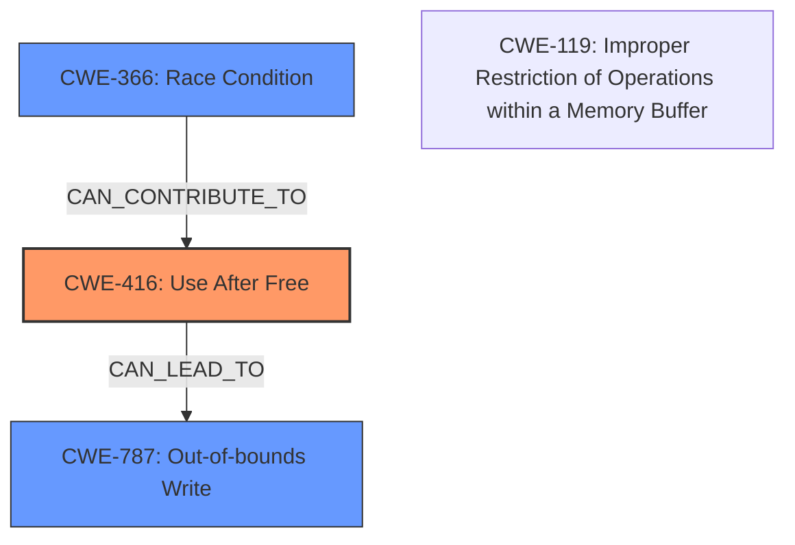

# Final Resolution for CVE-2022-1639

# Summary

| CWE ID  | CWE Name                                                       | Confidence | CWE Abstraction Level | CWE Vulnerability Mapping Label | CWE-Vulnerability Mapping Notes |
| :-------- | :------------------------------------------------------------- | :--------- | :-------------------- | :------------------------------ | :------------------------------ |
| CWE-416 | Use After Free                                           | 1.0      | Variant               | Allowed                         | Primary CWE                     |
| CWE-787 | Out-of-bounds Write                                          | 0.6      | Base                  | Allowed                         | Secondary Candidate             |
| CWE-366 | Race Condition                                                | 0.3      | Base                  | Allowed                         | Secondary Candidate             |

## Evidence and Confidence

*   **Confidence Score:** 0.8
*   **Evidence Strength:** MEDIUM

## Relationship Analysis

The primary relationship is based on the direct description of the vulnerability as a Use-After-Free (**CWE-416**). The secondary relationships consider potential consequences and contributing factors. **CWE-787 (Out-of-bounds Write)** is considered because the vulnerability description mentions "heap corruption," which can often result from out-of-bounds writes following a UAF. **CWE-366 (Race Condition)** is considered due to the multithreaded nature of Chrome and ANGLE, where race conditions could potentially exacerbate the UAF vulnerability.

## Vulnerability Chain

The vulnerability chain starts with **CWE-416 (Use After Free)**, where memory is reused after being freed. This can lead to **CWE-787 (Out-of-bounds Write)** if the freed memory is reallocated and then overwritten, corrupting the heap. **CWE-366 (Race Condition)** could contribute if multiple threads are involved in the freeing and subsequent access of the memory, making the UAF more exploitable.

## Summary of Analysis

The initial analysis correctly identified **CWE-416 (Use After Free)** as the primary **weakness**, which directly aligns with the vulnerability description: "Use after free in ANGLE." The confidence in this assessment remains high (1.0) due to the explicit nature of the description.

The criticism suggested considering **CWE-787 (Out-of-bounds Write)** as a secondary CWE due to the mention of "heap corruption." This is a reasonable suggestion, as heap corruption often involves writing beyond the intended bounds of a memory region. Therefore, **CWE-787** is added as a secondary CWE with a confidence of 0.6.

The criticism also raised the possibility of **CWE-366 (Race Condition)**. Given that ANGLE runs within Chrome, a multithreaded environment, it's plausible that a race condition could exacerbate the UAF. However, without more specific evidence of a race condition in the freeing or accessing of the memory, the confidence in this classification is lower (0.3).

The final decision is based on both the direct evidence (the UAF) and the potential consequences and contributing factors (heap corruption and race condition). The selected CWEs are at the optimal level of specificity, with **CWE-416** being a Variant, and **CWE-787** and **CWE-366** being Base level CWEs.