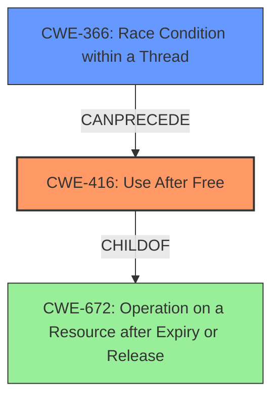

# Final Resolution for CVE-2022-1641

# Summary
| CWE ID | CWE Name | Confidence | CWE Abstraction Level | CWE Vulnerability Mapping Label | CWE-Vulnerability Mapping Notes |
|---|---|---|---|---|---|
| CWE-416 | Use After Free | 1.0 | Variant | Allowed | Primary CWE. Directly addresses the **root cause** of the vulnerability. |
| CWE-366 | Race Condition within a Thread | 0.4 | Base | Allowed | Secondary CWE.  A possible contributing factor if Web UI Diagnostics operates in a multi-threaded environment. |

## Evidence and Confidence

*   **Confidence Score:** 0.9
*   **Evidence Strength:** MEDIUM

## Relationship Analysis
The primary relationship considered is the potential chain relationship where a race condition (**CWE-366**) could lead to a **use-after-free** (**CWE-416**).  **CWE-416** is a variant of **CWE-672**, highlighting that an operation is performed on an expired resource. The abstraction levels influenced the decision, favoring the variant level (**CWE-416**) for its specificity but also considering the base level (**CWE-366**) for potential contributing factors.

## Vulnerability Chain
The primary **root cause** is the **use-after-free** condition (**CWE-416**). A potential vulnerability chain involves a race condition (**CWE-366**) where memory is freed by one thread while another thread is still using it, leading to the **use-after-free** and subsequent **heap corruption**. Missing information is whether the UI Diagnostics component is multi-threaded; if it is, this strengthens the chain.

## Summary of Analysis
The initial analysis correctly identified **CWE-416 (Use After Free)** as the primary **weakness**. The criticism suggested considering a potential race condition (**CWE-366**) if the affected component is multi-threaded. Based on the evidence "**Use after free** in Web UI Diagnostics in Google Chrome on Chrome OS prior to 101.0.4951.64 allowed a remote attacker who convinced a user to engage in specific UI interactions to potentially exploit heap corruption via specific user interaction," and "**Root cause** of vulnerability: **Use after free** in Web UI Diagnostics," **CWE-416** remains the primary **CWE**.

The graph relationships influenced the decision by highlighting the possibility of a **CWE-366** -> **CWE-416** chain. However, without explicit evidence of multi-threading, **CWE-366** is only considered a secondary candidate with lower confidence.

The selected **CWEs** are at the optimal level of specificity because **CWE-416** directly describes the vulnerability, and if further information arises, **CWE-366** could be added to describe the conditions.