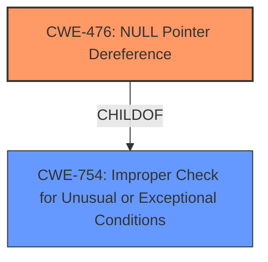

# Final Resolution for CVE-2022-1649

# Summary
| CWE ID | CWE Name | Confidence | CWE Abstraction Level | CWE Vulnerability Mapping Label | CWE-Vulnerability Mapping Notes |
|---|---|---|---|---|---|
| CWE-476 | NULL Pointer Dereference | 1.0 | Base | Allowed | Primary CWE: Matches the **root cause** directly. |
| CWE-754 | Improper Check for Unusual or Exceptional Conditions | 0.6 | Class | Allowed-with-Review | Secondary CWE: Contextualizes the missing null check. |
  
## Evidence and Confidence

*   **Confidence Score:** 0.95
*   **Evidence Strength:** HIGH

## Relationship Analysis
The primary relationship impacting the decision is the parent-child relationship between CWE-476 (NULL Pointer Dereference) and CWE-754 (Improper Check for Unusual or Exceptional Conditions). CWE-476 is a child of CWE-754, indicating that a missing null check is a specific type of improper check. While CWE-476 is the more direct and specific cause, including CWE-754 provides additional context.

## Vulnerability Chain
The vulnerability chain starts with a missing check for a NULL pointer (CWE-754). This leads to the dereference of a NULL pointer (CWE-476), which results in a crash or other undefined behavior.
  - **Root Cause:** Missing NULL check (CWE-754)
  - **Weakness:** NULL Pointer Dereference (CWE-476)
  - **Impact:** Crash or undefined behavior

## Summary of Analysis
The initial analysis correctly identified CWE-476 as the primary **weakness**. The criticism suggested adding CWE-754 to provide context for the missing null check. This suggestion has been incorporated into the final analysis.

The vulnerability description states: "**Null pointer dereference** in libr/bin/format/mach0/mach0.c". This directly supports the selection of CWE-476. The addition of CWE-754 is supported by the understanding that the **root cause** is the lack of a proper check before dereferencing the pointer. Both CWEs are at acceptable levels of abstraction (Base and Class, respectively).