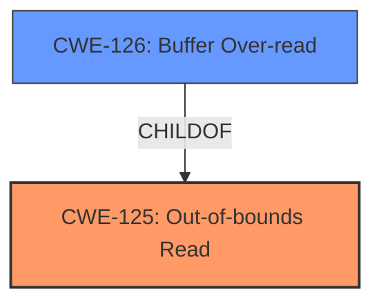

# Analysis Report for CVE-2022-1714

# Vulnerability Analysis Report: CVE-2022-1714

## Description

Out-of-bounds Read in GitHub repository radareorg/radare2 prior to 5.7.0. The bug causes the program reads data past the end of the intented buffer. Typically, this can allow attackers to read sensitive information from other memory locations or cause a crash.

## Vulnerability Description Key Phrases

**Rootcause:** Out-of-bounds Read
**Impact:** ['program reads data past the end of the intended buffer', 'read sensitive information from other memory locations', 'cause a crash']
**Attacker:** attackers
**Product:** radare2
**Version:** prior to 5.7.0

## Analysis (with Relationship Data)

# Summary
| CWE ID  | CWE Name                        | Confidence | CWE Abstraction Level | CWE Vulnerability Mapping Label | CWE-Vulnerability Mapping Notes |
| :------- | :------------------------------ | :--------- | :-------------------- | :------------------------------ | :------------------------------ |
| CWE-125 | Out-of-bounds Read | 1.00      | Base                  | Allowed                         | Root cause of the vulnerability  |

## Evidence and Confidence

*   **Confidence Score:** 1.00
*   **Evidence Strength:** HIGH

- **Analysis and Justification:**
  - *Explanation:* The vulnerability description explicitly states "**Out-of-bounds Read**" as the **rootcause**. The description also mentions that the program "reads data past the end of the intended buffer," which aligns directly with the definition of CWE-125 [Out-of-bounds Read]. The CVE Reference Links Content Summary confirms this by stating "A 4-byte out-of-bounds read in the MSP430 disassembler" and "the code attempts to read 2 bytes for a jump address when the buffer has less than 4 bytes." The retriever results also show CWE-125 as a high-scoring candidate. Therefore, CWE-125 is the most appropriate mapping.

  - *Relationship Analysis:* CWE-125 [Out-of-bounds Read] is a Base level CWE. The retriever results also included CWE-126 [Buffer Over-read], which is a Variant of CWE-125, however, the description provided aligns more precisely with the Base CWE. CWE-125 can precede CWE-823 (Use of Out-of-range Pointer Offset) and CWE-824 (Access of Uninitialized Pointer). While those could potentially be related, there is not enough evidence to confirm.

- **Confidence Score:**
  - Confidence: 1.00 (Direct evidence from the vulnerability description and CVE reference materials)

## Criticism of Analysis

Okay, here's a review of the provided analysis based on the full CWE specifications, focusing on the accuracy of the CWE mapping and potential alternative mappings, along with comments on the reasoning provided and the relevance of potential mitigations.

**Overall Assessment:**

The analysis correctly identifies **CWE-125: Out-of-bounds Read** as the primary weakness. The confidence score of 1.0 is justified given the clear language in both the vulnerability description and the CVE reference. The justification is well-articulated, referencing specific phrases from the input data.

**Detailed Review:**

| CWE ID  | CWE Name                        | Confidence | CWE Abstraction Level | CWE-Vulnerability Mapping Label | CWE-Vulnerability Mapping Notes | Review Comments                                                                                                                                                                                                                                                                                                                                                                |
| :------- | :------------------------------ | :--------- | :-------------------- | :------------------------------ | :------------------------------ | :---------------------------------------------------------------------------------------------------------------------------------------------------------------------------------------------------------------------------------------------------------------------------------------------------------------------------------------------------------------------------- |
| CWE-125 | Out-of-bounds Read | 1.00      | Base                  | Allowed                         | Root cause of the vulnerability  | **Correct**.  The analysis accurately maps the vulnerability to CWE-125.  The explanation is thorough and well-supported by evidence.  The CVE reference links directly confirm the out-of-bounds read condition. The provided code snippet (reading 2 bytes when only < 4 are available) is a clear example.                                                                                   |

**Analysis of Alternative CWEs Considered (Based on Retriever Results):**

*   **CWE-823: Use of Out-of-range Pointer Offset:**  While the code involves pointer arithmetic (implicit in array indexing), the core issue is *not* that the *offset* itself is derived from an untrusted source or is the result of a complex calculation. The problem is that the code attempts to read past the end of the *buffer* regardless of the pointer's inherent validity *within* the allocated buffer size. This makes CWE-125 the more accurate choice.  CWE-823 *could* become relevant in more complex scenarios. The "Additional Notes" for CWE-823 ("There are close relationships between incorrect pointer dereferences and other weaknesses related to buffer operations...") is worth keeping in mind for future, similar analyses.
*   **CWE-126: Buffer Over-read:** This *is* a very close call.  CWE-126 is a *Variant* of CWE-125. The description "reads from a buffer using buffer access mechanisms such as indexes or pointers that reference memory locations *after* the targeted buffer" is accurate.  Because CWE-126 is a *variant* and the core description matches, in many situations, CWE-126 might be preferable. *However*, the description for CWE-125 is "reads data past the end, or before the beginning, of the intended buffer."  Because the specification is simple, clear, and direct, this is a case where the *Base* CWE, CWE-125, is a slightly better fit.  Were the details of the pointer increment more complex, and the access specifically *after* the current pointer, CWE-126 would be preferable.

*   **CWE-130: Improper Handling of Length Parameter Inconsistency:** This is *not* the primary weakness, but it *could* be a contributing factor in some out-of-bounds read vulnerabilities. If the code *relied* on a length field associated with the buffer and *failed* to validate that length against the actual buffer size, CWE-130 would be relevant. In this specific case, however, the information doesn't indicate that a length parameter inconsistency was the root cause. It's more about the code directly assuming a certain length without checking.
*   **CWE-787: Out-of-bounds Write:** This is incorrect. The vulnerability is explicitly an *out-of-bounds read*, not a write.
*   **CWE-476: NULL Pointer Dereference:** There is no indication of a NULL pointer dereference in the vulnerability description. This mapping is irrelevant.
*   **CWE-170: Improper Null Termination:** This is not applicable. The vulnerability doesn't involve string manipulation or issues with null termination.
*   **CWE-190/191/193: Integer Overflow/Underflow/Off-by-one:** These are not the primary issues here. It is *possible* that an integer overflow/underflow could be *used* to calculate an incorrect buffer size or offset, leading to the out-of-bounds read, but the core problem remains the out-of-bounds access, not the integer issue itself. Furthermore, there is no evidence suggesting these vulnerabilities in the source materials.

**Mitigation Strategies (CWE-125):**

The analysis correctly identifies CWE-125, and the provided CWE specification includes relevant mitigation strategies:

*   **Input Validation:**  This is *highly relevant*. The "accept known good" strategy is appropriate. The description within Mitigation 1 about validating length arguments and buffer size calculations *directly applies* to this vulnerability.  The fix described in the CVE reference links confirms that input validation (checking `len > 4`) is the correct mitigation strategy.
*   **Language Selection:**  While using a memory-safe language could *prevent* this type of vulnerability, it's not a practical mitigation for an existing codebase.

**Recommendations:**

1.  **Maintain the CWE-125 mapping.** It is accurate and well-justified.
2.  **Consider mentioning CWE-126 in the analysis.** Given that CWE-126 is a variant of CWE-125, and the closeness of the mapping, specifically mentioning it would demonstrate thoughtful consideration of the alternatives.
3.  **Reinforce the relevance of Input Validation as a mitigation.** Explicitly connect the mitigation strategies from the CWE specification to the specific fix mentioned in the CVE details (the length check).

In summary, the analysis is strong. The identification of CWE-125 as the primary weakness is correct and supported by the evidence. By highlighting the relationship with CWE-126 and reinforcing the practical relevance of the Input Validation mitigation strategy, the analysis would be even stronger.

## Final Resolution

# Summary
| CWE ID  | CWE Name                        | Confidence | CWE Abstraction Level | CWE Vulnerability Mapping Label | CWE-Vulnerability Mapping Notes |
| :------- | :------------------------------ | :--------- | :-------------------- | :------------------------------ | :------------------------------ |
| CWE-125 | Out-of-bounds Read | 1.00      | Base                  | Allowed                         | Primary CWE, Root cause of the vulnerability  |
| CWE-126 | Buffer Over-read | 0.75      | Variant                  | Allowed                         | Secondary Candidate |

## Evidence and Confidence

*   **Confidence Score:** 0.95
*   **Evidence Strength:** HIGH

## Relationship Analysis
The primary relationship that impacted the decision was the parent-child relationship between CWE-125 (**Out-of-bounds Read**) and CWE-126 (**Buffer Over-read**). CWE-126 is a variant of CWE-125, making it a closely related alternative. The final decision leaned towards CWE-125 as the primary because the vulnerability description explicitly mentions reading "past the end of the intended buffer," which directly aligns with CWE-125's base-level description. However, CWE-126 was still considered as a secondary candidate due to its specific focus on buffer over-reads.

## Vulnerability Chain
The vulnerability chain starts with the **ROOTCAUSE** being the lack of proper bounds checking when reading data. This leads to **CWE-125 (Out-of-bounds Read)**, where the program reads data past the end of the intended buffer. The consequence of this read could be sensitive information disclosure or a program crash due to accessing invalid memory locations. The description "A 4-byte out-of-bounds read in the MSP430 disassembler" and "the code attempts to read 2 bytes for a jump address when the buffer has less than 4 bytes" from the CVE reference links are explicit evidence of this chain.

## Summary of Analysis
The initial analysis and criticism both converge on CWE-125 (**Out-of-bounds Read**) as the most appropriate primary CWE. The vulnerability description explicitly states "**Out-of-bounds Read**" as the **rootcause**. The description also mentions that the program "reads data past the end of the intended buffer," which aligns directly with the definition of CWE-125.

The graph relationships influenced the decision by highlighting the close relationship between CWE-125 and CWE-126. While CWE-126 is more specific, the general nature of the vulnerability description makes CWE-125 a slightly better fit as the primary. The explicit mention of reading past the end of the buffer in the vulnerability report is strong evidence for CWE-125.

The chosen CWEs are at the optimal level of specificity. CWE-125 is a base-level CWE, providing a general description of the vulnerability. While CWE-126 is a variant, the evidence doesn't strongly favor the more specific classification.

*Report generated on 2025-03-18 07:45:14*
