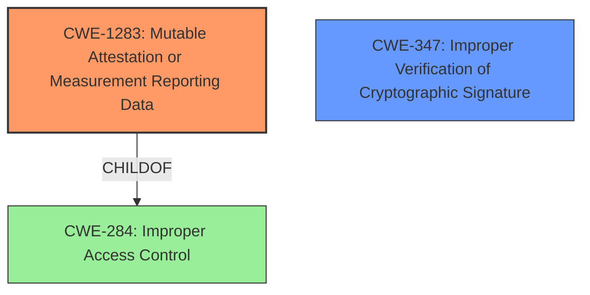

# Final Resolution for CVE-2022-1740

# Summary
| CWE ID | CWE Name | Confidence | CWE Abstraction Level | CWE Vulnerability Mapping Label | CWE-Vulnerability Mapping Notes |
|---|---|---|---|---|---|
| CWE-1283 | Mutable Attestation or Measurement Reporting Data | 1.0 | Base | Allowed | Primary CWE: The device's self-attestation mechanisms are modifiable by an attacker. |
| CWE-347 | Improper Verification of Cryptographic Signature | 0.5 | Base | Allowed | Secondary CWE: The system may not be properly verifying signatures, which could have prevented the vulnerability. Only applicable if signatures are expected. |

## Evidence and Confidence

*   **Confidence Score:** 0.9
*   **Evidence Strength:** MEDIUM

## Relationship Analysis
The primary CWE, CWE-1283 (**Mutable Attestation or Measurement Reporting Data**), is a base-level CWE, which is ideal for root cause analysis. It has a parent relationship to CWE-284 (**Improper Access Control**), indicating a broader context of access control issues. The secondary CWE, CWE-347 (**Improper Verification of Cryptographic Signature**), represents a missing security control that could have prevented the vulnerability. There are no direct relationships between CWE-1283 and CWE-347, but CWE-347 highlights the absence of a proper signature verification mechanism.

## Vulnerability Chain
The vulnerability chain starts with the **ROOTCAUSE**: a lack of proper protection for attestation data. This leads to the **WEAKNESS**: CWE-1283 (**Mutable Attestation or Measurement Reporting Data**), where an attacker can modify the reported hash values. This modification allows the attacker to disguise malicious applications. If a signature were expected, then the **WEAKNESS** CWE-347 (**Improper Verification of Cryptographic Signature**) contributes to the vulnerability by not detecting the modified data. The final impact is that the system trusts modified and potentially malicious applications.

## Summary of Analysis
The initial analysis correctly identified CWE-1283 (**Mutable Attestation or Measurement Reporting Data**) as the primary **WEAKNESS**. The criticism suggested adding CWE-347 (**Improper Verification of Cryptographic Signature**) as a secondary CWE, which is reasonable if the system is supposed to use signatures. The analysis has been updated to reflect this conditional inclusion of CWE-347. The selection of CWE-1283 is justified by the vulnerability description, which explicitly states that the self-attestation mechanisms are modifiable.

The decision to include CWE-347 is based on the *potential* lack of signature verification. If signatures are not used at all, then CWE-347 is not applicable. The confidence score for CWE-347 is lower (0.5) to reflect this uncertainty.

The selected CWEs are at the optimal level of specificity. CWE-1283 is a base-level CWE, which is preferred for root cause analysis. Alternative CWEs suggested by the retriever, such as CWE-1392 (**Use of Default Credentials**) and CWE-532 (**Insertion of Sensitive Information into Log File**), are not applicable based on the available evidence. CWE-1283 directly addresses the **ROOTCAUSE**: the ability to modify attestation data.