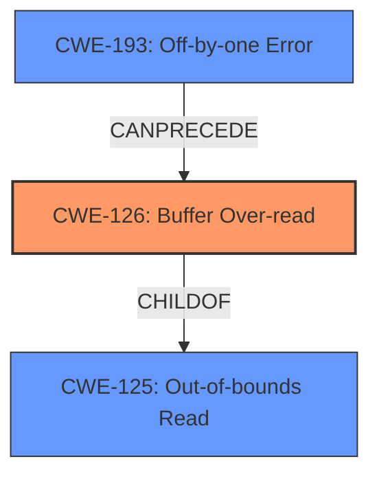

# Analysis Report for CVE-2022-1769

# Vulnerability Analysis Report: CVE-2022-1769

## Description

Buffer Over-read in GitHub repository vim/vim prior to 8.2.4974.

## Vulnerability Description Key Phrases

**Weakness:** buffer Over-read
**Product:** vim/vim
**Version:** prior to 8.2.4974

## Analysis (with Relationship Data)

# Summary
| CWE ID | CWE Name | Confidence | CWE Abstraction Level | CWE Vulnerability Mapping Label | CWE-Vulnerability Mapping Notes |
|---|---|---|---|---|---|
| CWE-126 | Buffer Over-read | 0.95 | Variant | Allowed | Primary CWE |
| CWE-125 | Out-of-bounds Read | 0.75 | Base | Allowed | Secondary Candidate |
| CWE-193 | Off-by-one Error | 0.60 | Base | Allowed | Secondary Candidate |

## Evidence and Confidence

*   **Confidence Score:** 0.90
*   **Evidence Strength:** HIGH

- **Analysis and Justification:**  
  - *Explanation:* "The vulnerability is described as a **buffer over-read** in vim/vim prior to version 8.2.4974. The CVE Reference Links Content Summary confirms this, stating that a **buffer over-read** vulnerability exists in `scriptfile.c` when handling the `:so` command due to an improper calculation of the length of the text being read. This aligns directly with CWE-126 (Buffer Over-read), a Variant-level CWE that specifically addresses reading beyond the boundaries of a buffer. The MITRE mapping guidance for CWE-126 indicates it is ALLOWED. CWE-125 (Out-of-bounds Read) is also a possible candidate, however, CWE-126 is more specific because it describes a read *after* the buffer, whereas CWE-125 describes reads before or after the buffer. CWE-193 is also a possible candidate, as it might be the cause of the buffer over-read because of an off-by-one error in the length calculation."
  
  - *Relationship Analysis:* "CWE-126 is a child of CWE-125 (Out-of-bounds Read), which is a more general case of reading outside buffer boundaries. CWE-126 can be caused by CWE-193 (Off-by-one Error), which may have led to the incorrect length calculation."

- **Confidence Score:**  
  - Confidence: 0.95 (High confidence due to direct match with the vulnerability description and CVE details)

## Criticism of Analysis

Okay, here's a review of the provided analysis, taking into account the full CWE specifications:

**Overall Assessment:**

The analysis is generally good. It correctly identifies CWE-126 (Buffer Over-read) as the primary weakness. The justification is well-reasoned and supported by the vulnerability description. The inclusion of secondary candidates (CWE-125, CWE-193) is also appropriate, demonstrating a deeper understanding of the potential root causes and related weaknesses. The confidence level is appropriate given the direct match in the vulnerability description.

**Detailed Review:**

1.  **CWE-126: Buffer Over-read (Primary)**
    *   **Assessment:** Correct. The description of the vulnerability aligns perfectly with the definition of CWE-126. The analysis correctly points out that the code reads beyond the allocated buffer.
    *   **Mapping Guidance:** The analysis follows the Mapping Guidance, which recommends using Variant-level CWEs when available, and that CWE-126 is ALLOWED.
    *   **Observed Examples:** The provided examples such as CVE-2022-1733 and CVE-2014-0160 are valid examples of buffer over-read vulnerabilities.
    *   **Mitigations:** Not explicitly discussed, but the analysis implicitly suggests the need for proper length calculation and validation. If the report was to be further enhanced, it could have mentioned general mitigations like "use an 'accept known good' input validation strategy".
    *   **Further Considerations:** The extended description mentions that this may result in exposure of sensitive information or possibly a crash. The provided analysis also describes that the impact of exploitation can be a denial of service or potentially remote code execution, aligning with the description in the CWE.

2.  **CWE-125: Out-of-bounds Read (Secondary Candidate)**
    *   **Assessment:** Reasonable as a secondary candidate. CWE-125 is a more general form of out-of-bounds read and is the parent of CWE-126. The justification for including it is acceptable, as the over-read is *technically* an out-of-bounds read.
    *   **Mapping Guidance:** The analysis follows the Mapping Guidance, as it is marked as Allowed.
    *   **Further Considerations:** It's good the analysis prioritized the more specific CWE-126, it shows understanding of CWE hierarchies.

3.  **CWE-193: Off-by-one Error (Secondary Candidate)**
    *   **Assessment:** Also a reasonable secondary candidate. The description mentions "improper calculation of the length," which *could* be due to an off-by-one error. This is a plausible root cause.
    *   **Mapping Guidance:** The analysis follows the Mapping Guidance, as it is marked as Allowed.
    *    **Potential Mitigations:** The full CWE specification includes a useful mitigation:  "When copying character arrays or using character manipulation methods, the correct size parameter must be used to account for the null terminator that needs to be added at the end of the array."  If the root cause *is* an off-by-one with string manipulation, this mitigation is highly relevant.
    *    **Further Considerations:** It could have been helpful to include a description about an off-by-one error in the length calculation that is causing the buffer over-read.

**Points for Improvement:**

*   **Expand on Mitigations:** While the analysis identifies the weakness and root cause well, it could be strengthened by explicitly discussing potential mitigations. Drawing from the CWE specifications, suggest practical steps to prevent the vulnerability (e.g., input validation, safe string handling functions, using languages with memory safety features).

*   **Relationship to other CWEs:** Some of the suggested CWEs in the "Retriever Results" section could be related to the vulnerability. For example, CWE-805 "Buffer Access with Incorrect Length Value" and CWE-130 "Improper Handling of Length Parameter Inconsistency" could be potential root causes or contributing factors to the buffer over-read. While the analysis mentions that the issue is caused by an improper calculation of the length of the text being read, the report could explain why it *didn't* choose CWE-805 or CWE-130.

*   **CWE-786 vs CWE-124:** CWE-786 (Access of Memory Location Before Start of Buffer) is in the initial retriever results, but should be ignored. The provided analysis correctly doesn't consider CWE-786 as the vulnerability is a buffer *over*-read and not a buffer *under*-read.

**Revised Summary Table (incorporating suggestions):**

| CWE ID  | CWE Name                       | Confidence | CWE Abstraction Level | CWE Vulnerability Mapping Label | CWE-Vulnerability Mapping Notes                                                                                                                                                  |
| ------- | ------------------------------ | ---------- | --------------------- | ------------------------------- | ----------------------------------------------------------------------------------------------------------------------------------------------------------------------------- |
| CWE-126 | Buffer Over-read               | 0.95       | Variant               | Allowed                         | Primary CWE                                                                                                                                                                   |
| CWE-125 | Out-of-bounds Read            | 0.75       | Base                  | Allowed                         | Secondary Candidate. Generalization of CWE-126.                                                                                                                               |
| CWE-193 | Off-by-one Error               | 0.60       | Base                  | Allowed                         | Secondary Candidate. Possible root cause of the incorrect length calculation leading to the over-read. Mitigation: Ensure correct size parameters for string manipulation functions |

**Conclusion:**

The analysis is accurate and well-justified. By adding a discussion of potential mitigations and further exploring the relationships between other related CWEs, the analysis can be further improved.

## Final Resolution

# Summary
| CWE ID | CWE Name | Confidence | CWE Abstraction Level | CWE Vulnerability Mapping Label | CWE-Vulnerability Mapping Notes |
|---|---|---|---|---|---|
| CWE-126 | Buffer Over-read | 0.95 | Variant | Allowed | Primary CWE |
| CWE-125 | Out-of-bounds Read | 0.75 | Base | Allowed | Secondary Candidate |
| CWE-193 | Off-by-one Error | 0.60 | Base | Allowed | Secondary Candidate |

## Evidence and Confidence

*   **Confidence Score:** 0.95
*   **Evidence Strength:** HIGH

## Relationship Analysis
The primary CWE is CWE-126 (**Buffer Over-read**), which is a child of CWE-125 (**Out-of-bounds Read**). This hierarchical relationship indicates that CWE-126 is a more specific case of CWE-125. CWE-193 (**Off-by-one Error**) is a possible cause of the **buffer over-read**, thus it can precede CWE-126.

## Vulnerability Chain
The vulnerability chain starts with a potential CWE-193 (**Off-by-one Error**) during the calculation of the buffer length. This leads to CWE-126 (**Buffer Over-read**), where the program reads beyond the allocated buffer. The impact of this can be denial of service or remote code execution.

## Summary of Analysis
The initial analysis and criticism both agree that CWE-126 (**Buffer Over-read**) is the most appropriate primary CWE. The vulnerability description explicitly mentions a **buffer over-read**, and the CVE details confirm that the issue exists in `scriptfile.c` due to an improper length calculation. This direct match justifies the selection of CWE-126.

The inclusion of CWE-125 (**Out-of-bounds Read**) as a secondary candidate is reasonable because it is a more general case of reading outside buffer boundaries. CWE-193 (**Off-by-one Error**) is also a plausible secondary candidate because the improper length calculation could be caused by an off-by-one error.

The graph relationships support the selection of CWE-126 as the primary CWE, as it is a more specific type of CWE-125. The potential for CWE-193 to precede CWE-126 suggests a vulnerability chain where an off-by-one error leads to a buffer over-read.

The selected CWEs are at the optimal level of specificity because CWE-126 directly describes the vulnerability, while CWE-125 and CWE-193 provide additional context about the possible root cause and broader category of the vulnerability.

*Report generated on 2025-03-18 07:58:22*
