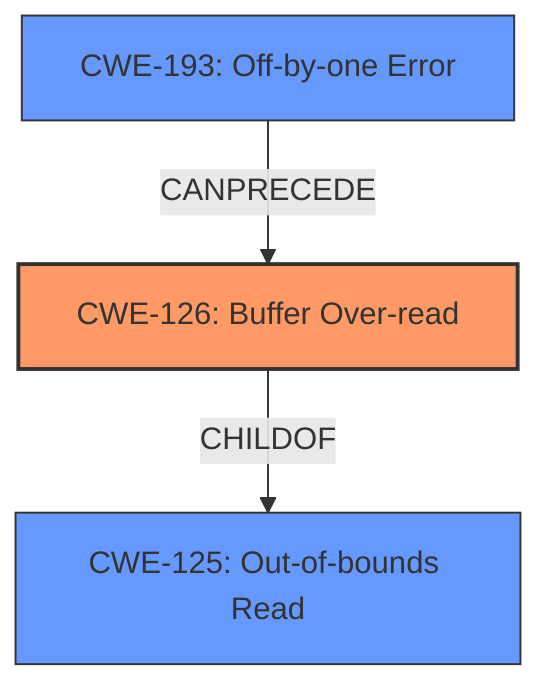

# Final Resolution for CVE-2022-1769

# Summary
| CWE ID | CWE Name | Confidence | CWE Abstraction Level | CWE Vulnerability Mapping Label | CWE-Vulnerability Mapping Notes |
|---|---|---|---|---|---|
| CWE-126 | Buffer Over-read | 0.95 | Variant | Allowed | Primary CWE |
| CWE-125 | Out-of-bounds Read | 0.75 | Base | Allowed | Secondary Candidate |
| CWE-193 | Off-by-one Error | 0.60 | Base | Allowed | Secondary Candidate |

## Evidence and Confidence

*   **Confidence Score:** 0.95
*   **Evidence Strength:** HIGH

## Relationship Analysis
The primary CWE is CWE-126 (**Buffer Over-read**), which is a child of CWE-125 (**Out-of-bounds Read**). This hierarchical relationship indicates that CWE-126 is a more specific case of CWE-125. CWE-193 (**Off-by-one Error**) is a possible cause of the **buffer over-read**, thus it can precede CWE-126.

## Vulnerability Chain
The vulnerability chain starts with a potential CWE-193 (**Off-by-one Error**) during the calculation of the buffer length. This leads to CWE-126 (**Buffer Over-read**), where the program reads beyond the allocated buffer. The impact of this can be denial of service or remote code execution.

## Summary of Analysis
The initial analysis and criticism both agree that CWE-126 (**Buffer Over-read**) is the most appropriate primary CWE. The vulnerability description explicitly mentions a **buffer over-read**, and the CVE details confirm that the issue exists in `scriptfile.c` due to an improper length calculation. This direct match justifies the selection of CWE-126.

The inclusion of CWE-125 (**Out-of-bounds Read**) as a secondary candidate is reasonable because it is a more general case of reading outside buffer boundaries. CWE-193 (**Off-by-one Error**) is also a plausible secondary candidate because the improper length calculation could be caused by an off-by-one error.

The graph relationships support the selection of CWE-126 as the primary CWE, as it is a more specific type of CWE-125. The potential for CWE-193 to precede CWE-126 suggests a vulnerability chain where an off-by-one error leads to a buffer over-read.

The selected CWEs are at the optimal level of specificity because CWE-126 directly describes the vulnerability, while CWE-125 and CWE-193 provide additional context about the possible root cause and broader category of the vulnerability.