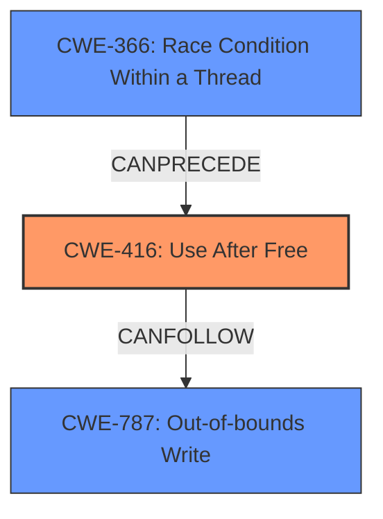

# Final Resolution for CVE-2022-1854

# Summary
| CWE ID | CWE Name | Confidence | CWE Abstraction Level | CWE Vulnerability Mapping Label | CWE-Vulnerability Mapping Notes |
|---|---|---|---|---|---|
| CWE-416 | Use After Free | 1.0 | Variant | Allowed | Primary CWE |
| CWE-366 | Race Condition Within a Thread | 0.4 | Base | Allowed | Secondary Candidate |
| CWE-787 | Out-of-bounds Write | 0.3 | Base | Allowed | Secondary Candidate |

## Evidence and Confidence

*   **Confidence Score:** 0.9
*   **Evidence Strength:** HIGH

## Relationship Analysis
The primary CWE is CWE-416 (**Use After Free**). This is a Variant level CWE, providing a good level of specificity. CWE-416 can be reached via a race condition (CWE-366) or lead to an out-of-bounds write (CWE-787) as a consequence. Therefore, while the primary **weakness** is CWE-416, we consider CWE-366 and CWE-787 as secondary candidates to represent possible causes and consequences.

## Vulnerability Chain
The vulnerability chain starts with a potential **race condition** (**CWE-366**) where memory is freed by one thread while another thread is still accessing it. This leads to a **use-after-free** condition (**CWE-416**), where the program attempts to access memory that has already been freed. The impact of this can be heap corruption, potentially leading to an **out-of-bounds write** (**CWE-787**) and ultimately arbitrary code execution. The vulnerability description specifically mentions the **use-after-free**, making CWE-416 the primary **weakness**.

## Summary of Analysis
The initial analysis and criticism both converge on CWE-416 (**Use After Free**) as the primary **weakness**. The vulnerability description explicitly states a **use-after-free**, providing strong evidence for this classification. The retriever results also support this, with CWE-416 having a high score.

The relationship analysis highlights potential causes and consequences of the **use-after-free**. A race condition (**CWE-366**) could lead to the **use-after-free**, and the **use-after-free** could lead to an out-of-bounds write (**CWE-787**).

The final decision is to classify the vulnerability primarily as CWE-416 with secondary considerations for CWE-366 and CWE-787. This reflects the specific vulnerability described and considers potential contributing factors and consequences. The selected CWEs are at the optimal level of specificity, with CWE-416 being a Variant and CWE-366 and CWE-787 being Base level CWEs. The decision is based on the provided evidence, relationship analysis, and mapping guidance.

The evidence from the vulnerability description is: "Use after free in ANGLE in Google Chrome prior to 102.0.5005.61 allowed a remote attacker to potentially exploit heap corruption via a crafted HTML page."

This statement explicitly mentions "Use after free", directly supporting the classification of CWE-416.