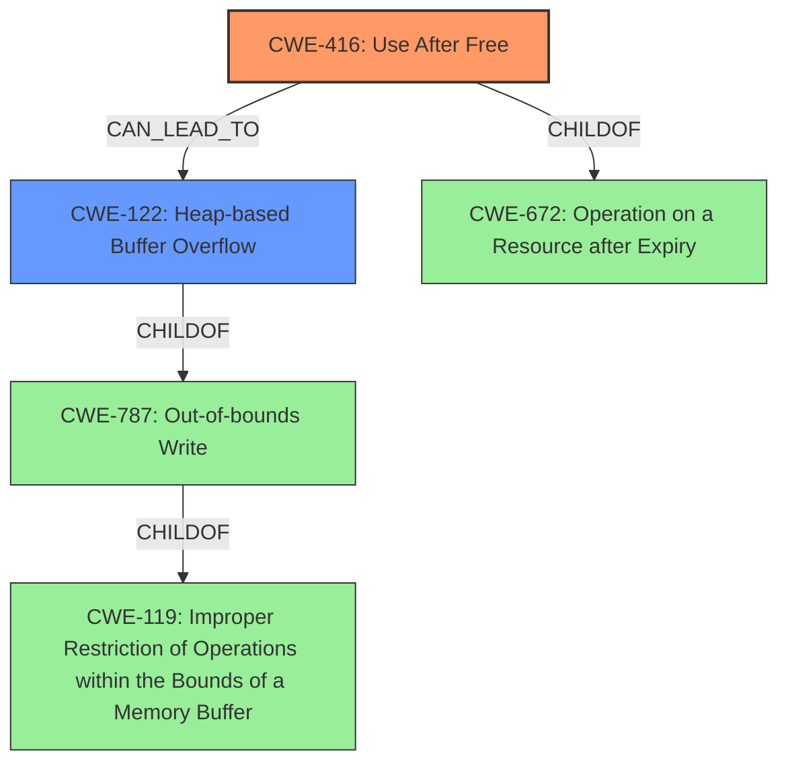

# Final Resolution for CVE-2022-1856

# Summary
| CWE ID | CWE Name | Confidence | CWE Abstraction Level | CWE Vulnerability Mapping Label | CWE-Vulnerability Mapping Notes |
|---|---|---|---|---|---|
| CWE-416 | Use After Free | 0.95 | Variant | Allowed | This is the primary CWE because the vulnerability description explicitly states "use after free". Mitigations include using memory-safe languages and setting pointers to NULL after freeing. |
| CWE-122 | Heap-based Buffer Overflow | 0.5 | Variant | Allowed | This is a secondary candidate because **heap corruption** is mentioned, and a UAF can lead to corruption, potentially in the form of a heap overflow. Mitigations include using languages with bounds checking and employing compiler-based overflow detection. This is *dependent on* the specific manifestation of the UAF. |

## Evidence and Confidence

*   **Confidence Score:** 0.93
*   **Evidence Strength:** HIGH

## Relationship Analysis
The primary relationship is that CWE-416 (Use After Free) can potentially lead to CWE-122 (Heap-based Buffer Overflow) if the freed memory is reallocated and subsequently overflowed. CWE-416 is a variant of CWE-672 (Operation on a Resource after Expiry). CWE-122 is a variant of CWE-119 (Improper Restriction of Operations within the Bounds of a Memory Buffer) and a child of CWE-787 (Out-of-bounds Write).

## Vulnerability Chain
The vulnerability chain starts with a coding error that leads to memory being freed prematurely or incorrectly. This results in CWE-416 (**Use After Free**), where the application attempts to access or modify the freed memory. If an attacker can reallocate this memory and then trigger a write operation using the dangling pointer, it can lead to **heap corruption**, which may manifest as CWE-122 (**Heap-based Buffer Overflow**) or other heap-related issues. The ultimate impact is arbitrary code execution due to **heap corruption**.

## Summary of Analysis
The initial analysis and criticism are both well-reasoned. The primary CWE, CWE-416 (**Use After Free**), is strongly supported by the vulnerability description, which explicitly mentions "use after free." The secondary CWE, CWE-122 (**Heap-based Buffer Overflow**), is plausible given the mention of "heap corruption," but it is less certain and depends on the specific details of how the use-after-free is exploited.

The graph relationships influenced the selection by illustrating how CWE-416 can potentially lead to CWE-122, and placing the vulnerability in the broader context of resource management issues (CWE-672) and memory safety (CWE-119, CWE-787).

The selected CWEs are at the optimal level of specificity. CWE-416 is a variant-level CWE that directly addresses the use-after-free condition. CWE-122 is also a variant-level CWE that describes a specific type of heap corruption that may result from the use-after-free.

The final decision is based on the provided evidence, specifically the vulnerability description's mention of "use after free" and "heap corruption". The confidence score reflects the strength of this evidence.