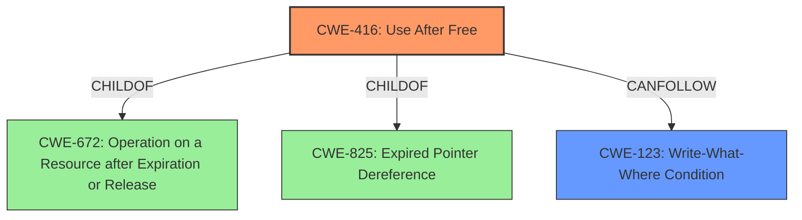

# Analysis Report for CVE-2022-1864

# Vulnerability Analysis Report: CVE-2022-1864

## Description

Use after free in WebApp Installs in Google Chrome prior to 102.0.5005.61 allowed an attacker who convinced a user to install a malicious extension to potentially exploit heap corruption via a crafted Chrome Extension and specific user interaction.

## Vulnerability Description Key Phrases

**Rootcause:** use after free
**Weakness:** heap corruption
**Vector:** crafted Chrome Extension and specific user interaction
**Product:** Google Chrome
**Version:** prior to 102.0.5005.61
**Component:** WebApp Installs

## Analysis (with Relationship Data)

# Summary
| CWE ID  | CWE Name             | Confidence | CWE Abstraction Level | CWE Vulnerability Mapping Label | CWE-Vulnerability Mapping Notes |
|---------|----------------------|------------|-----------------------|---------------------------------|-------------------------------|
| CWE-416 | Use After Free       | 1.0        | Variant              | Allowed                         | Primary CWE                   |

## Evidence and Confidence

*   **Confidence Score:** 1.0
*   **Evidence Strength:** HIGH

- **Analysis and Justification:**
  - *Explanation:* The vulnerability description explicitly states a **use after free** (**rootcause**) in WebApp Installs. The CVE Reference Links Content Summary confirms this by stating, "**Root cause of vulnerability:** Use-after-free vulnerability in the WebApp Installs component of Chromium." CWE-416 (Use After Free) is a variant-level CWE, making it a precise match. The description of CWE-416 accurately describes the vulnerability: "The product reuses or references memory after it has been freed." The "Retriever Results" also lists CWE-416 as the top candidate with a score of 0.8767. The impact described in the CVE details (arbitrary code execution) is a typical consequence of use-after-free vulnerabilities. MITRE mapping guidance for CWE-416 indicates this is ALLOWED. The weakness led to **heap corruption**.
  
  - *Relationship Analysis:* CWE-416 is a variant of CWE-672 (Operation on Resource after Expiry). Exploitation of a use-after-free can lead to various impacts, including arbitrary code execution, which may involve privilege escalation or data leakage.

- **Confidence Score:**
  - Confidence: 1.0 (Strong evidence from the vulnerability description and CVE reference materials).

## Criticism of Analysis

Okay, here's a review of the CWE analysis, considering the full CWE specifications:

**Overall Assessment:**

The primary CWE mapping to CWE-416 (Use After Free) is correct and justified with strong evidence. The analysis provides a clear explanation and rationale for selecting CWE-416, referencing the vulnerability description, CVE details, and retriever results. The confidence score of 1.0 is appropriate.

**Detailed Review:**

*   **CWE-416 (Use After Free) - Primary Mapping:**

    *   **Correctness:** The mapping is accurate. The description of CWE-416 aligns perfectly with the vulnerability description: re-using memory after it's been freed.
    *   **Abstraction Level:** Variant level is appropriate. It's specific enough to pinpoint the type of memory management error.
    *   **Mapping Guidance Adherence:** The analysis explicitly mentions that the CWE-416 Usage is "Allowed", which follows the CWE's mapping guidance.
    *   **Justification:** The justification is well-written, citing the original report, CVE summary, and the description of CWE-416.
    *   **Observed Examples:** The examples from the CWE database are relevant and further solidify the mapping.
    *   **Relationship Analysis:** The analysis correctly identifies CWE-416 as a child of CWE-672 and highlights the potential for arbitrary code execution.
*   **Retriever Results:**

    *   The retriever results are included and the analysis references the top candidate provided by the retriever.

**Suggestions for Improvement and Additional Considerations:**

1.  **Heap Corruption Context:** While CWE-416 is the *root cause*, the vulnerability description also mentions "heap corruption." It might be helpful to acknowledge this aspect in the analysis. While not a *direct* CWE mapping of the root cause, heap corruption is an *impact* of the vulnerability. This could be addressed with a note: "The 'heap corruption' mentioned in the description is a potential consequence or impact of the use-after-free. A successful UAF exploit can overwrite heap metadata or other data structures leading to heap corruption." A separate section for describing the impact of this vulnerability could be beneficial.

2.  **Potential Chain(s):**
    * It could be beneficial to explicitly enumerate possible CWE chains or attack patterns given the information available. For example:

        * "An attacker uses a malicious Chrome Extension (Attack Vector) to trigger a Use After Free vulnerability (CWE-416) leading to Heap Corruption. This heap corruption can then be leveraged for arbitrary code execution, potentially leading to privilege escalation and system compromise."
        * "Crafted Chrome Extension and specific user interaction (Attack Vector) -> triggering of the Use After Free (CWE-416) -> Heap Corruption -> CWE-123 Write-What-Where (If control of writes can be achieved) -> Arbitrary Code Execution."

3.  **Consider Mitigations:** While not strictly required, it can strengthen the analysis to briefly mention relevant mitigations, drawing from the CWE's "Potential Mitigations" section. For example:

    *   "Mitigation for CWE-416 includes using memory-safe languages or employing techniques like setting freed pointers to NULL (although this is not foolproof)."

4.  **CWE-672 (Operation on a Resource after Expiration or Release):** The analysis mentions that CWE-416 is a child of CWE-672. Although selecting the Variant is better than the Class (CWE-672), the analysis could include a sentence explaining *why* CWE-672 wasn't chosen, even though CWE-416 is a child. This demonstrates a deeper understanding of the CWE hierarchy. E.g., "While CWE-416 is a child of the more general CWE-672, CWE-416 is preferred because it more precisely describes the specific memory management error."

5.  **CWE-825 (Expired Pointer Dereference):** CWE-825 (Expired Pointer Dereference) is also the parent of CWE-416. Mentioning the relationship with CWE-825, and explaining why CWE-416 is more appropriate, would also strengthen the analysis. For example: "Although CWE-416 is child of CWE-825, the description of CWE-416 is a better fit as it goes into greater detail on what occurs when memory is re-used/referenced after being freed."

6.  **Review of Unselected Retriever Results:** Briefly justify why other high-ranking CWEs from the Retriever results were *not* selected. This shows due diligence. E.g., "CWE-366 (Race Condition within a Thread) received a high score, however, there's no explicit mention of concurrency or threading issues in the vulnerability description. Therefore, it's less likely to be the primary cause, although a race condition *could* contribute to triggering the UAF."

**Example Incorporating Suggestions:**

Here's an example of how to incorporate some of these suggestions into the "Analysis and Justification" section:

```
- **Analysis and Justification:**
  - *Explanation:* The vulnerability description explicitly states a **use after free** (**rootcause**) in WebApp Installs. The CVE Reference Links Content Summary confirms this by stating, "**Root cause of vulnerability:** Use-after-free vulnerability in the WebApp Installs component of Chromium." CWE-416 (Use After Free) is a variant-level CWE, making it a precise match. The description of CWE-416 accurately describes the vulnerability: "The product reuses or references memory after it has been freed." The "Retriever Results" also lists CWE-416 as the top candidate with a score of 0.8767. The impact described in the CVE details (arbitrary code execution) is a typical consequence of use-after-free vulnerabilities. MITRE mapping guidance for CWE-416 indicates this is ALLOWED. While CWE-416 is a child of the more general CWE-672 (Operation on a Resource after Expiration or Release) and CWE-825 (Expired Pointer Dereference), CWE-416 is preferred because it more precisely describes the specific memory management error. The weakness led to **heap corruption**. The 'heap corruption' mentioned in the description is a potential consequence or impact of the use-after-free. A successful UAF exploit can overwrite heap metadata or other data structures leading to heap corruption. Mitigation for CWE-416 includes using memory-safe languages or employing techniques like setting freed pointers to NULL (although this is not foolproof).
  - *Relationship Analysis:* CWE-416 is a variant of CWE-672 (Operation on Resource after Expiry). Exploitation of a use-after-free can lead to various impacts, including arbitrary code execution, which may involve privilege escalation or data leakage. An attacker uses a malicious Chrome Extension (Attack Vector) to trigger a Use After Free vulnerability (CWE-416) leading to Heap Corruption. This heap corruption can then be leveraged for arbitrary code execution, potentially leading to privilege escalation and system compromise. Other top candidates that were not selected: CWE-366 (Race Condition within a Thread) received a high score, however, there's no explicit mention of concurrency or threading issues in the vulnerability description. Therefore, it's less likely to be the primary cause, although a race condition *could* contribute to triggering the UAF."
```

By incorporating these suggestions, you can make the analysis even more robust and demonstrate a comprehensive understanding of the vulnerability and its relationship to the CWE framework.

## Final Resolution

# Summary
| CWE ID  | CWE Name             | Confidence | CWE Abstraction Level | CWE Vulnerability Mapping Label | CWE-Vulnerability Mapping Notes |
|---------|----------------------|------------|-----------------------|---------------------------------|-------------------------------|
| CWE-416 | Use After Free       | 1.0        | Variant              | Allowed                         | Primary CWE                   |
| CWE-123 | Write-What-Where     | 0.6        | Base              | Allowed                         | Secondary CWE                   |

## Evidence and Confidence

*   **Confidence Score:** 0.9
*   **Evidence Strength:** MEDIUM

## Relationship Analysis
The primary CWE, CWE-416 (**Use After Free**), is a Variant of CWE-672 (**Operation on a Resource after Expiration or Release**) and CWE-825 (**Expired Pointer Dereference**). The secondary CWE, CWE-123 (**Write-What-Where Condition**), can follow CWE-416. The selection of CWE-416 is based on its specific description of the vulnerability, making it a more precise match than its parents. The relationship between CWE-416 and CWE-123 indicates a potential vulnerability chain where a **Use After Free** could lead to arbitrary write capabilities.



## Vulnerability Chain
The vulnerability chain starts with the attacker convincing a user to install a malicious extension. This leads to a **Use After Free (CWE-416)** in WebApp Installs, resulting in heap corruption. The heap corruption can then potentially be exploited to achieve arbitrary write capabilities (**Write-What-Where, CWE-123**), which ultimately leads to arbitrary code execution.

## Summary of Analysis
The initial analysis correctly identified CWE-416 (**Use After Free**) as the primary **rootcause** of the vulnerability. The criticism provided valuable suggestions for improvement, particularly in acknowledging the heap corruption aspect and exploring potential vulnerability chains. Based on the vulnerability description and the relationships between CWEs, I concur with the primary classification of CWE-416.

The vulnerability description explicitly states "Use after free" in WebApp Installs, which directly aligns with the description of CWE-416. The CVE reference further confirms this with the statement, "**Root cause of vulnerability:** Use-after-free vulnerability in the WebApp Installs component of Chromium."

I am also adding CWE-123 (**Write-What-Where Condition**) as a secondary CWE because a **Use After Free** often leads to the ability to write to arbitrary memory locations if the freed memory is reallocated and the attacker can control the contents. This secondary classification reflects the potential impact and exploitability of the **rootcause** weakness.

The selection of CWE-416 is at the optimal level of specificity because it is a Variant that directly describes the memory management error. While CWE-672 and CWE-825 are parents of CWE-416, they are more general and do not capture the specific nature of the vulnerability. The inclusion of CWE-123 reflects the potential consequences of CWE-416, creating a more complete picture of the vulnerability.


*Report generated on 2025-03-18 08:04:56*
