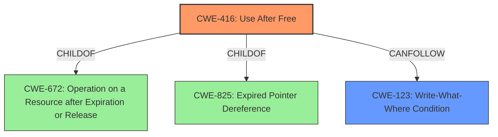

# Final Resolution for CVE-2022-1864

# Summary
| CWE ID  | CWE Name             | Confidence | CWE Abstraction Level | CWE Vulnerability Mapping Label | CWE-Vulnerability Mapping Notes |
|---------|----------------------|------------|-----------------------|---------------------------------|-------------------------------|
| CWE-416 | Use After Free       | 1.0        | Variant              | Allowed                         | Primary CWE                   |
| CWE-123 | Write-What-Where     | 0.6        | Base              | Allowed                         | Secondary CWE                   |

## Evidence and Confidence

*   **Confidence Score:** 0.9
*   **Evidence Strength:** MEDIUM

## Relationship Analysis
The primary CWE, CWE-416 (**Use After Free**), is a Variant of CWE-672 (**Operation on a Resource after Expiration or Release**) and CWE-825 (**Expired Pointer Dereference**). The secondary CWE, CWE-123 (**Write-What-Where Condition**), can follow CWE-416. The selection of CWE-416 is based on its specific description of the vulnerability, making it a more precise match than its parents. The relationship between CWE-416 and CWE-123 indicates a potential vulnerability chain where a **Use After Free** could lead to arbitrary write capabilities.

## Vulnerability Chain
The vulnerability chain starts with the attacker convincing a user to install a malicious extension. This leads to a **Use After Free (CWE-416)** in WebApp Installs, resulting in heap corruption. The heap corruption can then potentially be exploited to achieve arbitrary write capabilities (**Write-What-Where, CWE-123**), which ultimately leads to arbitrary code execution.

## Summary of Analysis
The initial analysis correctly identified CWE-416 (**Use After Free**) as the primary **rootcause** of the vulnerability. The criticism provided valuable suggestions for improvement, particularly in acknowledging the heap corruption aspect and exploring potential vulnerability chains. Based on the vulnerability description and the relationships between CWEs, I concur with the primary classification of CWE-416.

The vulnerability description explicitly states "Use after free" in WebApp Installs, which directly aligns with the description of CWE-416. The CVE reference further confirms this with the statement, "**Root cause of vulnerability:** Use-after-free vulnerability in the WebApp Installs component of Chromium."

I am also adding CWE-123 (**Write-What-Where Condition**) as a secondary CWE because a **Use After Free** often leads to the ability to write to arbitrary memory locations if the freed memory is reallocated and the attacker can control the contents. This secondary classification reflects the potential impact and exploitability of the **rootcause** weakness.

The selection of CWE-416 is at the optimal level of specificity because it is a Variant that directly describes the memory management error. While CWE-672 and CWE-825 are parents of CWE-416, they are more general and do not capture the specific nature of the vulnerability. The inclusion of CWE-123 reflects the potential consequences of CWE-416, creating a more complete picture of the vulnerability.