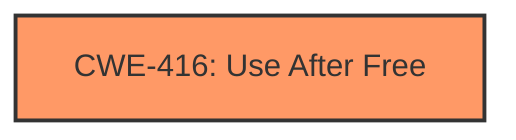

# Analysis Report for CVE-2022-1866

# Vulnerability Analysis Report: CVE-2022-1866

## Description

Use after free in Tablet Mode in Google Chrome on Chrome OS prior to 102.0.5005.61 allowed a remote attacker who convinced a user to engage in specific user interactions to potentially exploit heap corruption via specific user interactions.

## Vulnerability Description Key Phrases

**Rootcause:** use after free
**Weakness:** heap corruption
**Vector:** specific user interactions
**Attacker:** remote attacker
**Product:** Google Chrome on Chrome OS
**Version:** prior to 102.0.5005.61
**Component:** Tablet Mode

## Analysis (with Relationship Data)

# Summary
| CWE ID | CWE Name | Confidence | CWE Abstraction Level | CWE Vulnerability Mapping Label | CWE-Vulnerability Mapping Notes |
|---|---|---|---|---|---|
| CWE-416 | Use After Free | 1.0 | Variant | Allowed | Primary CWE |

## Evidence and Confidence

*   **Confidence Score:** 1.0
*   **Evidence Strength:** HIGH

- **Analysis and Justification:**  
  - *Explanation:* The vulnerability is described as a **use after free** in Tablet Mode in Google Chrome. This aligns directly with the description of CWE-416 (Use After Free), which occurs when a program reuses or references memory after it has been freed. The "CVE Reference Links Content Summary" also confirms "**Use after free**" as the root cause. The weakness results in **heap corruption** and can potentially lead to arbitrary code execution. CWE-416 is a Variant level CWE, which is a preferred level of abstraction.
  
  - *Relationship Analysis:* While other CWEs such as CWE-366 (Race Condition within a Thread) and CWE-843 (Access of Resource Using Incompatible Type ('Type Confusion')) are suggested by the retriever results, the explicit mention of "**use after free**" and **heap corruption** makes CWE-416 the most accurate and specific choice. There are no direct relationships found for CWE-416. The usage is ALLOWED.

- **Confidence Score:**  
  - *Example:* Confidence: 1.0 (Direct match with vulnerability description and reference materials.)

## Criticism of Analysis

## Critique of the Analysis

Overall, the analysis is accurate and well-justified. The primary CWE mapping to CWE-416 (Use After Free) is correct, and the justification provided is solid. The analysis correctly dismisses the other CWE suggestions as less specific or less directly related to the vulnerability description. However, there are a few points that could be improved:

**Strengths:**

*   **Correct Primary CWE:** The identification of CWE-416 as the primary weakness is accurate and well-supported by the vulnerability description ("use after free") and the reference summary.
*   **Good Justification:** The explanation of why CWE-416 is the most appropriate choice is clear and concise. It highlights the direct match with the vulnerability description and the consideration of alternative CWEs.
*   **High Confidence Score:** Assigning a confidence score of 1.0 is appropriate given the strong evidence.
*   **Consideration of Alternatives:** The analysis demonstrates an understanding of why other CWEs suggested by the retriever results (e.g., CWE-366, CWE-843) are not the best fit.
*   **Use of CWE Specifications:** The analysis leverages the provided CWE specifications effectively.

**Areas for Improvement:**

1.  **Relationship to Heap Corruption:** The vulnerability description mentions "heap corruption."  While Use-After-Free is a frequent *cause* of heap corruption, it would be good to explicitly state that the use of the freed memory leads to heap corruption when new data is written into the freed (and potentially re-allocated) memory region. It would help to clarify this relationship.

2.  **Context of Tablet Mode and User Interaction:** The vulnerability occurs in Tablet Mode and requires specific user interactions. The analysis could benefit from briefly discussing *how* Tablet Mode functionality might be related to memory management and how specific user actions could trigger the UAF. This provides context, even if the exact mechanism is not fully known.

3.  **Potential Chaining:** Although the analysis correctly identifies CWE-416 as the primary weakness, it might be beneficial to consider potential chaining relationships, especially considering the retriever results. While not a primary concern, exploring possible relationships with other CWEs could provide a more comprehensive view:

    *   **CWE-362 (Race Condition):**  Could the vulnerability involve a race condition where memory is freed by one thread while another is still accessing it?  The description mentions "specific user interactions," which might involve asynchronous operations.  If a race condition exists, it would *precede* CWE-416. However, there's no explicit mention of threads or concurrency in the provided information.
    *   **CWE-415 (Double Free):** Is double free an underlying cause? While UAF is different, it can sometimes be related to incorrect resource management that might also lead to double frees.

    Although dismissing these other CWEs as *primary* is correct, *acknowledging* the possibility of a chain and briefly explaining why it's unlikely based on the available information strengthens the analysis.

4.  **Mitigations Specific to Tablet Mode:** While the analysis correctly presents the general mitigations for CWE-416, it could be improved by mentioning specific mitigation strategies related to Tablet Mode functionality, if possible. For example, if there are specific APIs or events related to tablet mode transitions, focusing on rigorous validation and memory management around these points could be suggested.

**Revised Analysis Snippets (Incorporating Improvements):**

*   **Relationship Analysis:**
    "While other CWEs such as CWE-366 (Race Condition within a Thread) and CWE-843 (Access of Resource Using Incompatible Type ('Type Confusion')) are suggested by the retriever results, the explicit mention of "**use after free**" and **heap corruption** makes CWE-416 the most accurate and specific choice. The "use after free" occurs when memory is accessed after it has been freed, *resulting in heap corruption when subsequent writes occur to the freed memory region.* Although not explicitly stated, it is possible there is a race condition where multiple threads interact with the same memory region, or double free may occur. However, the provided information primarily indicated use after free."

*   **Context of Tablet Mode:**
    "The vulnerability occurs in Tablet Mode and requires specific user interactions to trigger the use-after-free. *It is plausible that specific transitions or events within Tablet Mode's UI and functionality lead to premature memory deallocation, leaving dangling pointers. The required user interactions may be necessary to trigger these specific events.*"

**Overall Recommendation:**

The analysis is excellent. Incorporating the suggested improvements would make it even more comprehensive and provide a deeper understanding of the vulnerability's context and potential causes.

## Final Resolution

# Summary
| CWE ID | CWE Name | Confidence | CWE Abstraction Level | CWE Vulnerability Mapping Label | CWE-Vulnerability Mapping Notes |
|---|---|---|---|---|---|
| CWE-416 | Use After Free | 1.0 | Variant | Allowed | Primary CWE |

## Evidence and Confidence

*   **Confidence Score:** 1.0
*   **Evidence Strength:** HIGH

## Relationship Analysis
The primary relationship considered was the direct match between the vulnerability description ("use after free") and the CWE-416 description. While potential chain relationships involving CWE-362 (Race Condition) or CWE-415 (Double Free) were considered, the lack of explicit evidence supporting concurrency or double freeing made CWE-416 the most appropriate and specific choice. The abstraction level of CWE-416 (Variant) is also optimal.

## Vulnerability Chain
The chain starts with the **root cause**, which is improper memory management within the Tablet Mode functionality of Google Chrome. This leads to a **weakness** which is a dangling pointer. The program then reuses this dangling pointer, resulting in **CWE-416 (Use After Free)**. The consequence is **heap corruption**, potentially leading to arbitrary code execution.

## Summary of Analysis
The initial analysis and criticism are accurate. The vulnerability description explicitly states "use after free," making CWE-416 the most direct and appropriate classification. The criticism suggests considering potential chaining relationships, such as race conditions or double frees. However, there is no direct evidence from the provided vulnerability description to support these other classifications. The analysis is based on the following evidence: "Use after free in Tablet Mode in Google Chrome on Chrome OS prior to 102.0.5005.61 allowed a remote attacker who convinced a user to engage in specific user interactions to potentially exploit heap corruption via specific user interactions."

The selected CWE is at the optimal level of specificity because it directly reflects the stated vulnerability, and there is no evidence to suggest a more specific or chained cause.

*Report generated on 2025-03-18 08:16:15*
