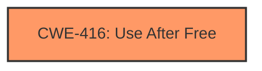

# Final Resolution for CVE-2022-1866

# Summary
| CWE ID | CWE Name | Confidence | CWE Abstraction Level | CWE Vulnerability Mapping Label | CWE-Vulnerability Mapping Notes |
|---|---|---|---|---|---|
| CWE-416 | Use After Free | 1.0 | Variant | Allowed | Primary CWE |

## Evidence and Confidence

*   **Confidence Score:** 1.0
*   **Evidence Strength:** HIGH

## Relationship Analysis
The primary relationship considered was the direct match between the vulnerability description ("use after free") and the CWE-416 description. While potential chain relationships involving CWE-362 (Race Condition) or CWE-415 (Double Free) were considered, the lack of explicit evidence supporting concurrency or double freeing made CWE-416 the most appropriate and specific choice. The abstraction level of CWE-416 (Variant) is also optimal.

## Vulnerability Chain
The chain starts with the **root cause**, which is improper memory management within the Tablet Mode functionality of Google Chrome. This leads to a **weakness** which is a dangling pointer. The program then reuses this dangling pointer, resulting in **CWE-416 (Use After Free)**. The consequence is **heap corruption**, potentially leading to arbitrary code execution.

## Summary of Analysis
The initial analysis and criticism are accurate. The vulnerability description explicitly states "use after free," making CWE-416 the most direct and appropriate classification. The criticism suggests considering potential chaining relationships, such as race conditions or double frees. However, there is no direct evidence from the provided vulnerability description to support these other classifications. The analysis is based on the following evidence: "Use after free in Tablet Mode in Google Chrome on Chrome OS prior to 102.0.5005.61 allowed a remote attacker who convinced a user to engage in specific user interactions to potentially exploit heap corruption via specific user interactions."

The selected CWE is at the optimal level of specificity because it directly reflects the stated vulnerability, and there is no evidence to suggest a more specific or chained cause.