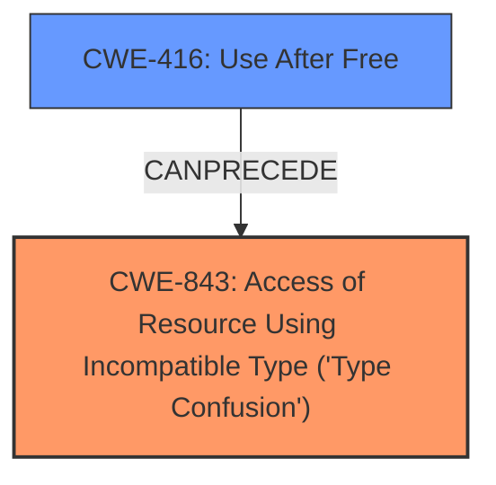

# Analysis Report for CVE-2022-1869

# Vulnerability Analysis Report: CVE-2022-1869

## Description

Type Confusion in V8 in Google Chrome prior to 102.0.5005.61 allowed a remote attacker to potentially exploit heap corruption via a crafted HTML page.

## Vulnerability Description Key Phrases

**Rootcause:** Confusion in V8
**Impact:** heap corruption
**Vector:** crafted HTML page
**Attacker:** remote attacker
**Product:** Google Chrome
**Version:** prior to 102.0.5005.61

## Analysis (with Relationship Data)

# Summary
| CWE ID | CWE Name | Confidence | CWE Abstraction Level | CWE Vulnerability Mapping Label | CWE-Vulnerability Mapping Notes |
|---|---|---|---|---|---|
| CWE-843 | Access of Resource Using Incompatible Type ('Type Confusion') | 0.95 | Base | Allowed | Primary CWE |
| CWE-416 | Use After Free | 0.6 | Variant | Allowed | Secondary Candidate |

## Evidence and Confidence

*   **Confidence Score:** 0.8
*   **Evidence Strength:** HIGH

- **Analysis and Justification:**  
  - *Explanation:* The vulnerability description explicitly states "**Type Confusion in V8**" leading to "heap corruption". CWE-843 (Access of Resource Using Incompatible Type ('Type Confusion')) directly aligns with this description. The CVE Reference Links Content Summary further supports this by stating "Type confusion vulnerability in the V8 JavaScript engine." CWE-843 is a Base level CWE, which is a preferred level of abstraction. Its Usage is ALLOWED according to MITRE.
  
  - *Relationship Analysis:* While CWE-843 does not have direct relationships in the provided information, it is related to memory corruption issues.

- **Confidence Score:**  
  - *Example:* Confidence: 0.95 (High evidence from technical description, CVE reference materials, and retriever results)

---

- **Analysis and Justification:**  
  - *Explanation:* CWE-416 (Use After Free) is a secondary candidate. The vulnerability description mentions "heap corruption", and type confusion can sometimes lead to use-after-free vulnerabilities. The Retriever Results also suggest CWE-416 as a potential match. However, the primary focus of the description and summary is on type confusion, making CWE-843 a more direct and appropriate mapping. CWE-416 is a Variant level CWE, which is a preferred level of abstraction. Its Usage is ALLOWED according to MITRE.

  - *Relationship Analysis:* CWE-416 is related to memory management issues. While not directly stated, type confusion might lead to memory corruption issues such as use-after-free.

- **Confidence Score:**  
  - *Example:* Confidence: 0.6 (Supporting evidence but not as direct as CWE-843)

## Criticism of Analysis

Okay, here's a detailed review of the provided analysis, incorporating the full CWE specifications:

**Overall Assessment:**

The analysis is generally sound and arrives at a reasonable conclusion. The primary mapping to CWE-843 is well-justified based on the vulnerability description.  The inclusion of CWE-416 as a secondary candidate is also reasonable, given the potential for type confusion to lead to use-after-free scenarios. The confidence scores are appropriate. The analysis demonstrates a good understanding of the CWEs and their relationships.

**Detailed Critique:**

**1. CWE-843 (Access of Resource Using Incompatible Type ('Type Confusion'))**

*   **Justification:** The analysis correctly identifies "Type Confusion in V8" as the primary root cause. The description of CWE-843 directly aligns with this. The connection to "heap corruption" is also relevant, as type confusion can often lead to memory corruption, including heap corruption.
*   **CWE Specification Review:**
    *   The CWE specification highlights the applicability of this weakness in type-unsafe languages. Javascript, while not strictly type-unsafe (due to dynamic typing), can still be vulnerable to type confusion issues within the V8 engine's implementation.
    *   The "Mapping Guidance" explicitly states that CWE-843 is at the Base level of abstraction, which is preferred. The analysis correctly notes this.
    *   The "Observed Examples" provide useful context, demonstrating how type confusion can manifest in real-world vulnerabilities (e.g., in CSS processing or file parsing).
*   **Critique:** The analysis is strong here.  The confidence score of 0.95 is well-supported.
*   **Suggestions:**  None.

**2. CWE-416 (Use After Free)**

*   **Justification:** The analysis correctly identifies the potential for type confusion to lead to use-after-free vulnerabilities. The mention of "heap corruption" in the original description is a contributing factor, as UAF is a common form of heap corruption. The Retriever Results also support this candidate.
*   **CWE Specification Review:**
    *   The "Description" of CWE-416 accurately reflects the vulnerability: reusing memory after it's been freed.
    *   The "Relationships" section shows that CWE-416 can be a consequence of other issues, including race conditions (CWE-362) and improper resource locking (CWE-413), which *could* be indirectly related to type confusion in some complex scenarios, although not directly in this relatively straightforward vulnerability description.
    *   The "Potential Mitigations" (language selection, setting pointers to NULL after freeing) are relevant, although less directly applicable given that the *root cause* is type confusion.
*   **Critique:** The analysis is solid in considering UAF as a secondary candidate. The confidence score of 0.6 is reasonable, reflecting the less direct evidence compared to CWE-843.
*   **Suggestions:** Could add a sentence acknowledging that it is not always possible to determine UAF without further examination of the code.

**3. Other CWEs Considered (Based on Retriever Results):**

*   **CWE-787 (Out-of-bounds Write):** While not selected, this CWE is related, as type confusion can lead to writing to unintended memory locations. If the type confusion allows writing outside the bounds of an allocated buffer, CWE-787 would be relevant. It's a reasonable consideration by the retriever.
*   **CWE-415 (Double Free):** Less likely in this scenario, but memory corruption *could* potentially lead to a double free.
*   **CWE-704 (Incorrect Type Conversion or Cast):** While type conversion is *related* to type confusion, CWE-843 is generally more specific and appropriate when the issue is about *accessing* a resource with the wrong type, rather than just the conversion itself. If the problem was only about incorrect conversion, this CWE would be the better fit.
*   **CWE-122 (Heap-based Buffer Overflow):** Related to heap corruption, and could be a *consequence* of type confusion.
*   **CWE-125 (Out-of-bounds Read):** Similar to CWE-787, this is a *potential consequence* of type confusion if it leads to reading from unintended memory locations.
*   **CWE-366 (Race Condition within a Thread):** While possible for type confusion to occur in the context of a race condition, the provided description doesn't indicate that it is the cause.
*   **CWE-356 (Product UI does not Warn User of Unsafe Actions) & CWE-451 (User Interface (UI) Misrepresentation of Critical Information) & CWE-1021 (Improper Restriction of Rendered UI Layers or Frames):** These are unlikely to be directly related as the type confusion occurs within the V8 engine itself, rather than in the UI.

**4. General Observations:**

*   **Abstraction Level:** The analysis correctly prioritizes the Base level CWE (CWE-843) and Variant level CWE (CWE-416).
*   **Evidence Strength:** The analysis accurately assesses the evidence strength for each CWE.
*   **Clarity and Justification:** The explanations are clear and well-reasoned.
*   **Mitigation Considerations:** While the analysis doesn't explicitly discuss mitigations, it's implicit that addressing the type confusion in the V8 engine would be the primary mitigation strategy.  The potential mitigations for CWE-416 (language selection, memory management practices) would be more *preventative* measures to reduce the likelihood of UAF in general, rather than specifically addressing the root cause of the type confusion.

**Recommendations:**

*   The analysis is well-done and doesn't require significant changes. The addition of a sentence acknowledging that it is not always possible to determine UAF without further examination of the code could improve clarity.
*   Consider mentioning that mitigations for CWE-416 would be preventative measures.

In conclusion, the analysis provides a strong and well-supported mapping to CWE-843, with a reasonable consideration of CWE-416 as a secondary factor. The confidence scores are appropriate, and the explanations are clear and concise.

## Final Resolution

# Summary
| CWE ID | CWE Name | Confidence | CWE Abstraction Level | CWE Vulnerability Mapping Label | CWE-Vulnerability Mapping Notes |
|---|---|---|---|---|---|
| CWE-843 | Access of Resource Using Incompatible Type ('Type Confusion') | 0.95 | Base | Allowed | Primary CWE |
| CWE-416 | Use After Free | 0.6 | Variant | Allowed | Secondary Candidate |

## Evidence and Confidence

*   **Confidence Score:** 0.9
*   **Evidence Strength:** HIGH

## Relationship Analysis
The primary relationship considered was the potential for **CWE-843 (Access of Resource Using Incompatible Type ('Type Confusion'))** to lead to **CWE-416 (Use After Free)**. While **CWE-843** doesn't have direct relationships listed in the provided information, its nature suggests it can **CANPRECEDE** memory corruption issues like **CWE-416**. **CWE-843** is a Base level CWE, offering a good level of specificity for the root cause. **CWE-416** is a Variant, making it a more specific consequence. Both are subtypes of memory corruption.



## Vulnerability Chain
The vulnerability chain starts with **CWE-843 (Access of Resource Using Incompatible Type ('Type Confusion'))**, which corrupts the heap. This corruption can then lead to **CWE-416 (Use After Free)** if the corrupted memory is freed and then accessed again. The **ROOTCAUSE** is the type confusion, and the potential impact is a use-after-free vulnerability.

## Summary of Analysis
The initial analysis and criticism both align on the primary classification of **CWE-843 (Access of Resource Using Incompatible Type ('Type Confusion'))**. The vulnerability description explicitly mentions "Type Confusion in V8", providing strong evidence for this classification. The CVE Reference Links Content Summary further supports this.

The inclusion of **CWE-416 (Use After Free)** as a secondary candidate is also reasonable, as type confusion can lead to heap corruption, potentially resulting in a use-after-free. However, the primary focus remains on the type confusion itself. As the critic noted, without deeper code inspection, it is hard to assert with certainty that **CWE-416** happened, even if its possibility exists.

The graph relationships influenced the decision by highlighting the potential chain of events, with type confusion leading to memory corruption. Both **CWE-843** and **CWE-416** are at appropriate levels of abstraction (Base and Variant, respectively). The mitigations for **CWE-843** would focus on preventing type confusion in the V8 engine, while mitigations for **CWE-416** would focus on memory management practices to prevent use-after-free vulnerabilities.
I am basing my assessment on the provided evidence and the additional information from the detailed CWE specifications, as well as the critic's notes.
The decision to prioritize **CWE-843** is justified by the explicit mention of "Type Confusion" in the vulnerability description.
```
Vulnerability Description
Type Confusion in V8 in Google Chrome prior to 102.0.5005.61 allowed a remote attacker to potentially exploit heap corruption via a crafted HTML page.
```
This direct evidence supports the classification.
The selected CWEs are at the optimal level of specificity, with **CWE-843** representing the **ROOTCAUSE** and **CWE-416** representing a potential consequence.


*Report generated on 2025-03-18 08:17:08*
