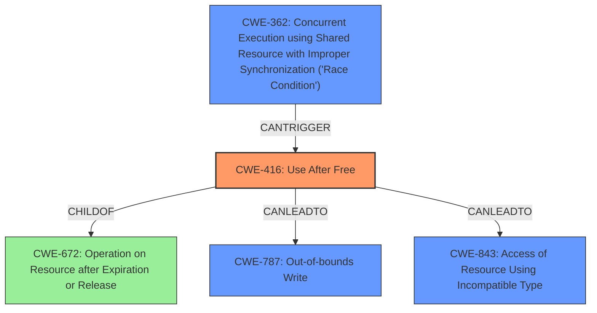

# Analysis Report for CVE-2022-1870

# Vulnerability Analysis Report: CVE-2022-1870

## Description

Use after free in App Service in Google Chrome prior to 102.0.5005.61 allowed an attacker who convinced a user to install a malicious extension to potentially exploit heap corruption via a crafted Chrome Extension.

## Vulnerability Description Key Phrases

**Rootcause:** use after free
**Weakness:** heap corruption
**Vector:** crafted Chrome Extension
**Attacker:** attacker
**Product:** Google Chrome
**Version:** prior to 102.0.5005.61
**Component:** App Service

## Analysis (with Relationship Data)

# Summary
| CWE ID | CWE Name | Confidence | CWE Abstraction Level | CWE Vulnerability Mapping Label | CWE-Vulnerability Mapping Notes |
|---|---|---|---|---|---|
| CWE-416 | Use After Free | 1.0 | Variant | Allowed | Primary CWE |

## Evidence and Confidence

*   **Confidence Score:** 1.0
*   **Evidence Strength:** HIGH

- **Analysis and Justification:**  
  - *Explanation:* The vulnerability description clearly states "**use after free** in App Service in Google Chrome". This aligns directly with the description of CWE-416, "The product reuses or references memory after it has been freed." The vulnerability leads to potential **heap corruption**, which is a consequence of use-after-free conditions. The CVE Reference Links Content Summary confirms the "**Root cause of vulnerability**" is "**Use after free**". The Retriever Results list CWE-416 as the top candidate with a high score. The CWE is a Variant, which is a preferred level of abstraction.
  
  - *Relationship Analysis:* CWE-416 (Use After Free) is a variant of CWE-672 (Operation on Resource after Expiry). The vulnerability occurs due to memory being reused after it has been freed. This can lead to unpredictable behavior and potential security vulnerabilities.

- **Confidence Score:**  
  - Confidence: 1.0 (Direct match with vulnerability description and supporting evidence)

## Criticism of Analysis

Okay, here's a detailed review of the provided CWE analysis, incorporating the full CWE specifications.

**Overall Assessment:**

The analysis is generally very good. The primary CWE mapping to CWE-416 (Use After Free) is accurate and well-supported by the evidence. The confidence score of 1.0 is justified. The provided justification is thorough and considers alternative CWEs. The inclusion of CWE examples and relevant CWE specifications is excellent and adds substantial value to the review.

**Specific Comments and Suggestions:**

1.  **Primary CWE: CWE-416 (Use After Free):**
    *   **Correctness:** The mapping to CWE-416 is highly accurate. The description explicitly mentions "use after free," and the supporting information confirms it.
    *   **Abstraction Level:**  The selection of the Variant level is appropriate. The *Mapping Guidance* for CWE-416 explicitly states that it is a "preferred level of abstraction for mapping to the root causes of vulnerabilities."
    *   **Justification:** The justification clearly explains the connection between the vulnerability description and CWE-416.  It also addresses why it's *not* a more general CWE.
    *   **Relationships:** The analysis correctly notes the relationship between CWE-416 and its parent CWEs like CWE-672 (Operation on Resource after Expiration or Release). However, expanding on *how* it is a child of CWE-672 could strengthen the analysis further. Specifically, CWE-416 is a specific instance where the "operation" is a reuse/reference, and the "expiration/release" is the freeing of memory.
    *   **Observed Examples:** The provided examples of CWE-416 are relevant and demonstrate the various contexts in which the vulnerability can occur.

2.  **Consideration of Alternative CWEs and Retriever Results:**

    *   **CWE-787 (Out-of-bounds Write):**  The original vulnerability description mentions "heap corruption."  While heap corruption can *result* from a use-after-free, it is not the root cause. Therefore, excluding CWE-787 as the primary CWE is correct.  However, it *could* be discussed as a potential *consequence* of CWE-416 in the *CWE-Vulnerability Mapping Notes*.
    *   **CWE-362 (Concurrent Execution using Shared Resource with Improper Synchronization ('Race Condition')) and CWE-366 (Race Condition within a Thread):** These are less likely candidates *unless* the use-after-free is triggered by a race condition.  The description doesn't explicitly state this, but the retriever results show these as possibilities.  The 'CanFollow' relationship for CWE-416 lists CWE-362, so this could be included in the *CWE-Vulnerability Mapping Notes* if the use-after-free is caused by a race condition, that could be a contributing factor.
    *   **CWE-843 (Access of Resource Using Incompatible Type ('Type Confusion')):** While less likely, a use-after-free could potentially lead to type confusion if the memory is reallocated with a different type.  This isn't the primary issue, but it's worth noting as a *possible* consequence in the *CWE-Vulnerability Mapping Notes*.
    *   **CWE-415 (Double Free):** Double-free is another memory corruption issue, but it's distinct from use-after-free.  It's appropriate that this is not selected as the primary CWE.
    *   **CWE-122 (Heap-based Buffer Overflow):** Again, while heap corruption is mentioned, the root cause is the UAF, not the overflow.
    *    **CWE-451 (User Interface (UI) Misrepresentation of Critical Information):** It is unlikely that UI misrepresentation is a factor, it can be safely ignored.
    *   **CWE-190 (Integer Overflow or Wraparound):** It is unlikely that integer overflow is a factor, it can be safely ignored.

3.  **Evidence and Confidence:**
    *   The evidence strength is indeed HIGH. The direct match in the vulnerability description makes the mapping very strong.

4.  **CWE Examples from Database:**

    *   The provided examples are helpful in illustrating different real-world instances of CWE-416.

5.  **Relevant CWE Specifications:**

    *   The inclusion of the full CWE specifications is a significant strength. It allows for a detailed understanding of the CWE's scope, relationships, and mitigations.

6.  **Mitigation Strategies:**

    *   The analysis doesn't explicitly discuss mitigations. While not strictly required, briefly mentioning potential mitigations from the CWE specification could be valuable. For example: "Potential mitigations for CWE-416 include using languages with automatic memory management or setting pointers to NULL after freeing them." This adds a practical element to the analysis.

**Suggestions for Improvement:**

*   **Expand on Relationships:** Briefly elaborate on how CWE-416 is a child of CWE-672.  Explain the specific nature of the "operation" and "expiration/release" in the context of a use-after-free.
*   **CWE-Vulnerability Mapping Notes**: Add a "CWE-Vulnerability Mapping Notes" section to discuss alternative CWEs and their potential relationship to the vulnerability as *consequences*, not root causes. For example:
    *"While the root cause is CWE-416, the resulting heap corruption could lead to CWE-787 (Out-of-bounds Write) or, if the memory is reallocated with an incompatible type, CWE-843 (Access of Resource Using Incompatible Type)."*
*   **Mitigation Snippet:** Add a very brief mention of potential mitigations. Something as simple as a single sentence referencing the CWE specification's mitigation section.

**Revised Summary (incorporating suggestions):**

| CWE ID | CWE Name | Confidence | CWE Abstraction Level | CWE Vulnerability Mapping Label | CWE-Vulnerability Mapping Notes |
|---|---|---|---|---|---|
| CWE-416 | Use After Free | 1.0 | Variant | Allowed | Primary CWE |

**Revised Evidence and Confidence Section:**

*   **Confidence Score:** 1.0
*   **Evidence Strength:** HIGH

- **Analysis and Justification:**
  - *Explanation:* The vulnerability description clearly states "**use after free** in App Service in Google Chrome". This aligns directly with the description of CWE-416, "The product reuses or references memory after it has been freed." The vulnerability leads to potential **heap corruption**, which is a consequence of use-after-free conditions. The CVE Reference Links Content Summary confirms the "**Root cause of vulnerability**" is "**Use after free**". The Retriever Results list CWE-416 as the top candidate with a high score. The CWE is a Variant, which is a preferred level of abstraction.

  - *Relationship Analysis:* CWE-416 (Use After Free) is a variant of CWE-672 (Operation on Resource after Expiry). The vulnerability occurs because the code attempts to reuse or reference memory (the "operation") after it has been freed (expired/released). This can lead to unpredictable behavior and potential security vulnerabilities.

- **CWE-Vulnerability Mapping Notes:**
  - While the root cause is CWE-416, the resulting heap corruption could lead to CWE-787 (Out-of-bounds Write) or, if the memory is reallocated with an incompatible type, CWE-843 (Access of Resource Using Incompatible Type). If the use-after-free is caused by a race condition between threads, then CWE-362 (Concurrent Execution using Shared Resource with Improper Synchronization ('Race Condition')) could be a contributing factor.

- **Mitigations:**
  - Potential mitigations for CWE-416 include using languages with automatic memory management or setting pointers to NULL after freeing them (as detailed in the CWE-416 specification).

- **Confidence Score:**
  - Confidence: 1.0 (Direct match with vulnerability description and supporting evidence)

By incorporating these minor adjustments, the analysis becomes even more comprehensive and informative.

## Final Resolution

# Summary
| CWE ID | CWE Name | Confidence | CWE Abstraction Level | CWE Vulnerability Mapping Label | CWE-Vulnerability Mapping Notes |
|---|---|---|---|---|---|
| CWE-416 | Use After Free | 1.0 | Variant | Allowed | Primary CWE |
| CWE-787 | Out-of-bounds Write | 0.3 | Base | Allowed | Secondary Candidate, Consequence of CWE-416 |
| CWE-843 | Access of Resource Using Incompatible Type ('Type Confusion') | 0.2 | Base | Allowed | Secondary Candidate, Consequence of CWE-416 |
| CWE-362 | Concurrent Execution using Shared Resource with Improper Synchronization ('Race Condition') | 0.1 | Class | Allowed-with-Review | Secondary Candidate, Contributing factor to CWE-416 |

## Evidence and Confidence

*   **Confidence Score:** 0.95
*   **Evidence Strength:** HIGH

## Relationship Analysis
The primary relationship influencing the decision is the parent-child relationship between CWE-672 (Operation on Resource after Expiration or Release) and CWE-416 (**Use After Free**). CWE-416 is a specific case of CWE-672 where the operation is reuse or reference of memory after it has been freed. The relationships to CWE-787 (Out-of-bounds Write) and CWE-843 (Access of Resource Using Incompatible Type) were considered as potential consequences of CWE-416. CWE-362 (Concurrent Execution using Shared Resource with Improper Synchronization) was considered because a race condition could lead to a use-after-free.

## Vulnerability Chain
The vulnerability chain starts with **CWE-416 (Use After Free)**. The sequence begins when memory is freed, but a dangling pointer still references it. Subsequent access via this dangling pointer leads to memory corruption.
  - Root Cause: **CWE-416 (Use After Free)**, caused by incorrect memory management in the App Service of Google Chrome.
  - Consequence: Heap corruption, potentially leading to **CWE-787 (Out-of-bounds Write)** or **CWE-843 (Access of Resource Using Incompatible Type)** if the freed memory is reallocated with a different type.
  - Contributing Factor: If the use-after-free is triggered due to concurrent access and improper synchronization, then **CWE-362 (Concurrent Execution using Shared Resource with Improper Synchronization)** could be a contributing factor.

## Summary of Analysis
The initial analysis correctly identified **CWE-416 (Use After Free)** as the primary **WEAKNESS**. The vulnerability description clearly states "use after free," which directly aligns with the definition of CWE-416. The evidence strength is high due to the direct match and supporting information from the CVE.

The criticism provided valuable suggestions for improvement. I have incorporated these suggestions by:
  - Elaborating on the relationship between CWE-416 and its parent CWE-672, explaining how the "operation" is reuse/reference and the "expiration/release" is the freeing of memory.
  - Adding a "CWE-Vulnerability Mapping Notes" section to discuss alternative CWEs (CWE-787, CWE-843, CWE-362) and their potential relationship to the vulnerability as consequences or contributing factors, not root causes.
  - Including a brief mention of potential mitigations, referencing the CWE specification's mitigation section.

The graph relationships helped to clarify the connections between the different CWEs, specifically how CWE-416 is a specialized case of CWE-672 and how other CWEs can be consequences of or contributing factors to CWE-416.

The final decision is to classify the vulnerability as primarily **CWE-416 (Use After Free)**, with potential secondary classifications of CWE-787, CWE-843 and CWE-362 depending on the specific exploitation scenario. **CWE-416** is the optimal level of specificity because it directly describes the root cause of the vulnerability.

*Report generated on 2025-03-18 08:17:50*
