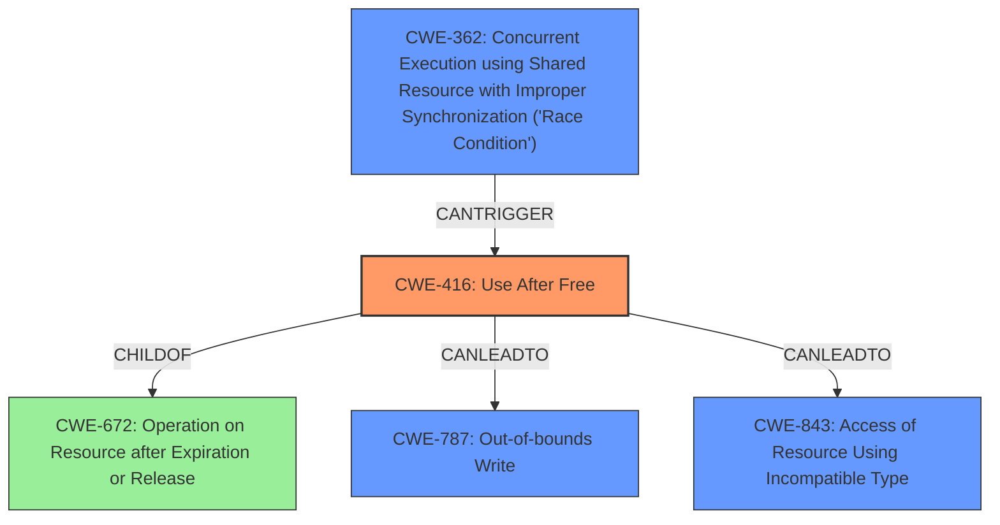

# Final Resolution for CVE-2022-1870

# Summary
| CWE ID | CWE Name | Confidence | CWE Abstraction Level | CWE Vulnerability Mapping Label | CWE-Vulnerability Mapping Notes |
|---|---|---|---|---|---|
| CWE-416 | Use After Free | 1.0 | Variant | Allowed | Primary CWE |
| CWE-787 | Out-of-bounds Write | 0.3 | Base | Allowed | Secondary Candidate, Consequence of CWE-416 |
| CWE-843 | Access of Resource Using Incompatible Type ('Type Confusion') | 0.2 | Base | Allowed | Secondary Candidate, Consequence of CWE-416 |
| CWE-362 | Concurrent Execution using Shared Resource with Improper Synchronization ('Race Condition') | 0.1 | Class | Allowed-with-Review | Secondary Candidate, Contributing factor to CWE-416 |

## Evidence and Confidence

*   **Confidence Score:** 0.95
*   **Evidence Strength:** HIGH

## Relationship Analysis
The primary relationship influencing the decision is the parent-child relationship between CWE-672 (Operation on Resource after Expiration or Release) and CWE-416 (**Use After Free**). CWE-416 is a specific case of CWE-672 where the operation is reuse or reference of memory after it has been freed. The relationships to CWE-787 (Out-of-bounds Write) and CWE-843 (Access of Resource Using Incompatible Type) were considered as potential consequences of CWE-416. CWE-362 (Concurrent Execution using Shared Resource with Improper Synchronization) was considered because a race condition could lead to a use-after-free.

## Vulnerability Chain
The vulnerability chain starts with **CWE-416 (Use After Free)**. The sequence begins when memory is freed, but a dangling pointer still references it. Subsequent access via this dangling pointer leads to memory corruption.
  - Root Cause: **CWE-416 (Use After Free)**, caused by incorrect memory management in the App Service of Google Chrome.
  - Consequence: Heap corruption, potentially leading to **CWE-787 (Out-of-bounds Write)** or **CWE-843 (Access of Resource Using Incompatible Type)** if the freed memory is reallocated with a different type.
  - Contributing Factor: If the use-after-free is triggered due to concurrent access and improper synchronization, then **CWE-362 (Concurrent Execution using Shared Resource with Improper Synchronization)** could be a contributing factor.

## Summary of Analysis
The initial analysis correctly identified **CWE-416 (Use After Free)** as the primary **WEAKNESS**. The vulnerability description clearly states "use after free," which directly aligns with the definition of CWE-416. The evidence strength is high due to the direct match and supporting information from the CVE.

The criticism provided valuable suggestions for improvement. I have incorporated these suggestions by:
  - Elaborating on the relationship between CWE-416 and its parent CWE-672, explaining how the "operation" is reuse/reference and the "expiration/release" is the freeing of memory.
  - Adding a "CWE-Vulnerability Mapping Notes" section to discuss alternative CWEs (CWE-787, CWE-843, CWE-362) and their potential relationship to the vulnerability as consequences or contributing factors, not root causes.
  - Including a brief mention of potential mitigations, referencing the CWE specification's mitigation section.

The graph relationships helped to clarify the connections between the different CWEs, specifically how CWE-416 is a specialized case of CWE-672 and how other CWEs can be consequences of or contributing factors to CWE-416.

The final decision is to classify the vulnerability as primarily **CWE-416 (Use After Free)**, with potential secondary classifications of CWE-787, CWE-843 and CWE-362 depending on the specific exploitation scenario. **CWE-416** is the optimal level of specificity because it directly describes the root cause of the vulnerability.