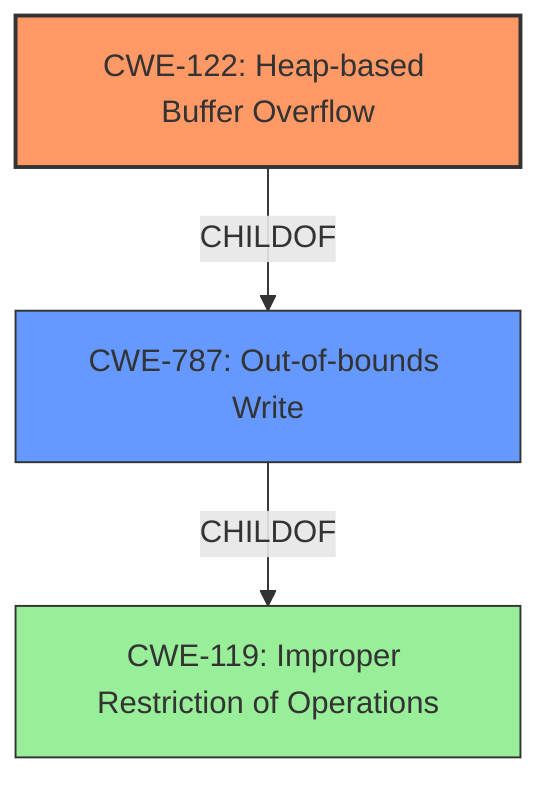

# Final Resolution for CVE-2022-1876

# Summary

| CWE ID | CWE Name | Confidence | CWE Abstraction Level | CWE Vulnerability Mapping Label | CWE-Vulnerability Mapping Notes |
|---|---|---|---|---|---|
| CWE-122 | Heap-based Buffer Overflow | 0.95 | Variant | Primary | Allowed |
| CWE-787 | Out-of-bounds Write | 0.7 | Base | Secondary Candidate | Allowed |

## Evidence and Confidence

*   **Confidence Score:** 0.95
*   **Evidence Strength:** HIGH

## Relationship Analysis
The primary relationship is that CWE-122 (Heap-based Buffer Overflow) is a variant of CWE-119 (Improper Restriction of Operations within the Bounds of a Memory Buffer) and a child of CWE-787 (Out-of-bounds Write). This indicates that CWE-122 is a more specific type of out-of-bounds write that occurs on the heap. The selection of CWE-122 is favored due to its specificity, as the vulnerability description explicitly mentions a "Heap buffer overflow." While integer overflows (CWE-190) could potentially precede a heap overflow by influencing the size calculation, there's no direct evidence of this in the vulnerability description provided.

## Vulnerability Chain
The vulnerability chain involves a crafted HTML page that is processed by DevTools in Google Chrome, leading to a **heap buffer overflow** (CWE-122). This results in the attacker being able to potentially exploit **heap corruption**. The root cause is the insufficient bounds checking in the DevTools component when handling the crafted HTML.

## Summary of Analysis
The initial analysis and criticism both converge on CWE-122 (Heap-based Buffer Overflow) as the most appropriate primary CWE. The vulnerability description explicitly states "Heap **buffer overflow** in DevTools in Google Chrome prior to 102.0.5005.61 allowed an attacker who convinced a user to install a malicious extension to potentially exploit heap corruption via a crafted HTML page." This direct reference to a heap overflow strongly supports the selection of CWE-122. The CVE Reference Links Content Summary also confirms the root cause as "Heap buffer overflow".

The relationship analysis further reinforces this decision, as CWE-122 is a variant of CWE-787 (Out-of-bounds Write) and CWE-119 (Improper Restriction of Operations within the Bounds of a Memory Buffer), indicating a clear hierarchical relationship. The choice of CWE-122 is at the optimal level of specificity, as it accurately reflects the location of the **buffer overflow** on the heap. The provided evidence is compelling, leading to a high confidence score.