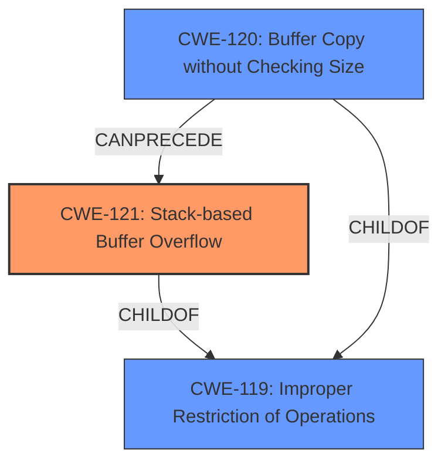

# Analysis Report for CVE-2022-1888

# Vulnerability Analysis Report: CVE-2022-1888

## Description

Alpha7 PC Loader (All versions) is vulnerable to a stack-based buffer overflow while processing a specifically crafted project file, which may allow an attacker to execute arbitrary code.

## Vulnerability Description Key Phrases

**Weakness:** stack-based buffer overflow
**Impact:** execute arbitrary code
**Vector:** specifically crafted project file
**Attacker:** attacker
**Product:** Alpha7 PC Loader
**Version:** All versions

## Analysis (with Relationship Data)

# Summary
| CWE ID | CWE Name | Confidence | CWE Abstraction Level | CWE Vulnerability Mapping Label | CWE-Vulnerability Mapping Notes |
|---|---|---|---|---|---|
| CWE-121 | Stack-based Buffer Overflow | 1.0 | Variant | Allowed | Primary CWE |
| CWE-120 | Buffer Copy without Checking Size of Input ('Classic Buffer Overflow') | 0.6 | Base | Allowed-with-Review | Secondary Candidate |
| CWE-119 | Improper Restriction of Operations within the Bounds of a Memory Buffer | 0.3 | Class | Discouraged | Secondary Candidate |

## Evidence and Confidence

*   **Confidence Score:** 1.0
*   **Evidence Strength:** HIGH

- **Analysis and Justification:**
  - *Explanation:* The vulnerability description explicitly states a "**stack-based buffer overflow**" exists in the Alpha7 PC Loader when processing a crafted project file. This directly corresponds to **CWE-121 (Stack-based Buffer Overflow)**, a Variant level CWE. The description also mentions that this can lead to arbitrary code execution. The CVE Reference Links Content Summary reinforces this by stating "**Weaknesses/vulnerabilities present: Stack-based buffer overflow (CWE-121)**." The attack vector is through processing a malicious project file.
  - The Retriever Results also lists CWE-121 and CWE-120 as potential candidates. CWE-120 is a valid option, but less specific than CWE-121.
  - Although **CWE-119 (Improper Restriction of Operations within the Bounds of a Memory Buffer)** is listed in the Retriever Results, it's a Class level CWE and discouraged when a more specific CWE is available. Given the explicit mention of a stack-based buffer overflow, CWE-121 is more appropriate.

  - *Relationship Analysis:* CWE-121 is a variant of **CWE-119 (Improper Restriction of Operations within the Bounds of a Memory Buffer)**. It's also related to other buffer overflow CWEs, but the stack-based nature makes CWE-121 the best fit.

- **Confidence Score:**
  - Confidence: 1.0 (High evidence from the vulnerability description and CVE reference materials)

## Criticism of Analysis

Okay, I've reviewed the provided analysis and the full CWE specifications. Here's my critique:

**Overall Assessment:**

The analysis is generally well-reasoned and arrives at the correct primary CWE (CWE-121). The confidence score of 1.0 is justified based on the provided evidence. The consideration of alternative CWEs, particularly CWE-120 and CWE-119, demonstrates a good understanding of the relationships between these weaknesses.

**Detailed Critique:**

*   **CWE-121 (Stack-based Buffer Overflow):**

    *   **Correct Mapping:** The identification of CWE-121 as the primary CWE is accurate and well-supported. The vulnerability description explicitly mentions a "stack-based buffer overflow," and the CVE reference confirms this.
    *   **Confidence:** The confidence score of 1.0 is appropriate, given the direct evidence.
    *   **Abstraction Level:** The analysis correctly notes that CWE-121 is a Variant level CWE, which is the preferred level when applicable.
    *   **Mitigations:** The analysis could benefit from briefly mentioning some specific mitigations for Stack-based Buffer Overflow as discussed in the CWE specification such as:
        *   Using compiler-based buffer overflow detection mechanisms (e.g., /GS flag in Visual Studio, FORTIFY_SOURCE in GCC).
        *   Implementing bounds checking on input.

*   **CWE-120 (Buffer Copy without Checking Size of Input ('Classic Buffer Overflow'))**

    *   **Valid Secondary Candidate:** Acknowledging CWE-120 as a secondary candidate is reasonable. While CWE-121 is more specific, the core issue involves a buffer copy without proper size checks, which is the essence of CWE-120.
    *   **Confidence:** The confidence score of 0.6 is reasonable.
    *   **Mapping Guidance:** The analysis correctly acknowledges that CWE-120 is "Allowed-with-Review" because it can be misused if a more specific CWE is available. This consideration is well-justified in the analysis.
    *    **Mitigations:** The Mitigations specified in the original data are valid.

*   **CWE-119 (Improper Restriction of Operations within the Bounds of a Memory Buffer)**

    *   **Correctly Discouraged:** The analysis rightly discourages the use of CWE-119 as the primary CWE. It's a Class-level CWE and too broad when a more specific Variant like CWE-121 exists. The reasoning for preferring CWE-121 is solid.
    *   **Confidence:** The confidence score of 0.3 is appropriate.
    *   **Mapping Guidance:** The analysis follows the CWE's Mapping Guidance by considering the children of CWE-119 (like CWE-121 and CWE-120) and choosing the most specific one.

*   **Retriever Results Analysis:**

    *   The analysis mentions that Retriever Results lists CWE-121 and CWE-120 as potential candidates which is accurate, but it does not analyse why other results may be false positives. This could be improved.

**Suggestions for Improvement:**

1.  **Expand on Mitigation Strategies:** While the analysis correctly identifies the primary CWE, it could briefly mention a few practical mitigation strategies specific to stack-based buffer overflows. This would make the analysis more actionable.
2.  **Briefly analyze why other retriever results were false positives:** While the analysis correctly discards some retriever results, explaining *why* they don't fit could strengthen the analysis. For example:
    *   **CWE-190 (Integer Overflow or Wraparound):** Explain that while integer overflows *can* lead to buffer overflows, the primary driver here is the lack of bounds checking during the buffer copy, not an integer overflow.
    *   **CWE-126 (Buffer Over-read):** Explain that the vulnerability description focuses on *writing* beyond the buffer, not *reading* beyond it.
    *   **CWE-131 (Incorrect Calculation of Buffer Size):** Explain that this vulnerability is due to a lack of bounds checking in the buffer copy, not necessarily an incorrect calculation of the initial buffer size.

**Revised Summary Table (incorporating suggestions):**

| CWE ID | CWE Name | Confidence | CWE Abstraction Level | CWE Vulnerability Mapping Label | CWE-Vulnerability Mapping Notes |
|---|---|---|---|---|---|
| CWE-121 | Stack-based Buffer Overflow | 1.0 | Variant | Allowed | Primary CWE. Mitigations include compiler-based overflow detection and input bounds checking. |
| CWE-120 | Buffer Copy without Checking Size of Input ('Classic Buffer Overflow') | 0.6 | Base | Allowed-with-Review | Secondary Candidate, less specific than CWE-121. |
| CWE-119 | Improper Restriction of Operations within the Bounds of a Memory Buffer | 0.3 | Class | Discouraged | Secondary Candidate, too broad.  More specific CWEs are available. |

By incorporating these suggestions, the analysis would be even more comprehensive and valuable. Overall, the analysis is strong and demonstrates a good understanding of CWE and vulnerability analysis principles.

## Final Resolution

# Summary

| CWE ID | CWE Name | Confidence | CWE Abstraction Level | CWE Vulnerability Mapping Label | CWE-Vulnerability Mapping Notes |
|---|---|---|---|---|---|
| CWE-121 | Stack-based Buffer Overflow | 1.0 | Variant | Allowed | Primary CWE. Mitigations include compiler-based overflow detection and input bounds checking. |
| CWE-120 | Buffer Copy without Checking Size of Input ('Classic Buffer Overflow') | 0.6 | Base | Allowed-with-Review | Secondary Candidate, less specific than CWE-121. |
| CWE-119 | Improper Restriction of Operations within the Bounds of a Memory Buffer | 0.3 | Class | Discouraged | Secondary Candidate, too broad. More specific CWEs are available. |

## Evidence and Confidence

*   **Confidence Score:** 1.0
*   **Evidence Strength:** HIGH

## Relationship Analysis
The primary relationship impacting the decision is the parent-child relationship between **CWE-119 (Improper Restriction of Operations within the Bounds of a Memory Buffer)**, **CWE-120 (Buffer Copy without Checking Size of Input ('Classic Buffer Overflow'))**, and **CWE-121 (Stack-based Buffer Overflow)**. **CWE-121** is a variant of **CWE-119**, providing a more specific classification. **CWE-120** is a base CWE that describes the buffer copy without checking size which can lead to **CWE-121** in stack based overflows. The abstraction levels influenced the decision, prioritizing the Variant level **CWE-121** over the Class level **CWE-119**.

## Vulnerability Chain
The vulnerability chain starts with a lack of bounds checking during a buffer copy operation (**CWE-120**). Because the copy occurs on the stack, this leads to a **stack-based buffer overflow (CWE-121)**. The overflow allows an attacker to overwrite adjacent memory on the stack, potentially including return addresses or other critical data. This can lead to arbitrary code execution.

## Summary of Analysis
The initial analysis and criticism both converge on **CWE-121 (Stack-based Buffer Overflow)** as the most appropriate primary CWE. This determination is based on the explicit mention of a "stack-based buffer overflow" in the vulnerability description: "Alpha7 PC Loader (All versions) is vulnerable to a **stack-based buffer overflow** while processing a specifically crafted project file, which may allow an attacker to execute arbitrary code."

The graph relationships reinforce this decision, as **CWE-121** is a specific variant of the more general **CWE-119**. The analysis also considered and correctly dismissed other potential CWEs (such as integer overflows or buffer over-reads) as not being the primary driver of this vulnerability.

The selected CWE is at the optimal level of specificity because it directly reflects the type of buffer overflow (stack-based) described in the vulnerability. The analysis is based on provided evidence and reasoning about CWE relationships. The provided retriever scores further support the selection of **CWE-121**.

*Report generated on 2025-03-18 08:19:10*
