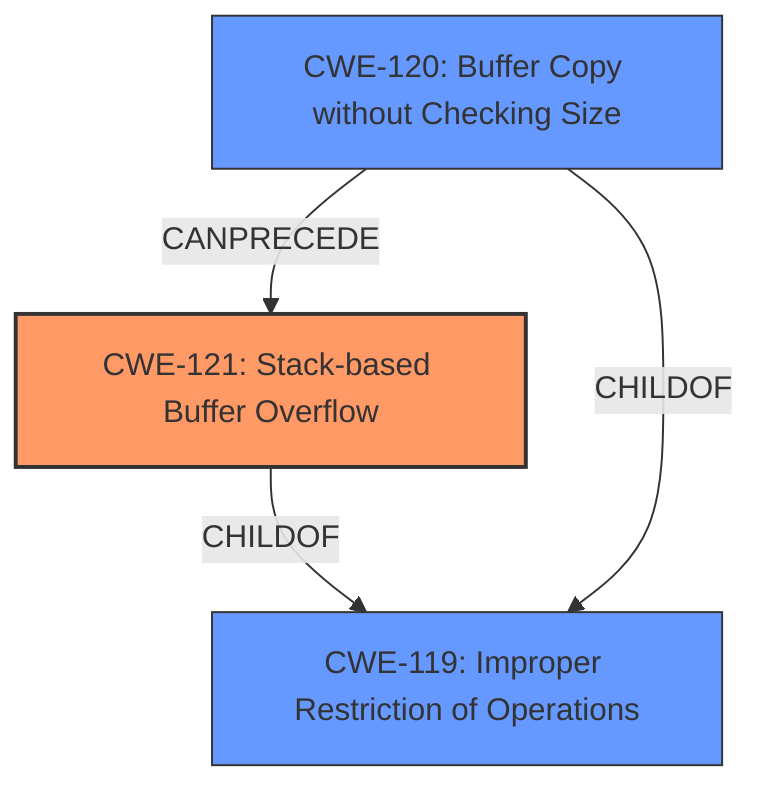

# Final Resolution for CVE-2022-1888

# Summary

| CWE ID | CWE Name | Confidence | CWE Abstraction Level | CWE Vulnerability Mapping Label | CWE-Vulnerability Mapping Notes |
|---|---|---|---|---|---|
| CWE-121 | Stack-based Buffer Overflow | 1.0 | Variant | Allowed | Primary CWE. Mitigations include compiler-based overflow detection and input bounds checking. |
| CWE-120 | Buffer Copy without Checking Size of Input ('Classic Buffer Overflow') | 0.6 | Base | Allowed-with-Review | Secondary Candidate, less specific than CWE-121. |
| CWE-119 | Improper Restriction of Operations within the Bounds of a Memory Buffer | 0.3 | Class | Discouraged | Secondary Candidate, too broad. More specific CWEs are available. |

## Evidence and Confidence

*   **Confidence Score:** 1.0
*   **Evidence Strength:** HIGH

## Relationship Analysis
The primary relationship impacting the decision is the parent-child relationship between **CWE-119 (Improper Restriction of Operations within the Bounds of a Memory Buffer)**, **CWE-120 (Buffer Copy without Checking Size of Input ('Classic Buffer Overflow'))**, and **CWE-121 (Stack-based Buffer Overflow)**. **CWE-121** is a variant of **CWE-119**, providing a more specific classification. **CWE-120** is a base CWE that describes the buffer copy without checking size which can lead to **CWE-121** in stack based overflows. The abstraction levels influenced the decision, prioritizing the Variant level **CWE-121** over the Class level **CWE-119**.

## Vulnerability Chain
The vulnerability chain starts with a lack of bounds checking during a buffer copy operation (**CWE-120**). Because the copy occurs on the stack, this leads to a **stack-based buffer overflow (CWE-121)**. The overflow allows an attacker to overwrite adjacent memory on the stack, potentially including return addresses or other critical data. This can lead to arbitrary code execution.

## Summary of Analysis
The initial analysis and criticism both converge on **CWE-121 (Stack-based Buffer Overflow)** as the most appropriate primary CWE. This determination is based on the explicit mention of a "stack-based buffer overflow" in the vulnerability description: "Alpha7 PC Loader (All versions) is vulnerable to a **stack-based buffer overflow** while processing a specifically crafted project file, which may allow an attacker to execute arbitrary code."

The graph relationships reinforce this decision, as **CWE-121** is a specific variant of the more general **CWE-119**. The analysis also considered and correctly dismissed other potential CWEs (such as integer overflows or buffer over-reads) as not being the primary driver of this vulnerability.

The selected CWE is at the optimal level of specificity because it directly reflects the type of buffer overflow (stack-based) described in the vulnerability. The analysis is based on provided evidence and reasoning about CWE relationships. The provided retriever scores further support the selection of **CWE-121**.