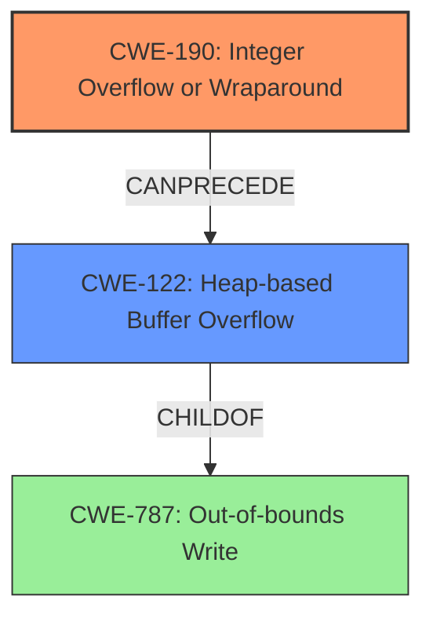

# Final Resolution for CVE-2022-1922

# Summary
| CWE ID | CWE Name | Confidence | CWE Abstraction Level | CWE Vulnerability Mapping Label | CWE-Vulnerability Mapping Notes |
|---|---|---|---|---|---|
| CWE-190 | Integer Overflow or Wraparound | 1.0 | Base | Allowed | Primary CWE |
| CWE-122 | Heap-based Buffer Overflow | 0.7 | Variant | Allowed | Secondary Candidate |

## Evidence and Confidence

*   **Confidence Score:** 0.9
*   **Evidence Strength:** HIGH

## Relationship Analysis
The primary **WEAKNESS** is **CWE-190 (Integer Overflow or Wraparound)**, which can **precede** **CWE-122 (Heap-based Buffer Overflow)**. **CWE-122** is a variant of **CWE-787 (Out-of-bounds Write)**. The integer overflow leads to an incorrect size calculation, potentially resulting in a heap overflow depending on system configuration (libc and OS). The abstraction levels are appropriate: **CWE-190** is a Base CWE, ideal for root cause analysis, and **CWE-122** is a Variant, reflecting its conditional nature.

## Vulnerability Chain
The vulnerability chain starts with an **integer overflow (CWE-190)** in the `gst_matroska_decompress_data` function when calculating the decompressed size. This leads to an incorrect size being passed to `realloc`. If the `libc` implementation doesn't use `mmap` or if the OS doesn't support `mmap`, this can result in a **heap-based buffer overflow (CWE-122)**, where the heap is overwritten. The **ROOTCAUSE** is the integer overflow, and the impact is a potential heap overwrite.

## Summary of Analysis
The initial analysis and criticism are accurate. The primary **ROOTCAUSE** is the integer overflow (**CWE-190**), leading to a potential heap overflow (**CWE-122**). The confidence scores are well-justified.

The analysis provided the following evidence: "The vulnerability description clearly states that the **rootcause** is an **integer overflow** in the `gst_matroska_decompress_data` function. The "Vulnerability Description Key Phrases" section also highlights "**rootcause: integer overflow**"."

The graph relationships confirm that **CWE-190** can **precede** **CWE-122**, and **CWE-122** is a variant of **CWE-787**, indicating a potential out-of-bounds write.

The selected CWEs are at the optimal level of specificity: **CWE-190** as the Base-level **ROOTCAUSE**, and **CWE-122** as a Variant that describes the conditional heap overflow.