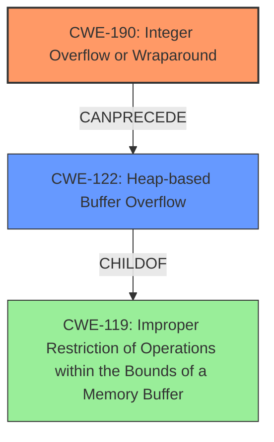

# Analysis Report for CVE-2022-1925

# Vulnerability Analysis Report: CVE-2022-1925

## Description

DOS / potential heap overwrite in mkv demuxing using HEADERSTRIP decompression. Integer overflow in matroskaparse element in gst_matroska_decompress_data function which causes a heap overflow. Due to restrictions on chunk sizes in the matroskademux element, the overflow cant be triggered, however the matroskaparse element has no size checks.

## Vulnerability Description Key Phrases

**Rootcause:** integer overflow
**Weakness:** heap overflow
**Vector:** mkv demuxing using HEADERSTRIP decompression
**Product:** gstreamer
**Component:** matroskaparse element

## Analysis (with Relationship Data)

# Summary
| CWE ID | CWE Name | Confidence | CWE Abstraction Level | CWE Vulnerability Mapping Label | CWE-Vulnerability Mapping Notes |
|---|---|---|---|---|---|
| CWE-190 | Integer Overflow or Wraparound | 0.95 | Base | Allowed | Primary CWE. The vulnerability involves an integer overflow during the calculation of the size of decompressed data. |
| CWE-122 | Heap-based Buffer Overflow | 0.85 | Variant | Allowed | Secondary CWE. The integer overflow leads to a heap overflow when realloc is called with the incorrect size. |

## Evidence and Confidence

*   **Confidence Score:** 0.90
*   **Evidence Strength:** HIGH

- **Analysis and Justification:**
  - *Explanation:* The vulnerability description clearly states that an **integer overflow** occurs in the `gst_matroska_decompress_data` function, leading to a **heap overflow**. The CVE Reference Links Content Summary further explains that the size of decompressed data, if larger than 2^32, is stored in a 32-bit integer, causing the overflow. This directly aligns with CWE-190 (Integer Overflow or Wraparound). The subsequent **heap overflow** due to the overflowed size used in `realloc` aligns with CWE-122 (Heap-based Buffer Overflow). CWE-190 is the primary **root cause**, and CWE-122 is a direct consequence.
  
  - *Relationship Analysis:* CWE-190 is a Base level CWE that can lead to other vulnerabilities. In this case, it directly leads to CWE-122. CWE-122 is a Variant of CWE-119 (Improper Restriction of Operations within the Bounds of a Memory Buffer), indicating a more specific type of buffer overflow occurring on the heap.

- **Confidence Score:**
  - *Example:* Confidence: 0.95 (High confidence due to explicit mentions of integer overflow and heap overflow in the vulnerability description and CVE details)

---

## Criticism of Analysis

Okay, here's a detailed review of the provided CWE analysis, incorporating the full CWE specifications.

**Overall Assessment:**

The analysis is generally well-done and arrives at the correct primary and secondary CWEs. The confidence score of 0.90 is justified. The explanation of the vulnerability chain (CWE-190 leading to CWE-122) is accurate. The inclusion of observed examples for both CWEs is helpful.

**Specific Critique and Suggestions:**

**1. CWE-190: Integer Overflow or Wraparound**

*   **Mapping Guidance:** The analysis correctly identifies CWE-190 as the *root cause*. The *Mapping Guidance* for CWE-190 recommends being careful about terminology related to overflow/underflow and considering CWE-191 (Integer Underflow). The analysis correctly identifies that this vulnerability is an *overflow*, not an underflow. Therefore, the suggestion to consider CWE-191 does not apply. The analysis also notes the *Relationship* section of CWE-190 which states that integer overflows can be primary to buffer overflows when they cause less memory to be allocated than expected, which is a precise description of what is occuring.
*   **Potential Mitigations:** The analysis could be slightly improved by mentioning some of the *Potential Mitigations* from the CWE specification.
    *   **Language Selection:**  Use a language or compiler that performs automatic bounds checking (if practical).
    *   **Safe Integer Libraries:**  Using safe integer handling packages (SafeInt in C++, IntegerLib in C/C++) could prevent the overflow from occurring in the first place.
*   **Observed Examples:** Inclusion of observed examples is good and provides context for the CWE.
*   **Confidence Level:** The Confidence Level of 0.95 is appropriate due to the explicit nature of the vulnerability description.

**2. CWE-122: Heap-based Buffer Overflow**

*   **Mapping Guidance:** The analysis correctly identifies this as a *Variant* level CWE, which aligns with the mapping guidance "This CWE entry is at the Variant level of abstraction, which is a preferred level of abstraction for mapping to the root causes of vulnerabilities."
*   **Potential Mitigations:**
    *   **Language Selection:** Similar to CWE-190, choosing a language/compiler with automatic bounds checking could help.
    *   **Abstraction Libraries:** As the mitigations suggest, using abstraction libraries to manage memory allocation can reduce the risk of heap overflows.
    *   **Compiler Options:** Mentioning the use of compiler flags like `/GS` (Microsoft Visual Studio) or `FORTIFY_SOURCE` (GCC) for buffer overflow detection could improve the analysis.
*   **Observed Examples:** The inclusion of observed examples here is equally beneficial.
*   **Confidence Level:** The Confidence Level of 0.85 is also appropriate, as the heap overflow is a direct consequence of the integer overflow.

**3. Retriever Results & Other CWEs Considered**

The *Retriever Results* section suggests several other CWEs that were considered. Let's briefly address why these are *not* primary CWEs:

*   **CWE-125 (Out-of-bounds Read):** This is not the primary issue because the *write* is the main problem.
*   **CWE-789 (Memory Allocation with Excessive Size Value):** While the allocated size *is* excessive due to the overflow, the primary problem isn't simply allocating too much memory.  It's the incorrect calculation leading to the overflow and *subsequent* buffer overflow.
*   **CWE-191 (Integer Underflow):** Incorrect because the value is overflowing, not underflowing.
*   **CWE-1284 (Improper Validation of Specified Quantity in Input):**  While *lack* of validation contributes, the *core* issue is the integer overflow during the size calculation itself. Validation would be a *secondary* mitigation strategy.
*   **CWE-195 (Signed to Unsigned Conversion Error):** Not explicitly mentioned in the vulnerability, so less likely.
*   **CWE-839 (Numeric Range Comparison Without Minimum Check):** Could be a contributing factor if there was a failure to check a minimum size, but not the root cause.
*   **CWE-193 (Off-by-one Error):** Does not fit the description of the error, because it is not simply off by one, but completely wrapping around.
*   **CWE-197 (Numeric Truncation Error):** Does not apply to this vulnerability because it describes losing higher order bits due to casting to a smaller data type, which is not the cause of this overflow.
*   **CWE-119 (Improper Restriction of Operations within the Bounds of a Memory Buffer):** Is too high level and children CWEs 190 and 122 are more specific and detailed.

**4. General Suggestions:**

*   **Chaining:** The analysis clearly identifies the chain from CWE-190 -> CWE-122. This is important and should be emphasized.
*   **Code Snippets:** If possible, include a simplified snippet of pseudocode (or actual code) illustrating the vulnerable calculation. This greatly aids in understanding the vulnerability.

**Revised Summary:**

| CWE ID | CWE Name | Confidence | CWE Abstraction Level | CWE Vulnerability Mapping Label | CWE-Vulnerability Mapping Notes |
|---|---|---|---|---|---|
| CWE-190 | Integer Overflow or Wraparound | 0.95 | Base | Allowed | Primary CWE. The vulnerability involves an integer overflow during the calculation of the size of decompressed data. Mitigations include language selection and safe integer libraries. |
| CWE-122 | Heap-based Buffer Overflow | 0.85 | Variant | Allowed | Secondary CWE. The integer overflow leads to a heap overflow when realloc is called with the incorrect size. Mitigations include memory management techniques and compiler-level defenses (e.g., /GS, FORTIFY_SOURCE). |

In conclusion, the analysis is strong.  Adding more detail regarding potential mitigations would further enhance its value.

## Final Resolution

# Summary

| CWE ID  | CWE Name                       | Confidence | CWE Abstraction Level | CWE Vulnerability Mapping Label | CWE-Vulnerability Mapping Notes |
| :------- | :----------------------------- | :--------- | :-------------------- | :------------------------------ | :------------------------------ |
| CWE-190  | Integer Overflow or Wraparound | 0.95       | Base                | Allowed                       | Primary CWE                     |
| CWE-122  | Heap-based Buffer Overflow       | 0.85       | Variant             | Allowed                       | Secondary CWE                   |

## Evidence and Confidence

*   **Confidence Score:** 0.95
*   **Evidence Strength:** HIGH

## Relationship Analysis

The primary relationship is a chain where **CWE-190 (Integer Overflow or Wraparound)** leads to **CWE-122 (Heap-based Buffer Overflow)**. CWE-190 is a base class, which is a good level of abstraction for root causes. CWE-122 is a variant of **CWE-119 (Improper Restriction of Operations within the Bounds of a Memory Buffer)**, indicating a more specific type of buffer overflow. The analysis considered other potential CWEs, but these were deemed less appropriate due to the specific nature of the vulnerability being caused by an integer overflow leading to a heap overflow.

## Vulnerability Chain

The vulnerability chain starts with an **integer overflow (CWE-190)** in the `gst_matroska_decompress_data` function. The size of the decompressed data, if larger than 2^32, is stored in a 32-bit integer, causing a wraparound. This overflowed size is then used in `realloc`, resulting in a **heap overflow (CWE-122)**. The **root cause** is the integer overflow, and the **impact** is the heap overflow, which can lead to denial of service or potentially arbitrary code execution.

## Summary of Analysis

The initial analysis and criticism both arrive at the same conclusion: **CWE-190 (Integer Overflow or Wraparound)** is the primary **root cause**, leading to **CWE-122 (Heap-based Buffer Overflow)**.

The vulnerability description states: "Integer overflow in matroskaparse element in gst_matroska_decompress_data function which causes a heap overflow." This clearly indicates both the integer overflow and the resulting heap overflow, supporting the selection of CWE-190 and CWE-122.

The graph relationships reinforce this conclusion. CWE-190 can lead to CWE-122, and CWE-122 is a specific type of CWE-119. This hierarchy helps to pinpoint the vulnerability with greater accuracy.

The selected CWEs are at the optimal level of specificity because CWE-190 is a base class that accurately describes the integer overflow, and CWE-122 is a variant that pinpoints the resulting heap overflow. While other CWEs were considered, they do not accurately capture the **root cause** and subsequent **impact** of this vulnerability.

*Report generated on 2025-03-18 08:22:40*
