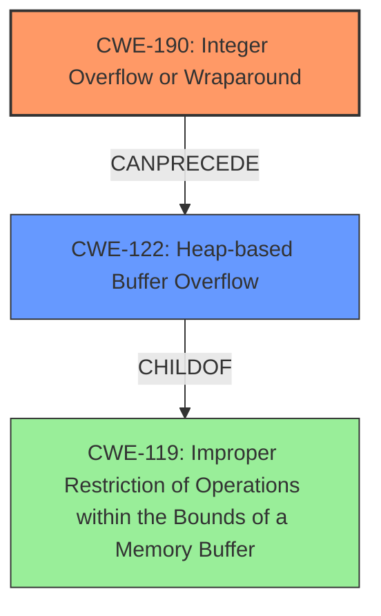

# Final Resolution for CVE-2022-1925

# Summary

| CWE ID  | CWE Name                       | Confidence | CWE Abstraction Level | CWE Vulnerability Mapping Label | CWE-Vulnerability Mapping Notes |
| :------- | :----------------------------- | :--------- | :-------------------- | :------------------------------ | :------------------------------ |
| CWE-190  | Integer Overflow or Wraparound | 0.95       | Base                | Allowed                       | Primary CWE                     |
| CWE-122  | Heap-based Buffer Overflow       | 0.85       | Variant             | Allowed                       | Secondary CWE                   |

## Evidence and Confidence

*   **Confidence Score:** 0.95
*   **Evidence Strength:** HIGH

## Relationship Analysis

The primary relationship is a chain where **CWE-190 (Integer Overflow or Wraparound)** leads to **CWE-122 (Heap-based Buffer Overflow)**. CWE-190 is a base class, which is a good level of abstraction for root causes. CWE-122 is a variant of **CWE-119 (Improper Restriction of Operations within the Bounds of a Memory Buffer)**, indicating a more specific type of buffer overflow. The analysis considered other potential CWEs, but these were deemed less appropriate due to the specific nature of the vulnerability being caused by an integer overflow leading to a heap overflow.

## Vulnerability Chain

The vulnerability chain starts with an **integer overflow (CWE-190)** in the `gst_matroska_decompress_data` function. The size of the decompressed data, if larger than 2^32, is stored in a 32-bit integer, causing a wraparound. This overflowed size is then used in `realloc`, resulting in a **heap overflow (CWE-122)**. The **root cause** is the integer overflow, and the **impact** is the heap overflow, which can lead to denial of service or potentially arbitrary code execution.

## Summary of Analysis

The initial analysis and criticism both arrive at the same conclusion: **CWE-190 (Integer Overflow or Wraparound)** is the primary **root cause**, leading to **CWE-122 (Heap-based Buffer Overflow)**.

The vulnerability description states: "Integer overflow in matroskaparse element in gst_matroska_decompress_data function which causes a heap overflow." This clearly indicates both the integer overflow and the resulting heap overflow, supporting the selection of CWE-190 and CWE-122.

The graph relationships reinforce this conclusion. CWE-190 can lead to CWE-122, and CWE-122 is a specific type of CWE-119. This hierarchy helps to pinpoint the vulnerability with greater accuracy.

The selected CWEs are at the optimal level of specificity because CWE-190 is a base class that accurately describes the integer overflow, and CWE-122 is a variant that pinpoints the resulting heap overflow. While other CWEs were considered, they do not accurately capture the **root cause** and subsequent **impact** of this vulnerability.