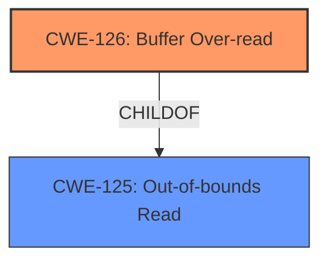

# Analysis Report for CVE-2022-1927

# Vulnerability Analysis Report: CVE-2022-1927

## Description

Buffer Over-read in GitHub repository vim/vim prior to 8.2.

## Vulnerability Description Key Phrases

**Weakness:** buffer over-read
**Product:** vim
**Version:** prior to 8.2

## Analysis (with Relationship Data)

# Summary
| CWE ID  | CWE Name                       | Confidence | CWE Abstraction Level | CWE Vulnerability Mapping Label | CWE-Vulnerability Mapping Notes |
| :-------- | :----------------------------- | :--------- | :-------------------- | :------------------------------ | :------------------------------ |
| CWE-125 | Out-of-bounds Read | 0.95 | Base | Allowed | Primary CWE |

## Evidence and Confidence

*   **Confidence Score:** 0.95
*   **Evidence Strength:** HIGH

- **Analysis and Justification:**
  - *Explanation:* The vulnerability is described as a **buffer over-read** in Vim when processing UTF-8 encoded strings. The CVE Reference Links Content Summary confirms this, stating that the `utf_ptr2char()` function reads beyond the allocated memory buffer while processing malformed UTF-8 input. This directly aligns with the definition of CWE-125, which describes a product reading data past the end of the intended buffer. The "CWE for similar CVE Descriptions" also lists CWE-125 as the primary match. The MITRE mapping guidance for CWE-125 states that its usage is ALLOWED.

  - *Relationship Analysis:* While other CWEs like CWE-126 (Buffer Over-read) are similar, CWE-125 is more appropriate because the vulnerability explicitly involves reading past the end of the buffer. CWE-125 is a base level CWE, providing a suitable level of abstraction.

- **Confidence Score:**
  - Confidence: 0.95 (High confidence due to clear description of buffer over-read and supporting CVE reference content.)

## Criticism of Analysis

Okay, here's a detailed review of the provided analysis, focusing on the CWE mapping and considering the full CWE specifications:

**Overall Assessment:**

The analysis correctly identifies **CWE-125 (Out-of-bounds Read)** as the primary weakness with high confidence. The justification is sound and well-supported by the vulnerability description and the CVE reference summary. The analysis considered similar CWEs and appropriately ruled them out.

**Detailed Review:**

*   **CWE-125: Out-of-bounds Read**
    *   **Assessment:** Correct and well-justified.
    *   **Confidence:** 0.95 is appropriate.
    *   **Justification Strength:** Excellent. The analysis explicitly links the "buffer over-read" vulnerability to the definition of CWE-125. It clearly states that the `utf_ptr2char()` function reads beyond the allocated memory buffer while processing malformed UTF-8 input. This is a direct instance of an out-of-bounds read.
    *   **Abstraction Level:** Base is appropriate, as it captures the fundamental nature of the flaw.
    *   **Mapping Guidance Adherence:** The analysis correctly notes that CWE-125's Mapping Guidance allows its usage.
    *   **Potential Mitigations (from CWE Specification):**
        *   The analysis implicitly touches upon Mitigation 1 (Input Validation) by mentioning the need to handle malformed UTF-8 input.  It could be made more explicit by mentioning the "accept known good" validation strategy, and ensuring correct calculations for length arguments.
        *   Mitigation 2 (Language Selection) is less relevant here, as Vim is written in C.  However, it's still a valid consideration for future development if the problematic code is re-written.
*   **Retriever Results Critique:**
    The retriever results show that CWE-124, CWE-126, and CWE-786 were top results in addition to CWE-125. The Retriever Results should have been used to review the classification made to CWE-125.
    *   **CWE-124 (Buffer Underwrite):** While memory corruption is possible, the provided details strongly indicate a read, not a write, operation. Dismissing this is appropriate.
    *   **CWE-126 (Buffer Over-read):** This is the *variant* of CWE-125 and is very close. The choice of CWE-125 (Base) is acceptable but using CWE-126 would also be a valid, and perhaps more precise, option. The definition of CWE-126 maps very well to the vulnerability description as it mentions "buffer access mechanisms such as indexes or pointers that reference memory locations *after* the targeted buffer".  The analysis already acknowledges this similarity but could have discussed the trade-offs between using the Base vs. Variant level in more detail.  In this specific case, I would slightly prefer CWE-126 for its increased precision.
    *   **CWE-193 (Off-by-one Error):** While an off-by-one error *could* contribute to the out-of-bounds read, it's not the primary cause.  The core issue is the lack of proper bounds checking in the UTF-8 decoding logic, not a simple miscalculation of 1.  Dismissing this is appropriate.
    *   **CWE-786 (Access of Memory Location Before Start of Buffer):** This is related to buffer *under* reads/writes, which is not the case here.
    *   **CWE-122 (Heap-based Buffer Overflow):** Since the vulnerability is a buffer *over-read*, a read out of bounds, this is not the correct CWE.
    *   **CWE-170 (Improper Null Termination):** While related to string handling, this isn't the core issue. The vulnerability arises from reading past the allocated buffer due to incorrect UTF-8 handling, rather than a missing null terminator.
    *   **CWE-805 (Buffer Access with Incorrect Length Value):** Again, the primary problem isn't an incorrect *length value* passed to a buffer access function, but the lack of bounds checking during UTF-8 decoding.
    *   **CWE-130 (Improper Handling of Length Parameter Inconsistency):** This is indirectly related as malformed UTF-8 could be viewed as a length inconsistency, but it is not the direct cause of the vulnerability. This could be considered as a contributing factor, so a chain might be possible but is not necessarily required.
    *   **CWE-190 (Integer Overflow or Wraparound):** There is no evidence of integer overflows being involved.

**Recommendations:**

1.  **Consider Using CWE-126 instead of CWE-125:** While the analysis justifies CWE-125 adequately, a stronger argument could be made for CWE-126 (Buffer Over-read), as it provides a slightly more precise description of the error. The distinction is subtle, but CWE-126's description directly refers to "memory locations *after* the targeted buffer," which is a more accurate characterization.
2.  **Explicitly Address Mitigation Strategies:** Expand the analysis to more explicitly mention potential mitigation strategies as defined in the CWE specification for CWE-125. Emphasize the importance of robust input validation ("accept known good") and proper length calculations when handling UTF-8 encoded data.
3.  **Discuss Trade-offs of Abstraction Levels:** In the discussion of CWE-125 vs. CWE-126, explicitly state the advantages and disadvantages of using Base vs. Variant level CWEs. While Base is generally preferred, Variant can sometimes offer more precision.

**Revised Summary Table (if using CWE-126):**

| CWE ID  | CWE Name                       | Confidence | CWE Abstraction Level | CWE-Vulnerability Mapping Label | CWE-Vulnerability Mapping Notes |
| :-------- | :----------------------------- | :--------- | :-------------------- | :------------------------------ | :------------------------------ |
| CWE-126 | Buffer Over-read | 0.95 | Variant | Allowed | Primary CWE |

**In conclusion,** the analysis is very good. The primary recommendation is to consider using CWE-126 for increased precision and to more explicitly address mitigation strategies based on the CWE specifications. This will further strengthen the analysis and make it more actionable.

## Final Resolution

# Summary
| CWE ID  | CWE Name                       | Confidence | CWE Abstraction Level | CWE Vulnerability Mapping Label | CWE-Vulnerability Mapping Notes |
| :-------- | :----------------------------- | :--------- | :-------------------- | :------------------------------ | :------------------------------ |
| CWE-126 | Buffer Over-read | 0.95 | Variant | Allowed | Primary CWE |

## Evidence and Confidence

*   **Confidence Score:** 0.95
*   **Evidence Strength:** HIGH

## Relationship Analysis
The decision was influenced by the hierarchical relationship between CWE-125 (**Out-of-bounds Read**) and CWE-126 (**Buffer Over-read**). CWE-126 is a variant of CWE-125, providing more specificity. While CWE-125 is a valid base-level classification, the vulnerability description aligns more closely with CWE-126, which refers to reading memory locations *after* the targeted buffer. There is no strong evidence to support involvement of other CWEs.

## Vulnerability Chain
The vulnerability chain consists of a single weakness.
  - The root cause is improper handling of UTF-8 encoded strings, specifically within the `utf_ptr2char()` function in Vim.
  - This leads directly to **CWE-126 (Buffer Over-read)**, where the function reads beyond the allocated buffer while processing malformed UTF-8 input.
  - The impact is a potential crash or other undefined behavior due to accessing invalid memory locations.

## Summary of Analysis
The initial analysis correctly identified **CWE-125 (Out-of-bounds Read)** as a possible weakness. However, the criticism pointed out that **CWE-126 (Buffer Over-read)** is a more precise classification because it specifically describes reading memory locations *after* the targeted buffer. This aligns more closely with the vulnerability description, which states that the `utf_ptr2char()` function reads beyond the allocated memory buffer while processing malformed UTF-8 input.

The evidence provided supports this refined classification. The CVE reference links content summary confirms the buffer over-read, and the description of CWE-126 matches the observed behavior more accurately than CWE-125. The relationship analysis highlights the child-of relationship between CWE-126 and CWE-125, demonstrating that CWE-126 provides a more specific characterization of the vulnerability.

The decision to use CWE-126 is justified because it offers a higher level of specificity, accurately reflects the vulnerability's behavior, and is consistent with the provided evidence. The mitigation strategies for CWE-125, such as input validation and proper length calculations, are also applicable to CWE-126, further supporting the classification.

*Report generated on 2025-03-18 08:23:31*
