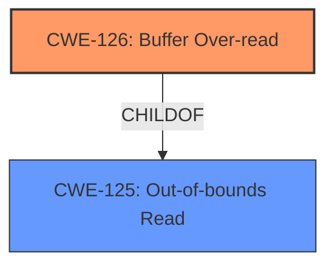

# Final Resolution for CVE-2022-1927

# Summary
| CWE ID  | CWE Name                       | Confidence | CWE Abstraction Level | CWE Vulnerability Mapping Label | CWE-Vulnerability Mapping Notes |
| :-------- | :----------------------------- | :--------- | :-------------------- | :------------------------------ | :------------------------------ |
| CWE-126 | Buffer Over-read | 0.95 | Variant | Allowed | Primary CWE |

## Evidence and Confidence

*   **Confidence Score:** 0.95
*   **Evidence Strength:** HIGH

## Relationship Analysis
The decision was influenced by the hierarchical relationship between CWE-125 (**Out-of-bounds Read**) and CWE-126 (**Buffer Over-read**). CWE-126 is a variant of CWE-125, providing more specificity. While CWE-125 is a valid base-level classification, the vulnerability description aligns more closely with CWE-126, which refers to reading memory locations *after* the targeted buffer. There is no strong evidence to support involvement of other CWEs.

## Vulnerability Chain
The vulnerability chain consists of a single weakness.
  - The root cause is improper handling of UTF-8 encoded strings, specifically within the `utf_ptr2char()` function in Vim.
  - This leads directly to **CWE-126 (Buffer Over-read)**, where the function reads beyond the allocated buffer while processing malformed UTF-8 input.
  - The impact is a potential crash or other undefined behavior due to accessing invalid memory locations.

## Summary of Analysis
The initial analysis correctly identified **CWE-125 (Out-of-bounds Read)** as a possible weakness. However, the criticism pointed out that **CWE-126 (Buffer Over-read)** is a more precise classification because it specifically describes reading memory locations *after* the targeted buffer. This aligns more closely with the vulnerability description, which states that the `utf_ptr2char()` function reads beyond the allocated memory buffer while processing malformed UTF-8 input.

The evidence provided supports this refined classification. The CVE reference links content summary confirms the buffer over-read, and the description of CWE-126 matches the observed behavior more accurately than CWE-125. The relationship analysis highlights the child-of relationship between CWE-126 and CWE-125, demonstrating that CWE-126 provides a more specific characterization of the vulnerability.

The decision to use CWE-126 is justified because it offers a higher level of specificity, accurately reflects the vulnerability's behavior, and is consistent with the provided evidence. The mitigation strategies for CWE-125, such as input validation and proper length calculations, are also applicable to CWE-126, further supporting the classification.