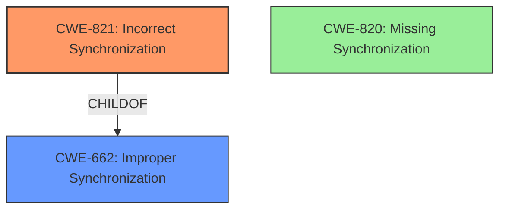

# Final Resolution for CVE-2022-1931

# Summary
| CWE ID | CWE Name | Confidence | CWE Abstraction Level | CWE Vulnerability Mapping Label | CWE-Vulnerability Mapping Notes |
|---|---|---|---|---|---|
| CWE-821 | Incorrect Synchronization | 0.95 | Base | Allowed | Primary CWE |
| CWE-662 | Improper Synchronization | 0.40 | Class | Discouraged | Secondary Candidate, Parent of CWE-821, but not as specific. |
| CWE-820 | Missing Synchronization | 0.20 | Base | Allowed | Secondary Candidate, but less precise than CWE-821 as synchronization was attempted, just implemented incorrectly. |

## Evidence and Confidence

*   **Confidence Score:** 0.95
*   **Evidence Strength:** HIGH

## Relationship Analysis
The primary relationship that influenced the decision was the parent-child relationship between CWE-662 (Improper Synchronization) and CWE-821 (**Incorrect Synchronization**). While CWE-662 is a broader class, CWE-821 offers a more specific description of the **weakness**. There is no direct relationship between CWE-820 (Missing Synchronization) and CWE-821, further supporting the selection of CWE-821 as the most appropriate classification. The abstraction levels also played a role, with CWE-821 being a Base level CWE, which is preferred over the Class level CWE-662.

## Vulnerability Chain
The vulnerability chain involves an **incorrect synchronization** issue, leading to the incorrect assignment of message ownership.
  - **Root Cause:** CWE-821 (**Incorrect Synchronization**)
  - **Weakness:** The message owner is being overwritten due to **incorrect synchronization**.
  - **Impact:** Potential for unauthorized access or modification of messages, leading to data integrity issues and potential confidentiality breaches.
There are no missing links in this chain as described.

## Summary of Analysis
The analysis of both the initial assessment and the criticism supports the selection of CWE-821 (**Incorrect Synchronization**) as the primary CWE. The vulnerability description and code changes in `src/controllers/api/v1/messages.js` provide direct evidence of the synchronization issue.
The selection of CWE-821 is based on the following evidence:
"The vulnerability is described as **"Incorrect Synchronization"** in the polonel/trudesk repository. The analysis of the commit and code changes in `src/controllers/api/v1/messages.js` confirms this, highlighting a problem with message owner assignment where the owner was being overwritten."
The graph relationships influenced the final selection by highlighting the parent-child relationship between CWE-662 and CWE-821, reinforcing the importance of selecting the more specific Base level CWE. The selected CWEs are at the optimal level of specificity because CWE-821 directly describes the nature of the **synchronization** issue (incorrect vs. missing).