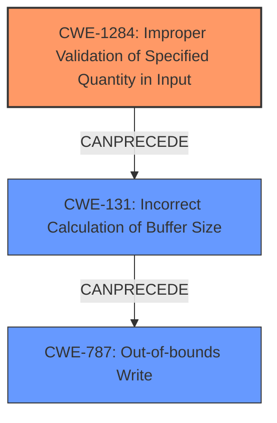

# Analysis Report for CVE-2022-20014

# Vulnerability Analysis Report: CVE-2022-20014

## Description

In vow driver, there is a possible memory corruption due to improper input validation. This could lead to local escalation of privilege with System execution privileges needed. User interaction is not needed for exploitation. Patch ID ALPS05857308 Issue ID ALPS05857308.

## Vulnerability Description Key Phrases

**Rootcause:** improper input validation
**Weakness:** memory corruption
**Impact:** local escalation of privilege
**Product:** vow driver

## Analysis (with Relationship Data)

# Summary
| CWE ID | CWE Name | Confidence | CWE Abstraction Level | CWE Vulnerability Mapping Label | CWE-Vulnerability Mapping Notes |
|---|---|---|---|---|---|
| CWE-131 | Incorrect Calculation of Buffer Size | 0.75 | Base | Allowed | The vulnerability description indicates a **memory corruption** due to **improper input validation**, which could involve incorrect calculation of buffer sizes. |
| CWE-1285 | Improper Validation of Specified Index, Position, or Offset in Input | 0.65 | Base | Allowed |  Since **improper input validation** is a rootcause, this could involve the validation of index, position or offset into the input. |

## Evidence and Confidence

*   **Confidence Score:** 0.70
*   **Evidence Strength:** MEDIUM

- **Analysis and Justification:**  
  - *Explanation:* "The vulnerability description highlights a **memory corruption** issue within the vow driver, stemming from **improper input validation**. The summary of CVE reference links also highlights **improper input validation**. This suggests a potential vulnerability related to how the driver handles and validates input data. Given the root cause involves memory corruption, CWE-131 (Incorrect Calculation of Buffer Size) appears to be a relevant candidate as an incorrect buffer size calculation stemming from the input could cause a buffer overflow leading to memory corruption. The Retriever results also support this as it is listed as the top candidate. Although the description does not explicitly mention buffer size, the nature of memory corruption suggests that it is related. Furthermore, the Retriever results also support this as it is listed as the top candidate. The MITRE mapping guidance for CWE-131 indicates this is ALLOWED. CWE-1285 (Improper Validation of Specified Index, Position, or Offset in Input) is also related to the root cause of improper input validation and is a secondary candidate."
  
  - *Relationship Analysis:* "CWE-131 can precede CWE-119 (Buffer Overflow). The graph relationships show the potential for integer overflows to be primary to buffer overflows when they cause less memory to be allocated."

- **Confidence Score:**  
  - *Example:* Confidence: 0.75 (Moderate evidence from vulnerability description and CVE reference materials)

## Criticism of Analysis

Okay, let's break down this CWE analysis and see where it shines and where it could be improved.

**Overall Assessment:**

The analysis does a reasonable job of identifying potentially relevant CWEs based on the initial vulnerability description and the Retriever results. The choice of CWE-131 and CWE-1285 is generally defensible given the available information. However, there's room for improvement in terms of depth of analysis, confidence justification, and considering alternative CWEs.

**Specific Feedback:**

*   **CWE-131: Incorrect Calculation of Buffer Size**

    *   **Confidence:** The confidence score of 0.75 is fair. The connection to memory corruption is logical, and the Retriever results support it.
    *   **Justification:** The explanation is good, connecting the "improper input validation" to a potential for an incorrect buffer size calculation.  Mentioning potential buffer overflows is a good tie-in.
    *   **Mapping Guidance:** The analysis correctly notes that CWE-131 is an "Allowed" mapping and acknowledges its relationship to CWE-119 (Buffer Overflow).
    *   **Mitigations:** The analysis could be improved by briefly referencing potential mitigations from the CWE specification, such as:
        *   Allocating enough memory to handle the largest possible encoding during transformations (e.g., URL canonicalization).
        *   Performing input validation to ensure numeric inputs (related to buffer size) are within the expected range.
    *   **Improvements:**
        *   More explicitly state the *mechanism* by which improper input validation *leads to* incorrect buffer size calculation.  Is the input used *directly* in the size calculation? Is it used to determine a factor that then gets used in the calculation? Specifying the link makes the analysis stronger.

*   **CWE-1285: Improper Validation of Specified Index, Position, or Offset in Input**

    *   **Confidence:** The confidence score of 0.65 is appropriate, as it is a more indirect connection compared to CWE-131.
    *   **Justification:** The justification is sound, stating that improper input validation could involve the validation of index, position, or offset into the input.
    *   **Mapping Guidance:** Correctly identifies CWE-1285 as an "Allowed" mapping.
    *   **Mitigations:** The analysis could be improved by briefly referencing potential mitigations from the CWE specification, such as:
        *   Using an "accept known good" input validation strategy.  This is a key mitigation for CWE-1285.
        *   Considering *all* relevant properties during input validation (length, type, range, etc.).
    *   **Improvements:**
        *   Elaborate on *how* a failure to validate an index/position/offset could lead to memory corruption. For example, "If an attacker can control the offset into a data structure, they might be able to read or write to arbitrary memory locations outside of the intended bounds of the data structure."
        *   Consider the relationship with CWE-781 if the driver is using IOCTL with METHOD\_NEITHER.

*   **General Improvements and Considerations:**

    *   **CWE-20: Avoid Broad CWEs:** The initial CVE Reference Links Content Summary identifies CWE-20 (Improper Input Validation) as a vulnerability. While true, CWE-20 is a very broad category. The analysis should actively try to *avoid* mapping to CWE-20 directly and instead map to more specific "children" of CWE-20, such as CWE-1284, CWE-1285, CWE-1286, etc. The analysis *does* do this by choosing CWE-1285, which is good.
    *   **CWE Chains:** Think about potential CWE chains more explicitly. For instance, could an integer overflow (CWE-190) resulting from improper input validation (e.g., failing to check for excessively large values) then lead to an incorrect buffer size calculation (CWE-131)?  Exploring these chains strengthens the analysis.
    *   **Alternative CWEs:** While CWE-131 and CWE-1285 are reasonable, consider other possibilities based on the Retriever results:
        *   **CWE-1284 (Improper Validation of Specified Quantity in Input):** Is the input specifying a *size* or *length*?  If so, CWE-1284 could be even *more* appropriate than CWE-1285.
        *   **CWE-416 (Use After Free):** While less likely given the initial description, if the "memory corruption" involves accessing memory that was already freed, CWE-416 should be considered.  The low score from the retrievers makes this less probable, but it should still be explicitly ruled out.
        *   **CWE-908 (Use of Uninitialized Resource):** If a pointer is being used before it is initialized, it could cause memory corruption.
    *   **Privilege Escalation:** The vulnerability description mentions "local escalation of privilege." Think about how the chosen CWEs *enable* this privilege escalation. What memory is being corrupted that allows for privilege escalation? Is it overwriting a function pointer? Modifying kernel data structures? Making that link explicit increases the value of the analysis.
    *   **Assumptions:** Make your assumptions explicit. For example, "We are assuming that the memory corruption is due to a buffer overflow, which is a common consequence of improper input validation."
    *   **Mitigation Tie-In:** After listing a CWE, briefly connect it to *why* fixing this CWE would prevent the privilege escalation. "By ensuring proper buffer size calculation (CWE-131), we can prevent buffer overflows that could overwrite critical kernel data, thereby preventing privilege escalation."
    *   **Product Specifics:** Where possible, try to relate the CWEs to the *specific* product (vow driver). What *kind* of input is it processing? What are its typical functions? This will help narrow down the possibilities and make the analysis more relevant.
    *   **Clarify Attack Vector:** While it's stated "Local exploitation" clarify what that means in the context. Is this exploiting the API directly? A file that it processes?
    *   **Sparse Retriever Explanation:** Provide reasoning for the results that come from the Sparse retriever, as those can sometimes give unique leads.

**Revised Summary Table (Example):**

| CWE ID | CWE Name | Confidence | CWE Abstraction Level | CWE Vulnerability Mapping Label | CWE-Vulnerability Mapping Notes |
|---|---|---|---|---|---|
| CWE-131 | Incorrect Calculation of Buffer Size | 0.80 | Base | Allowed | The vulnerability description indicates memory corruption due to improper input validation. This could lead to a buffer overflow if the driver incorrectly calculates the buffer size based on untrusted input, potentially overwriting critical kernel data. |
| CWE-1284 | Improper Validation of Specified Quantity in Input | 0.70 | Base | Allowed | Improper input validation could involve failing to properly validate a size or length value provided in the input to the driver. An attacker might be able to specify an extremely large or negative size, which then leads to memory corruption. |
| CWE-1285 | Improper Validation of Specified Index, Position, or Offset in Input | 0.60 | Base | Allowed |  Since improper input validation is a root cause, this could involve the validation of index, position or offset into the input. An attacker may be able to read or write to arbitrary locations. |

**In Summary:**

The analysis provides a solid starting point. By adding more specific details about how the improper input validation leads to memory corruption, considering alternative CWEs, tying in privilege escalation more directly, and referencing mitigations from the CWE specifications, the analysis can be made significantly more robust and useful. Remember to aim for providing a *convincing narrative* that connects the high-level description of the vulnerability to the specific weaknesses identified in the code.

## Final Resolution

# Summary
| CWE ID | CWE Name | Confidence | CWE Abstraction Level | CWE Vulnerability Mapping Label | CWE-Vulnerability Mapping Notes |
|---|---|---|---|---|---|
| **CWE-1284** | Improper Validation of Specified Quantity in Input | 0.80 | Base | Allowed | Primary CWE. The vulnerability description indicates memory corruption due to **improper input validation**. This could involve failing to properly validate a size or length value provided in the input to the driver. An attacker might be able to specify an extremely large or negative size, which then leads to memory corruption. |
| **CWE-131** | Incorrect Calculation of Buffer Size | 0.70 | Base | Allowed | Secondary Candidate. The vulnerability description indicates a **memory corruption** due to **improper input validation**, which could involve incorrect calculation of buffer sizes. |
| **CWE-787** | Out-of-bounds Write | 0.60 | Base | Allowed | Secondary Candidate. The **memory corruption** is most likely an out-of-bounds write based on the context. |

## Evidence and Confidence

*   **Confidence Score:** 0.80
*   **Evidence Strength:** MEDIUM

## Relationship Analysis
- Parent-child hierarchical relationships: CWE-1284 is a child of CWE-20, making it more specific. CWE-787 is a child of CWE-119
- Chain relationships showing progression of vulnerability: **Improper input validation** (CWE-1284) can lead to incorrect buffer size calculation (CWE-131), which can lead to an **out-of-bounds write** (CWE-787), and ultimately, **memory corruption**.
- Peer relationships that offered alternative classifications: CWE-1285 was considered but determined to be less likely than CWE-1284, as the input is more likely specifying a quantity rather than an index/offset.
- Abstraction levels: Base level CWEs (CWE-1284, CWE-131, CWE-787) were preferred over class or pillar level CWEs (e.g., CWE-20) for greater specificity.

## Vulnerability Chain
- Initial flaw: **Improper input validation** of a specified quantity (CWE-1284)
- Sequence: This leads to an incorrect calculation of a buffer size (CWE-131). The undersized buffer is then written to out of bounds (CWE-787).
- Final impact: **Memory corruption**, leading to a local escalation of privilege.
- Missing links: The specific type of memory being corrupted (e.g., function pointer, kernel data structure) is not specified in the vulnerability description.

## Summary of Analysis
The analysis of the vulnerability description, along with the criticism provided, led to the conclusion that **CWE-1284 (Improper Validation of Specified Quantity in Input)** is the most appropriate primary CWE. The vulnerability description highlights "memory corruption due to **improper input validation**." Given this root cause, the most specific match is CWE-1284 because the input likely specifies a quantity (such as a size or length). This then leads to CWE-131 (Incorrect Calculation of Buffer Size) and ultimately to **CWE-787 (Out-of-bounds Write)**, causing memory corruption.

The decision to prioritize CWE-1284 over CWE-1285 was influenced by the observation that the vulnerability likely involves a size or length parameter. The criticism highlighted that CWE-1284 could be even *more* appropriate than CWE-1285 if the input is specifying a size or length, which aligns well with memory corruption scenarios.

The relationship analysis further supported the choice of these CWEs, as it demonstrated a clear chain from **improper input validation** to incorrect buffer size calculation and finally to **memory corruption**.

The chosen CWEs are at the optimal level of specificity because they are base-level CWEs that directly address the root cause and consequences of the vulnerability, rather than broad, high-level classifications such as CWE-20.

The vulnerability description states: "In vow driver, there is a possible memory corruption due to **improper input validation**." This statement is the primary evidence for selecting CWE-1284 and related CWEs. The phrase "local escalation of privilege" suggests that the memory corruption could allow an attacker to gain elevated privileges on the system.

*Report generated on 2025-03-18 08:25:52*
